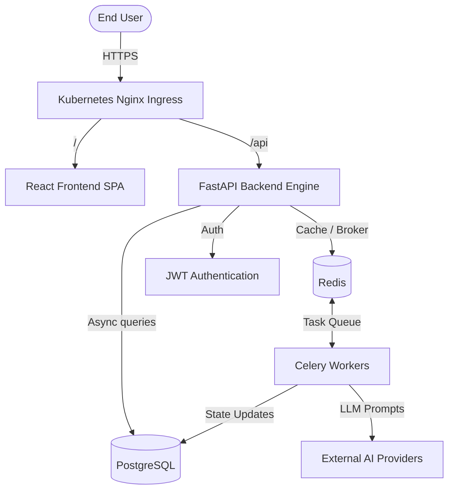
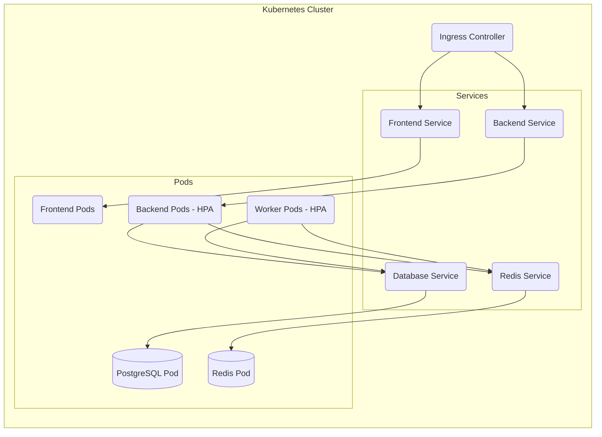
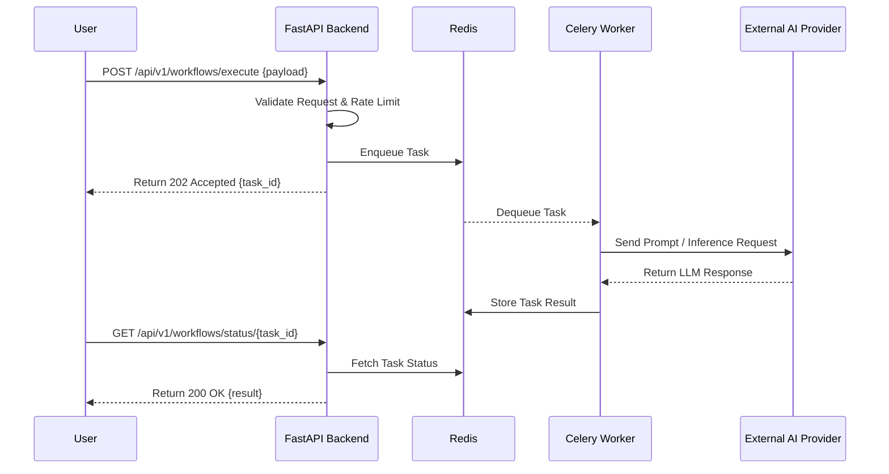

# Architecture Documentation

AIFlow Enterprise is an AI-Powered Business Automation Platform designed for scalability, security, and high performance.

## 1. High-Level Architecture Overview

The system follows a microservices-based decoupled architecture:
- **Frontend (SPA)**: React + Vite, communicating with the backend over REST APIs.
- **Backend (API Engine)**: FastAPI application providing stateless, asynchronous business logic, authorization, and workflow orchestration.
- **Background Workers**: Celery workers responsible for executing long-running AI tasks, polling external LLMs, and performing intensive asynchronous operations.
- **State & Persistence**:
  - **PostgreSQL**: Primary relational datastore (Multi-tenant schema, ACLs, Workflow metadata).
  - **Redis**: In-memory cache, rate-limiting store, and Celery broker.
- **Telemetry & Monitoring**: OpenTelemetry and Prometheus emitting structured JSON logs, metrics, and distributed traces.

## 2. Component Diagram

## 3. Deployment Architecture

The platform runs atop Kubernetes, orchestrated by `Deployment`, `Service`, and `Ingress` resources.

## 4. Data Flow: AI Workflow Execution

## 5. Integration Points
- **External AI Providers**: Integrates via unified `BaseAIProvider` class to support OpenAI, Anthropic, etc.
- **Monitoring Stack**: Exposes `/metrics` endpoint for Prometheus and emits OpenTelemetry OTLP traces to collectors.
