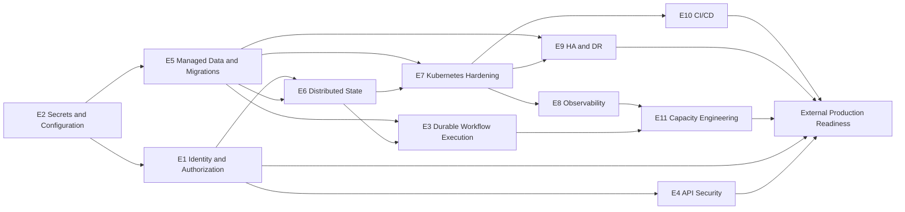

# AIFlow Enterprise — Implementation Roadmap

**Planning horizon:** 12 weekly sprints  
**Inputs:** `SOFTWARE_ARCHITECTURE.md`, `SECURITY_AUDIT.md`, and `PRODUCTION_READINESS.md`  
**Objective:** Move AIFlow Enterprise from an internal/demo foundation to a secure, observable, scalable production platform.  
**Sizing:** S = up to 2 engineer-days; M = 3–5 engineer-days; L = 1–2 engineer-weeks; XL = multi-team or multi-sprint initiative.

## 1. Prioritization and Planning Rules

| Priority | Meaning | Release rule |
|---|---|---|
| P0 | Production blocker: security, data loss, identity, or platform correctness | Must complete before external production launch |
| P1 | Required for reliable scale, operability, or service objectives | Must complete before one-million-user readiness gate |
| P2 | Important resilience, cost, and product-quality improvement | Complete after P0/P1 foundation or in parallel where safe |
| P3 | Optimization, cleanup, or later-stage capability | Schedule after production baseline is proven |

| Risk | Meaning |
|---|---|
| Critical | A defect can cause compromise, broad data exposure, or unrecoverable production failure |
| High | A defect can cause major outage, tenant impact, integrity loss, or release delay |
| Medium | A defect can impair reliability, performance, supportability, or cost |
| Low | Limited operational impact; mainly maintainability or optimization |

## 2. Epic Portfolio

| ID | Epic | Priority | Primary outcome | Dependency summary |
|---|---|---|---|---|
| E1 | Identity, Authentication, and Authorization | P0 | Real user identity and tenant-scoped access control | Secrets foundation |
| E2 | Secret, Configuration, and Edge Hardening | P0 | No usable secrets in source; secure runtime configuration | E1 for auth-sensitive settings |
| E3 | Workflow and AI Execution Safety | P0 | Safe, durable workflow execution and AI tool isolation | E1, E2, E5 |
| E4 | API and Input Security | P0 | Secure WebSockets, uploads, SSRF controls, and error handling | E1, E2 |
| E5 | Data Platform and Migration Foundation | P0 | Managed PostgreSQL/pgvector, migrations, and connection discipline | E2 |
| E6 | Distributed Workers and Caching | P1 | Durable asynchronous work, Redis state, and cache governance | E1, E5 |
| E7 | Kubernetes and Infrastructure Hardening | P1 | Repeatable, secure, multi-zone deployment platform | E2, E5, E6 |
| E8 | Observability and Logging | P1 | SLO-driven metrics, traces, centralized redacted logs | E2, E7 |
| E9 | High Availability and Disaster Recovery | P1 | Tested multi-AZ resilience and recovery objectives | E5, E7, E8 |
| E10 | CI/CD and Supply-Chain Governance | P1 | Deterministic, tested, signed, progressive releases | E2, E5, E7 |
| E11 | Performance and Capacity Engineering | P1 | Measured scale limits and remediation plans | E5, E6, E8 |
| E12 | Frontend Resilience and Security | P2 | Secure client sessions, CSP, performance, and quality | E1, E2, E8 |
| E13 | Application Quality and Persistence Completion | P2 | Replace demo/mock state with durable domain behavior | E1, E5, E6 |
| E14 | Scale Optimization and Platform Maturity | P3 | Cost, regional, and advanced platform optimization | E7–E13 |

## 3. Detailed Backlog

### E1 — Identity, Authentication, and Authorization

| ID | Task | Priority | Effort | Dependencies | Risk | Expected impact | Acceptance criteria |
|---|---|---:|---|---|---|---|---|
| E1.1 | Implement database-backed signup, login, and password verification | P0 | L | E2.1 | Critical | Prevents arbitrary account/token issuance | Login verifies a stored password hash; signup persists an account; invalid credentials never issue tokens; automated positive/negative tests pass. |
| E1.2 | Replace demo frontend auth state and mock login | P0 | M | E1.1 | Critical | Restores a real client trust boundary | No default authenticated user or mock token remains; login calls the API; protected routes reflect verified session state. |
| E1.3 | Implement persistent sessions, refresh rotation, and revocation | P0 | L | E1.1, E5.1, E6.1 | Critical | Enables secure multi-pod authentication | Refresh tokens are hashed, rotated once, revoked on logout, persisted centrally, and invalidated across replicas. |
| E1.4 | Enforce deny-by-default RBAC and tenant/workspace ownership | P0 | XL | E1.1, E5.2 | Critical | Eliminates privilege escalation and IDOR | Every protected route declares an authorization policy; missing roles deny access; cross-tenant access tests return 403/404. |
| E1.5 | Create authorization matrix and regression suite | P0 | M | E1.4 | High | Prevents authorization regressions | Matrix maps all API actions to roles/permissions; automated tests cover allow, deny, and cross-tenant cases. |

### E2 — Secret, Configuration, and Edge Hardening

| ID | Task | Priority | Effort | Dependencies | Risk | Expected impact | Acceptance criteria |
|---|---|---:|---|---|---|---|---|
| E2.1 | Remove, rotate, and externalize committed/default secrets | P0 | L | None | Critical | Prevents JWT forging and infrastructure compromise | No usable secrets remain in repository; all exposed values are rotated; startup fails when mandatory secrets are absent. |
| E2.2 | Establish typed environment configuration and validation | P0 | M | E2.1 | High | Eliminates silent unsafe defaults | Configuration has environment-specific schemas; production rejects development defaults and unknown critical values. |
| E2.3 | Tighten CORS, security headers, TLS, and metrics exposure | P0 | M | E2.2 | High | Reduces browser and operational exposure | Exact origin allowlist is enforced; CSP/HSTS are applied at edge; metrics deny by default and are network-restricted. |
| E2.4 | Add secret scanning and baseline remediation | P0 | M | E2.1 | High | Stops future credential leaks | Pre-commit and CI secret scans run; repository history is reviewed; exceptions have owners and expiry dates. |

### E3 — Workflow and AI Execution Safety

| ID | Task | Priority | Effort | Dependencies | Risk | Expected impact | Acceptance criteria |
|---|---|---:|---|---|---|---|---|
| E3.1 | Remove `eval` and define safe calculator/tool contracts | P0 | M | E1.4 | High | Eliminates code-injection path | No runtime use of `eval`; allowed calculator grammar is tested; invalid expressions are rejected safely. |
| E3.2 | Implement sandboxed code execution policy | P0 | XL | E2.1, E7.2 | Critical | Prevents host compromise from workflow code | Untrusted code runs in isolated, resource-limited, no-network execution; escape tests and audit events pass. |
| E3.3 | Implement durable workflow lifecycle and idempotency | P0 | XL | E5.2, E6.1 | High | Prevents duplicated or lost workflow work | Execution states are persisted; retries are idempotent; cancellation and recovery work after pod restart. |
| E3.4 | Add bounded parallel DAG execution | P1 | L | E3.3, E11.1 | High | Reduces latency and raises throughput | Independent branches run concurrently within configured tenant/global limits; ordering and failure tests pass. |
| E3.5 | Add workflow quotas, timeouts, and DLQ handling | P1 | L | E3.3, E6.1 | High | Contains abuse and operational failures | Every execution has limits; failed jobs reach a DLQ with replay controls; quota breaches are observable. |

### E4 — API and Input Security

| ID | Task | Priority | Effort | Dependencies | Risk | Expected impact | Acceptance criteria |
|---|---|---:|---|---|---|---|---|
| E4.1 | Authenticate and authorize execution WebSockets | P0 | M | E1.3, E1.4 | Critical | Prevents execution-stream data exposure | Connection validation occurs before accept; execution ownership is enforced; unauthorized subscriptions are rejected. |
| E4.2 | Implement SSRF-safe HTTP workflow nodes | P0 | L | E1.4, E7.2 | High | Blocks internal-network data exfiltration | HTTPS/host/IP controls, redirect validation, egress policy, body limits, and SSRF tests are implemented. |
| E4.3 | Harden document upload and parser pipeline | P0 | L | E6.1, E7.2 | High | Reduces DoS and malicious-file risk | File type/magic-byte, size, page, chunk, and malware checks run before isolated processing. |
| E4.4 | Standardize safe API errors and log redaction | P1 | M | E8.2 | Medium | Prevents sensitive disclosure | Clients receive generic errors with correlation IDs; secrets, PII, prompts, and document content are redacted from logs. |

### E5 — Data Platform and Migration Foundation

| ID | Task | Priority | Effort | Dependencies | Risk | Expected impact | Acceptance criteria |
|---|---|---:|---|---|---|---|---|
| E5.1 | Provision managed PostgreSQL with pgvector and multi-AZ availability | P0 | XL | E2.1 | Critical | Creates production data foundation | Managed database meets encryption, backup, HA, pgvector, private networking, and access-control requirements. |
| E5.2 | Adopt Alembic migrations and remove startup DDL | P0 | L | E5.1 | High | Enables controlled schema evolution | All schema changes run through versioned migrations; application startup performs no DDL. |
| E5.3 | Implement database connection budget and pooling | P0 | M | E5.1 | High | Prevents database exhaustion | Global connection budget is documented; pooler is deployed; load test remains below connection limits. |
| E5.4 | Add tenant indexes, query limits, pagination, and retention policy | P1 | L | E5.2, E11.1 | High | Preserves query performance at scale | High-volume queries are indexed and paginated; retention/archival jobs are tested; query plans meet targets. |
| E5.5 | Optimize pgvector retrieval and mandate production vector store | P1 | L | E5.1, E11.1 | High | Enables scalable RAG | Vector index is deployed and benchmarked; production cannot silently use SQLite fallback. |

### E6 — Distributed Workers and Caching

| ID | Task | Priority | Effort | Dependencies | Risk | Expected impact | Acceptance criteria |
|---|---|---:|---|---|---|---|---|
| E6.1 | Deploy durable queue, worker, and Redis architecture | P1 | XL | E2.1, E5.1 | High | Moves long work off request path | Worker command, broker, result state, retries, health checks, autoscaling, and deployment path are verified in staging. |
| E6.2 | Move rate limits, lockouts, sessions, and revocations to Redis | P1 | L | E1.3, E6.1 | High | Enables consistent security controls across pods | State survives pod changes and is shared across replicas; rate-limit/lockout integration tests pass. |
| E6.3 | Define cache catalog, tenant keys, TTLs, and invalidation | P1 | L | E6.1, E5.2 | Medium | Reduces database/API load safely | Every cache has owner, key, tenant scope, TTL, invalidation, and stale-data behavior; cache-isolation tests pass. |
| E6.4 | Separate cache, session, and queue capacity/failure domains | P2 | L | E6.1 | Medium | Limits blast radius | Workloads have separate clusters/databases or enforced resource isolation; failure tests prove one does not starve another. |

### E7 — Kubernetes and Infrastructure Hardening

| ID | Task | Priority | Effort | Dependencies | Risk | Expected impact | Acceptance criteria |
|---|---|---:|---|---|---|---|---|
| E7.1 | Consolidate and test one deployment model | P1 | L | E5.1, E6.1 | High | Prevents Helm/manifest drift | A single deployment model installs from scratch in staging; templates/manifests validate and smoke tests pass. |
| E7.2 | Apply workload security and network controls | P1 | L | E2.1 | High | Reduces cluster and SSRF blast radius | NetworkPolicies, restricted pod security, workload identity, non-root/read-only controls, and egress rules are enforced. |
| E7.3 | Add zone-aware availability controls | P1 | M | E7.1 | High | Improves node/zone failure tolerance | Topology spread, anti-affinity, PDBs, priorities, probes, and graceful shutdown are validated in disruption tests. |
| E7.4 | Implement immutable, signed image deployment | P1 | M | E10.2 | Medium | Prevents untraceable releases | Deployments reference signed image digests; `latest` is prohibited; provenance is verifiable. |

### E8 — Observability and Logging

| ID | Task | Priority | Effort | Dependencies | Risk | Expected impact | Acceptance criteria |
|---|---|---:|---|---|---|---|---|
| E8.1 | Define SLOs, SLIs, and alert ownership | P1 | M | E11.1 | High | Creates measurable reliability goals | API, workflow, RAG, queue, and dependency SLOs exist with owners, error budgets, and burn-rate alerts. |
| E8.2 | Centralize structured logs and enforce redaction | P1 | L | E7.1 | High | Makes incidents diagnosable without data leakage | Logs are centralized, retained, access-controlled, redacted, and correlated across API/workers. |
| E8.3 | Deploy tracing collector and end-to-end correlation | P1 | L | E7.1, E8.2 | Medium | Reduces MTTR | Requests trace across frontend, API, queue, workflow, database, and AI calls; trace sampling/cost controls are defined. |
| E8.4 | Operationalize dashboards, alerts, and runbooks | P1 | M | E8.1–E8.3 | Medium | Enables on-call response | Every paging alert has an owner/runbook; alert tests and dashboard reviews are completed. |

### E9 — High Availability and Disaster Recovery

| ID | Task | Priority | Effort | Dependencies | Risk | Expected impact | Acceptance criteria |
|---|---|---:|---|---|---|---|---|
| E9.1 | Implement encrypted backups, WAL archival, and restore automation | P1 | XL | E5.1 | Critical | Prevents unrecoverable data loss | Backups, WAL archival, encryption, cross-account copies, and backup alerts operate automatically. |
| E9.2 | Prove PITR and full restore procedures | P1 | L | E9.1 | Critical | Validates recovery claims | Automated restore test succeeds at least weekly; evidence records achieved RTO/RPO. |
| E9.3 | Implement and test multi-region failover | P1 | XL | E5.1, E7.3, E9.1 | High | Reduces regional-outage impact | Traffic failover, data replication, promotion, rollback, and customer communication are exercised end to end. |
| E9.4 | Run chaos, dependency, and game-day exercises | P2 | L | E6–E9.3 | Medium | Improves real resilience | Node, pod, Redis, database, and provider failure drills have documented results and follow-up actions. |

### E10 — CI/CD and Supply-Chain Governance

| ID | Task | Priority | Effort | Dependencies | Risk | Expected impact | Acceptance criteria |
|---|---|---:|---|---|---|---|---|
| E10.1 | Make quality and security gates deterministic and required | P1 | M | E2.4 | High | Prevents known-bad changes | CI uses lockfile installs; lint, typecheck, tests, migrations, SAST, secrets, dependencies, and container scans gate merge. |
| E10.2 | Build once, sign artifacts, and publish SBOM/provenance | P1 | L | E10.1 | High | Secures release supply chain | Images are signed by CI, SBOMs/provenance are stored, and promotion uses immutable digests. |
| E10.3 | Implement staging deployment, verification, and rollback | P1 | L | E7.1, E10.2 | High | Turns CI into reliable delivery | Pipeline deploys to staging, runs smoke/integration tests, verifies rollout, and performs tested rollback. |
| E10.4 | Add canary/progressive production delivery | P2 | L | E8.1, E10.3 | Medium | Lowers production change risk | Canary traffic, SLO-based promotion, automatic halt, and rollback work in a production-like exercise. |

### E11 — Performance and Capacity Engineering

| ID | Task | Priority | Effort | Dependencies | Risk | Expected impact | Acceptance criteria |
|---|---|---:|---|---|---|---|---|
| E11.1 | Define workloads, SLOs, and capacity model | P1 | M | E8.1 | High | Creates realistic scale target | Peak/steady workloads, growth assumptions, SLOs, and capacity budgets are approved by engineering and product. |
| E11.2 | Build production-like load and soak test suite | P1 | L | E5.1, E6.1, E11.1 | High | Measures actual limits | Tests cover API, WebSocket, workflow, RAG, queue, and failure scenarios with reproducible datasets. |
| E11.3 | Remove measured bottlenecks and tune resource limits | P1 | XL | E11.2 | High | Raises safe throughput | Bottlenecks are documented, fixed, benchmarked, and retested; p95/p99 targets hold under soak load. |
| E11.4 | Establish cost and capacity review cadence | P2 | S | E11.3 | Medium | Controls scale cost | Monthly review tracks compute, DB, cache, egress, vector, and AI cost per tenant/workload. |

### E12 — Frontend Resilience and Security

| ID | Task | Priority | Effort | Dependencies | Risk | Expected impact | Acceptance criteria |
|---|---|---:|---|---|---|---|---|
| E12.1 | Adopt secure browser-session and CSRF model | P2 | L | E1.3, E2.3 | High | Reduces token theft/session abuse | Token storage model is threat-modeled; cookie/CSRF or memory-token controls are implemented and tested. |
| E12.2 | Apply edge CSP and frontend security-header tests | P2 | M | E2.3 | Medium | Contains future XSS impact | CSP is served with frontend assets; security-header tests pass; unsafe directives are justified or removed. |
| E12.3 | Split route/navigation metadata and repair lint debt | P2 | M | E10.1 | Low | Improves maintainability and build quality | Lint is clean; route metadata is modular; route smoke tests cover public/protected paths. |
| E12.4 | Establish frontend performance budgets | P2 | M | E11.1 | Medium | Improves user experience at scale | Bundle, LCP, INP, and error budgets are measured in CI/RUM and regressions fail review. |

### E13 — Application Quality and Persistence Completion

| ID | Task | Priority | Effort | Dependencies | Risk | Expected impact | Acceptance criteria |
|---|---|---:|---|---|---|---|---|
| E13.1 | Replace mock API stores with repository/service persistence | P2 | XL | E1.4, E5.2 | High | Makes core product data durable and tenant-safe | Workflow, admin, knowledge, and execution APIs use database repositories and enforce tenant scopes. |
| E13.2 | Add API contracts, integration tests, and test data isolation | P2 | L | E13.1, E10.1 | Medium | Reduces integration regressions | Contract tests cover versioned APIs; tests use isolated fixtures and do not rely on demo behavior. |
| E13.3 | Complete connector/provider credential lifecycle | P2 | L | E1.4, E2.1, E6.1 | High | Safely enables integrations | Credentials are encrypted, scoped, rotated, audited, and never returned unmasked. |

### E14 — Scale Optimization and Platform Maturity

| ID | Task | Priority | Effort | Dependencies | Risk | Expected impact | Acceptance criteria |
|---|---|---:|---|---|---|---|---|
| E14.1 | Implement data archival and analytical isolation | P3 | XL | E5.4, E11.3 | Medium | Keeps operational DB responsive | Historical execution/audit data is archived/queryable; OLTP SLA remains stable. |
| E14.2 | Evaluate regional data residency and multi-region tenancy | P3 | XL | E9.3, E13.1 | High | Supports global enterprise customers | Regional placement, replication, residency, and deletion controls are documented and tested. |
| E14.3 | Implement FinOps allocation and AI cost controls | P3 | L | E8.1, E11.4 | Medium | Controls unit economics | Per-tenant cost attribution, budgets, alerts, and throttles are active. |

## 4. Twelve-Week Sprint Plan

The plan assumes a cross-functional delivery team with backend, frontend, platform, security, and QA capacity. P0 work takes precedence over feature expansion. Tasks may run in parallel only when their listed dependencies are satisfied.

| Sprint | Theme | Planned tasks | Sprint exit criteria |
|---|---|---|---|
| 1 | Security mobilization and design | E2.1, E2.2, E1.1 design, E1.4 authorization inventory, E11.1 | All secrets inventoried/rotation plan approved; identity and authorization design approved; scale SLO assumptions defined. |
| 2 | Real identity | E1.1, E1.2, E2.4, E10.1 foundation | Real signup/login flows work in test environment; mock auth removed; required quality/security gate design agreed. |
| 3 | Authorization and API closure | E1.4, E1.5, E4.1, E2.3 | Admin/API/WebSocket access is deny-by-default and tenant-scoped; CORS/metrics/edge policy is verified. |
| 4 | Data production foundation | E5.1 provisioning, E5.2 migration baseline, E5.3 | Managed pgvector environment is available; migrations deploy schema; connection budget/pooler design is validated. |
| 5 | Safe execution boundaries | E3.1, E4.2, E4.3 design/implementation, E1.3 | `eval` removed; HTTP nodes meet SSRF policy; session/refresh design is implemented and tested. |
| 6 | Durable processing | E6.1, E6.2, E3.3 foundation | Queue/workers operate in staging; distributed security state works; durable execution model is proven through pod restart. |
| 7 | Platform hardening | E7.1, E7.2, E7.3, E8.2 foundation | One secure deployment path installs in staging; network/workload policies and centralized logging are active. |
| 8 | Observability and data scale | E8.1, E8.3, E8.4, E5.4, E5.5 | SLO dashboards/alerts/traces are active; vector and database query plans meet initial performance targets. |
| 9 | Resilience and delivery | E9.1, E10.2, E10.3 | Backups/WAL automation operates; signed immutable artifacts deploy to staging with verified rollout/rollback. |
| 10 | Capacity proof | E11.2, E11.3, E3.4, E3.5 | Load/soak suite executes; top bottlenecks are remediated; workflow concurrency/quotas/DLQ are validated. |
| 11 | Recovery and application completion | E9.2, E9.3 design/exercise, E12.1, E13.1 foundation | PITR restore is proven; regional failover plan is exercised; secure client-session work and persistent core APIs are in progress. |
| 12 | Launch readiness decision | E9.3 completion, E10.4, E12.2–E12.4, E13.2, readiness review | Failover, canary, security regression, capacity, and release evidence are reviewed; launch go/no-go is documented. |

## 5. Dependency Path and Critical Path

The minimum external-production critical path is: **E2 → E1 → E4**, **E2 → E5 → E6 → E3**, **E5/E6 → E7 → E8/E10**, and **E5/E7 → E9**, followed by **E11 capacity proof**.

## 6. Launch Gates

| Gate | Owner | Required evidence | Blocking priority |
|---|---|---|---|
| Identity and authorization | Security + Backend | External account validation, role/tenant test suite, no anonymous sensitive access | P0 |
| Secret management | Security + Platform | Rotation completion, managed secret references, secret scan clean | P0 |
| Data integrity | Backend + Platform | Migration rollout, managed DB HA, pool budget, backup success | P0 |
| Execution safety | Backend + Security | SSRF/eval remediation, sandbox policy, durable queues and idempotency | P0 |
| Reliability | Platform + SRE | SLO dashboards, paging runbooks, multi-zone tests, restore evidence | P1 |
| Capacity | SRE + Engineering | Load/soak results meeting p95/p99, error, queue, and cost targets | P1 |
| Delivery | Platform + QA | Signed artifact, staged rollout, canary and rollback evidence | P1 |
| Product durability | Product + Engineering | Critical mock stores replaced, tenant-safe persistence and contracts | P2 |

## 7. Program Risks and Mitigations

| Risk | Level | Consequence | Mitigation |
|---|---|---|---|
| P0 scope is larger than one sprint team can deliver | Critical | Security and launch delay | Staff identity/security/data work in parallel; freeze non-essential feature work. |
| Demo/mock APIs conceal persistence and authorization complexity | High | Rework late in the program | Complete E13 discovery early; prioritize core workflow, identity, and knowledge paths. |
| Database/vector scale is unmeasured | High | Cost or latency failure under load | Provision realistic staging data in Sprint 4; start benchmarking by Sprint 8. |
| External AI provider latency/cost dominates service behavior | High | Missed SLOs and runaway cost | Add quotas, fallbacks, circuit breakers, cost telemetry, and per-tenant budgets. |
| Infrastructure manifests drift from actual runtime | High | Failed deployments or insecure defaults | Establish one deployment source and enforce staging install tests in Sprint 7. |
| DR documentation is not executable | High | RTO/RPO claims fail during incident | Automate backup/restore and conduct evidence-based game days by Sprint 11. |
| Security fixes change client behavior | Medium | Temporary product disruption | Use contract tests, staged rollout, user communication, and feature flags where appropriate. |

## 8. Completion Definition

This roadmap is complete when all P0 and P1 tasks meet their acceptance criteria, production release gates have verifiable evidence, and a production-like staging environment has passed security, capacity, failover, restore, deployment rollback, and tenant-isolation tests. P2/P3 work then proceeds based on observed load, customer commitments, and cost data.

