# AIFlow Enterprise — Software Architecture

**Status:** Current implementation architecture  
**Audience:** Engineering, platform, security, and operations teams  
**Last reviewed:** 2026-08-06

## 1. Overview

AIFlow Enterprise is a modular SaaS automation platform. It combines a React single-page application with a FastAPI backend to provide workflow automation, AI and RAG capabilities, integrations, operations dashboards, and enterprise administration.

The platform is designed around domain-oriented frontend modules and backend API routers. PostgreSQL with pgvector is the intended production database and vector-search engine; Redis provides caching, while SQLite is available as a development fallback.

> **Implementation note:** This document describes the current codebase. Some API domains and authentication flows contain demo or in-memory implementations and require production hardening before handling real customer workloads.

## 2. System Architecture

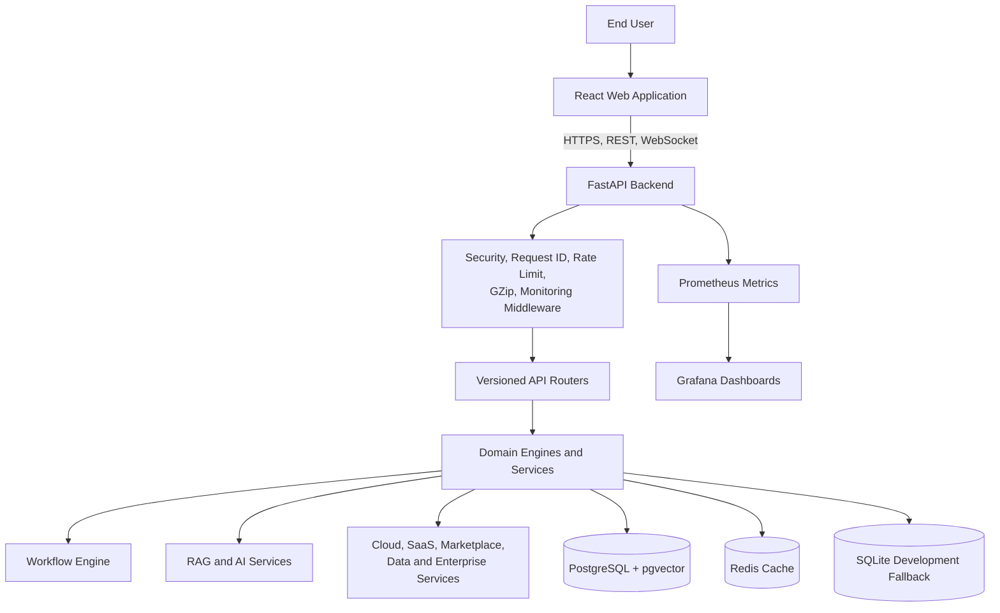

### Core characteristics

- React and TypeScript SPA, built with Vite and served as static assets.
- FastAPI REST API, grouped under `/api/v1`, with WebSocket execution monitoring.
- Async SQLAlchemy persistence layer and Pydantic request/response schemas.
- PostgreSQL and pgvector for operational and semantic data; Redis for cache services.
- Prometheus, Grafana, OpenTelemetry, JSON logs, and request correlation support.
- Docker Compose for local environments; Kubernetes, Helm, and GitHub Actions for delivery.

## 3. Frontend Architecture

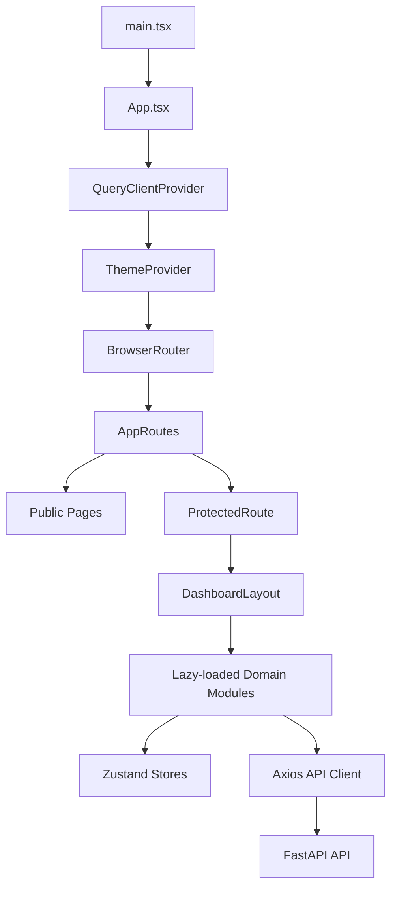

### Frontend technologies

| Concern | Implementation |
|---|---|
| UI runtime | React 19 and TypeScript |
| Build tooling | Vite 5 |
| Navigation | React Router |
| Server-state behavior | TanStack React Query |
| Local state | Zustand with persistence |
| Styling | Tailwind CSS |
| Workflow canvas | `@xyflow/react` |
| HTTP client | Axios |

### Module organization

`frontend/src/modules/` groups screens by business domain: authentication, dashboard, workflow, execution, AI, AIOps, administration, data, cloud, marketplace, enterprise, agentic, mobile, SaaS, industry, hyperautomation, and platform operations.

`AppRoutes.tsx` defines public and protected routes. Feature pages are loaded with `React.lazy`, reducing initial bundle work by loading most domain pages only when the user navigates to them.

The common UI layer includes layout components, reusable UI primitives, monitoring widgets, theme context, API client configuration, and route protection.

## 4. Backend Architecture

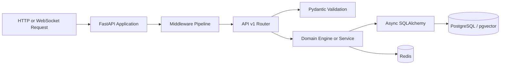

### Backend layers

| Layer | Responsibility |
|---|---|
| `app/api/v1/` | Domain routes, HTTP contracts, and response serialization |
| `app/schemas/` | Pydantic request and response DTOs |
| `app/models/` | SQLAlchemy ORM entities |
| `app/engine/` | Workflow compilation, execution, retries, scheduling, and node runners |
| `app/ai/` | Agent runtime, RAG, providers, memory, tools, and vector store |
| `app/core/` | Configuration, database, security, RBAC, metrics, and auditing |
| `app/middleware/` | Rate limiting, security headers, and correlation IDs |
| `app/monitoring/` | Metrics registry, exporters, instrumentation, and decorators |
| `app/workers/` and `app/tasks/` | Background-work scaffolding |

### API domains

The versioned router aggregates authentication, workspaces, workflows, executions, webhooks, schedules, AI agents, prompts, knowledge, memory, administration, connectors, AIOps, plugins, cloud, marketplace, hyperautomation, intelligence, data platform, mobile, enterprise, agentic, SaaS, industry, and platform modules.

Cross-cutting backend services include CORS control, GZip compression, security headers, rate limiting, request IDs, Prometheus instrumentation, and OpenTelemetry hooks.

## 5. Authentication

The intended authentication model uses signed JWT bearer tokens, with separate access and refresh tokens.

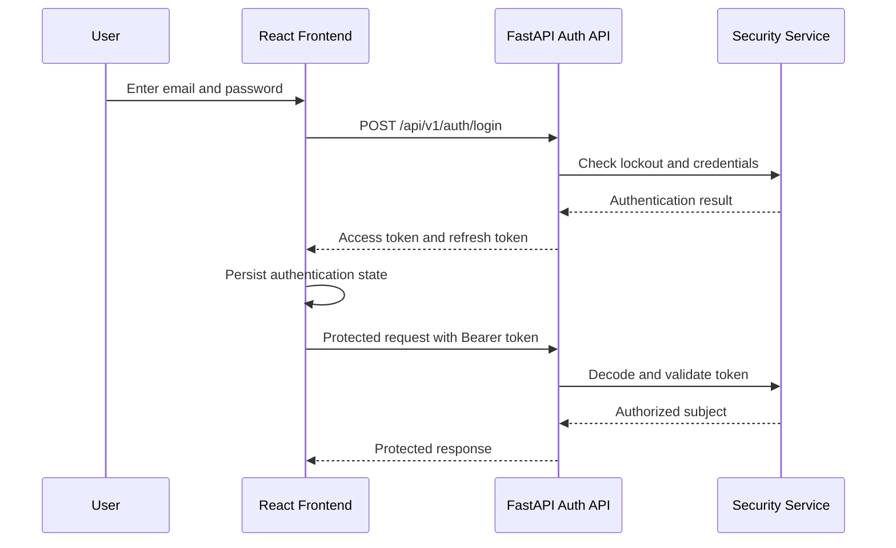

### Current mechanics

- Access tokens contain `sub`, `type`, `exp`, and `jti` claims and default to a one-hour lifetime.
- Refresh tokens default to a seven-day lifetime.
- The Axios request interceptor adds the access token as an `Authorization` header.
- The client clears local authentication state after an HTTP 401 response.
- `ProtectedRoute` prevents unauthenticated navigation to dashboard routes.

### Production requirements

The present implementation uses demo authentication behavior and in-memory failed-login and revocation stores. Production deployment should validate users against the database, verify password hashes, persist sessions and revocations in Redis or PostgreSQL, rotate refresh tokens, and use secure cookie/storage controls.

## 6. Database Design

PostgreSQL is the production data store. The `pgvector` extension supports semantic retrieval through a 1536-dimensional vector field. SQLAlchemy defines the logical schema.

### Core tenancy and access model

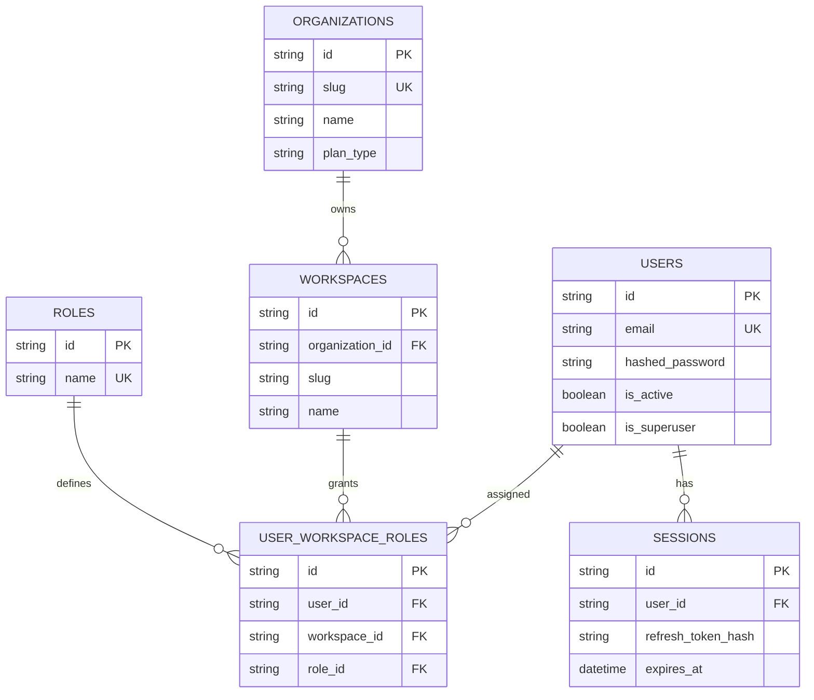

### Workflow and execution model

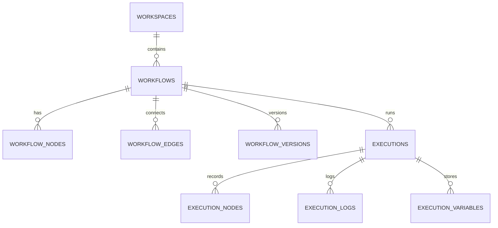

### Primary tables

| Area | Tables |
|---|---|
| Identity | `users`, `sessions`, `roles`, `permissions`, `user_workspace_roles` |
| Tenancy | `organizations`, `workspaces`, `saas_tenants`, `saas_workspaces` |
| Workflow | `workflows`, `workflow_nodes`, `workflow_edges`, `workflow_versions`, `workflow_templates` |
| Execution | `executions`, `execution_nodes`, `execution_logs`, `execution_variables`, `webhook_requests`, `scheduled_jobs` |
| AI and RAG | `prompt_templates`, `knowledge_bases`, `knowledge_documents`, `vector_chunks`, `agent_sessions`, `chat_messages` |
| AIOps | AI models, prompt versions/evaluations, costs, governance, approvals, safety scans |
| Platform domains | Connectors, plugins, marketplace, cloud, data, intelligence, enterprise, mobile, industry, hyperautomation, and platform graph tables |

### RAG tables

`knowledge_bases` belongs to a workspace and records corpus metadata. `knowledge_documents` represents uploaded files. `vector_chunks` stores each chunk's document identity, content, JSON metadata, and `Vector(1536)` embedding. `agent_sessions` and `chat_messages` retain conversational context and citations.

## 7. API Flow

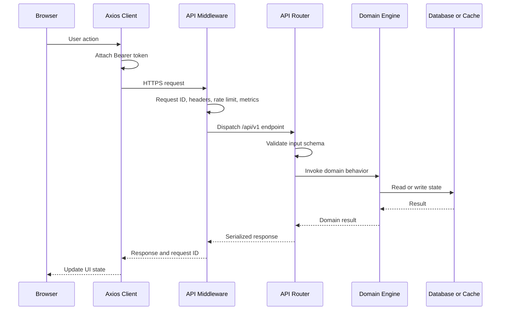

The public API is exposed under `/api/v1`. Root and health endpoints are also available for platform checks. Metrics are exposed for Prometheus scraping. Execution status can be broadcast to subscribed WebSocket clients.

## 8. RAG Flow

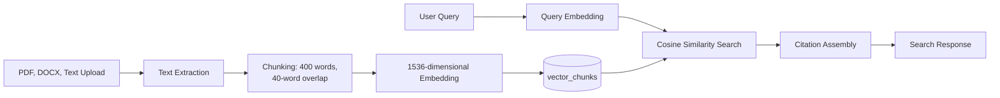

### Ingestion sequence

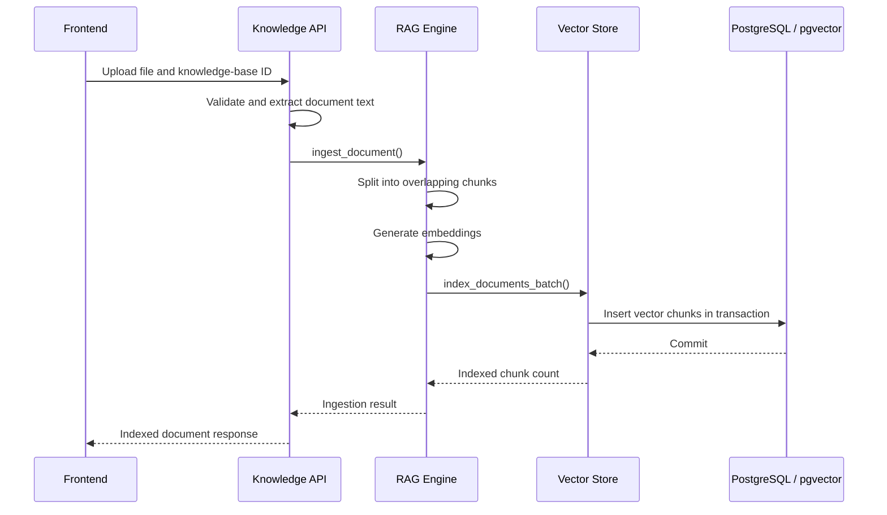

The production query path uses pgvector cosine distance and limits results to the requested top-k. SQLite uses a development fallback that scans rows and applies dot-product and keyword-overlap scoring; it is not intended for production-scale knowledge bases.

## 9. Workflow Engine

Workflows are represented as a directed graph of nodes and edges, created in the React Flow editor and executed by backend node runners.

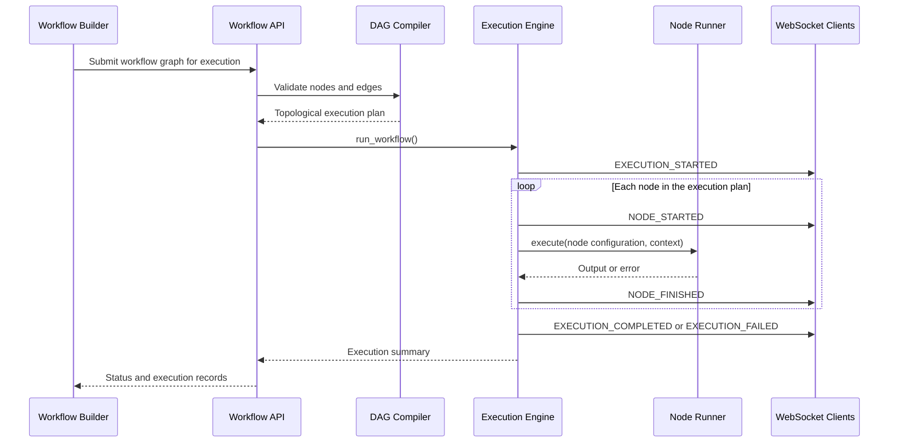

The DAG compiler uses Kahn's topological-sort approach to identify cycles and produce an execution order. The execution engine resolves variables from a shared context, selects a node runner by node type, records per-node output, and broadcasts lifecycle events. The current implementation executes nodes serially; independent graph branches are not yet parallelized.

## 10. Deployment Architecture

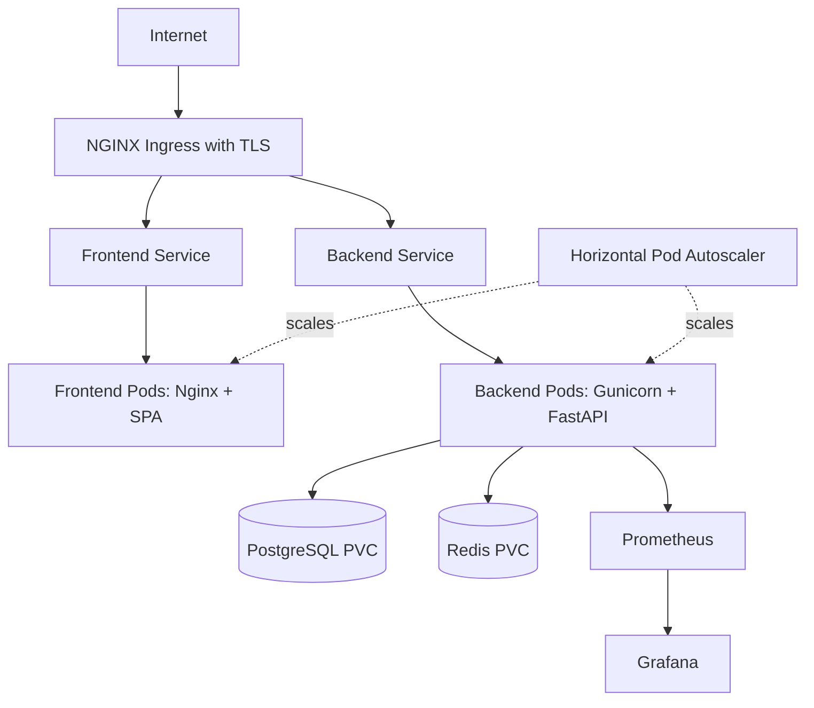

### Deployment components

| Component | Architecture |
|---|---|
| Frontend | Multi-stage Node build; Nginx serves the generated SPA and health endpoint |
| Backend | Python container running Gunicorn with Uvicorn workers |
| Ingress | NGINX ingress with TLS and separate frontend/API hosts |
| Backend scalability | Kubernetes deployment, PDB, readiness/liveness checks, and HPA from 3 to 10 replicas |
| Persistence | PostgreSQL and Redis persistent volumes in the supplied manifests |
| Monitoring | Prometheus scrapes `/metrics`; Grafana consumes dashboards |
| Local runtime | Docker Compose supplies frontend, backend, PostgreSQL, and Redis |
| CI/CD | GitHub Actions tests, builds container images, validates deployment assets, and publishes to GHCR |

## 11. Security Considerations

### Implemented controls

- JWT bearer-token primitives and refresh-token endpoints.
- Password hashing support through bcrypt via Passlib.
- Configurable login-failure lockout threshold.
- Request correlation IDs and structured auditing/monitoring hooks.
- Security-header middleware and GZip response compression.
- Rate-limiting middleware.
- Explicit CORS allowlist and Vercel subdomain regex.
- Non-root backend container user.
- Kubernetes secrets/config-map injection points.
- TLS-enabled ingress configuration and Prometheus observability.

### Required production hardening

1. Remove all default secrets and fixed deployment credentials from source-controlled configuration. Use a managed secret store and fail startup when required secrets are absent.
2. Replace demo authentication with database-backed account lookup, password verification, account lifecycle management, session persistence, refresh-token rotation, and distributed revocation.
3. Enforce tenant and workspace authorization in every data query and service boundary; do not rely solely on route protection.
4. Use PostgreSQL with pgvector in production, apply schema migrations through Alembic, and avoid application-managed DDL at worker startup.
5. Apply upload size limits, file-type validation, malware scanning, and asynchronous processing for documents before RAG ingestion.
6. Protect WebSocket subscriptions with authenticated, tenant-scoped authorization and remove stale subscribers.
7. Set security headers at both application and edge layers, including a Content Security Policy appropriate to the deployed frontend.
8. Restrict monitoring endpoints and ensure metrics labels never contain unbounded user-controlled data.
9. Add dependency scanning, container scanning, secret scanning, SAST, and release gates to the required CI pipeline.
10. Define backup, restore, disaster-recovery, retention, and key-rotation procedures for PostgreSQL, Redis, and observability stores.

## 12. Architecture Decisions and Next Steps

The current architecture provides a strong domain-oriented base. The primary engineering priorities are production authentication, schema migration discipline, distributed background execution, tenant isolation, mandatory pgvector production deployment, database connection capacity management, and operational resiliency for stateful services.

