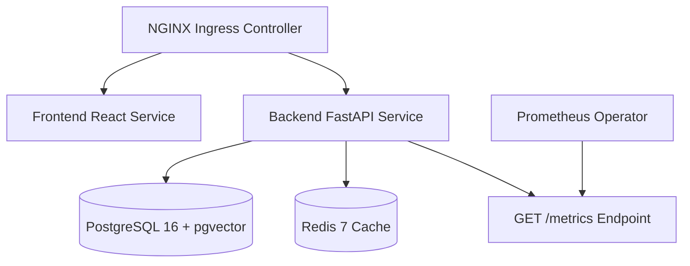

# Kubernetes Architecture & Manifest Specification

## Cluster Topology & Component Layout

## Security & Isolation
- **Non-root containers**: UID 10001 (`appuser`).
- **Read-Only Filesystem**: Container root filesystem mounted read-only.
- **Network Policies**: Ingress/Egress restricted to namespace services.
- **Resource Limits**: Enforced CPU & Memory requests/limits on all pods.
