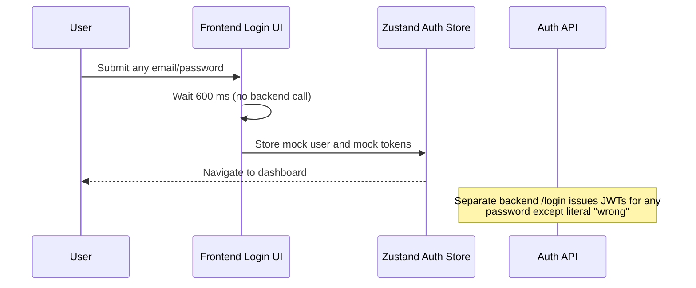
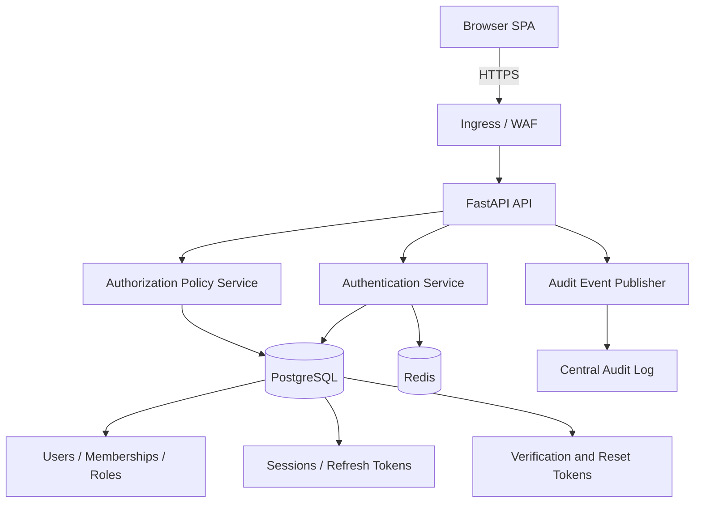
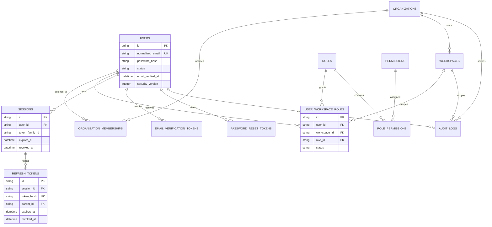
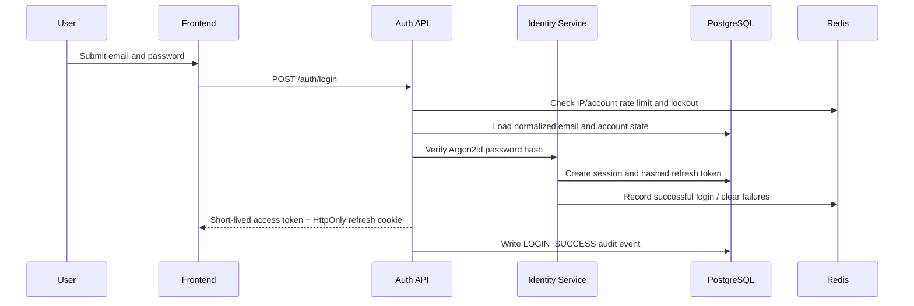
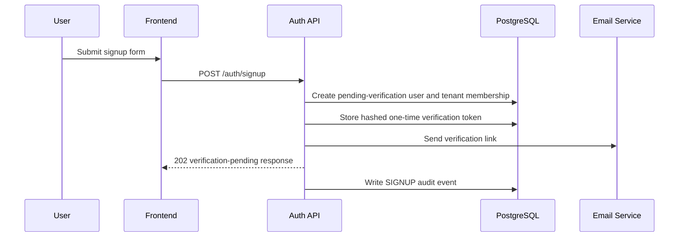
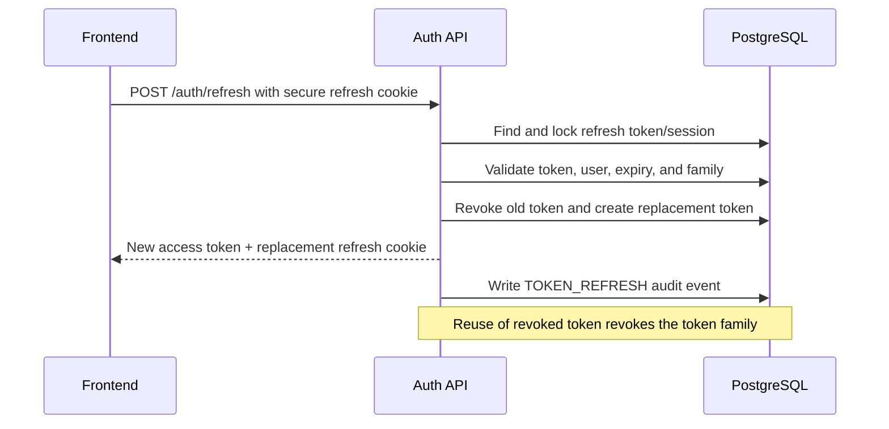
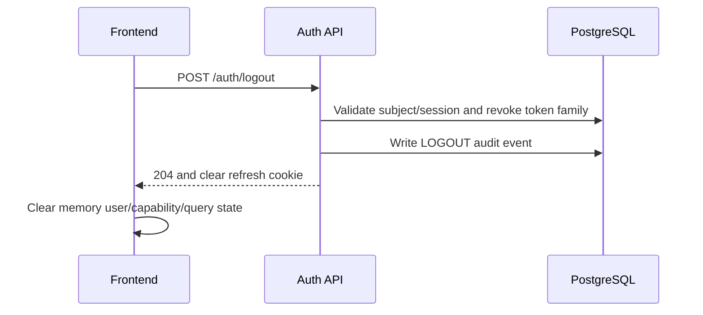
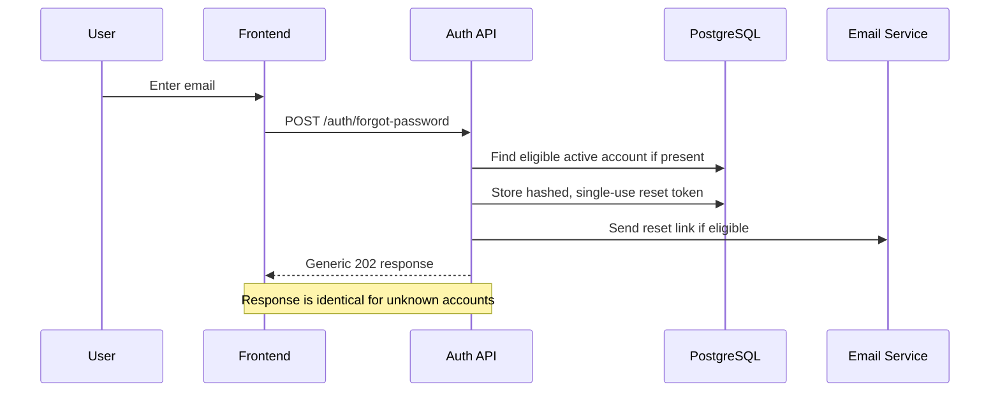
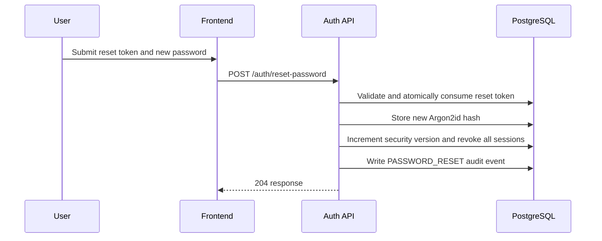

# E1 — Identity, Authentication, and Authorization Implementation Specification

**Status:** Proposed implementation specification  
**Epic:** E1 — Identity, Authentication, and Authorization  
**Priority:** P0 — external-production blocker  
**Source of truth:** `docs/SOFTWARE_ARCHITECTURE.md`, `docs/SECURITY_AUDIT.md`, `docs/PRODUCTION_READINESS.md`, and `docs/IMPLEMENTATION_ROADMAP.md`  
**Scope:** Identity lifecycle, authentication, session management, role-based access control (RBAC), and tenant isolation.  
**Out of scope:** UI visual redesign, SSO implementation beyond interface readiness, and unrelated workflow/business feature delivery.

## 1. Executive Summary

The existing implementation contains JWT helper functions and route-protection primitives, but it is a demo authentication system rather than a secure identity platform. Backend login accepts every password except one sentinel value, signup issues tokens without creating an account, the frontend initializes as an authenticated administrator using mock tokens, and authorization defaults missing roles to `admin`. Several sensitive routes do not apply authentication or authorization dependencies.

E1 replaces those behaviors with a production-grade, database-backed identity system. It establishes secure account lifecycle management, password verification, verified email ownership, rotating refresh tokens, centrally persisted sessions and revocations, deny-by-default authorization, and tenant/workspace-scoped access checks. The result must work consistently across horizontally scaled API and worker pods.

**Success condition:** no request can gain access based on demo state, a client-controlled role, a default signing key, or an object identifier belonging to another tenant.

## 2. Current Architecture

### 2.1 Current authentication flow

The frontend and backend authentication paths are disconnected. The browser can declare itself authenticated without server interaction. The backend login endpoint emits access and refresh tokens without looking up a user or verifying a password hash.

### 2.2 Current authorization model

- `get_current_active_user` verifies a bearer JWT's type is `access`.
- `require_role` reads `roles` from the JWT, but defaults absent roles to `admin`.
- The existing RBAC module defines roles and permissions but is not consistently applied to routes.
- The workflow router has an authentication dependency, but the admin router has no equivalent dependency.
- WebSocket execution streams accept connections without authentication or ownership checks.
- Several domain APIs use in-memory/mock stores, so object ownership is not consistently enforceable.

### 2.3 Existing JWT implementation

Current JWTs use HS256 and include:

| Claim | Current use |
|---|---|
| `sub` | Email/user subject |
| `type` | `access` or `refresh` |
| `exp` | Expiry timestamp |
| `jti` | Random token identifier |

Access tokens default to 60 minutes; refresh tokens default to seven days. Revoked token IDs are stored in an in-memory set, which does not survive restart or propagate between workers/pods. The signing key has a usable default in application configuration.

### 2.4 Existing frontend auth flow

- `LoginPage.tsx` creates a mock administrator identity and mock JWT strings locally.
- `authStore.ts` persists a pre-authenticated demo user and tokens through Zustand persistence, normally browser local storage.
- `ProtectedRoute.tsx` checks only `isAuthenticated` from client state.
- `apiClient.ts` attaches the stored access token to all API requests and clears state on HTTP 401; it does not refresh tokens.

### 2.5 Existing backend auth flow

- `POST /api/v1/auth/signup` returns tokens without persisting a user.
- `POST /api/v1/auth/login` accepts all passwords except `wrong`.
- `POST /api/v1/auth/refresh` validates a refresh JWT and issues a new pair, but does not rotate or persist a session.
- `POST /api/v1/auth/logout` revokes a provided refresh token only in local memory.
- `GET /api/v1/auth/me` returns fixed demo-user data.

### 2.6 Current weaknesses

| ID | Weakness | Severity | Consequence |
|---|---|---|---|
| W1 | Demo client login and pre-authenticated browser state | Critical | Any visitor can enter protected UI routes. |
| W2 | Backend login/signup issue tokens without identity verification | Critical | Any caller can mint valid access/refresh JWTs. |
| W3 | Default/committed JWT secrets | Critical | Tokens can be forged when defaults are used. |
| W4 | Missing-role fallback to administrator | Critical | Privilege escalation. |
| W5 | Sensitive routers lack authorization enforcement | Critical | Anonymous or low-privilege administrative access. |
| W6 | WebSocket streams lack identity and ownership validation | Critical | Execution data exposure through IDOR. |
| W7 | Refresh/revocation/lockout state is process-local | High | Inconsistent behavior in multi-pod deployments. |
| W8 | Tokens persist in browser storage | High | XSS can steal durable credentials. |
| W9 | No verified account lifecycle | High | No assurance of account ownership or recovery controls. |
| W10 | No universal tenant/workspace object authorization | High | Cross-tenant data access risk. |

## 3. Problems to Solve

E1 must resolve every identity-related issue identified in the architecture, security, and readiness assessments.

1. **Establish a server-authoritative identity boundary.** Accounts, password hashes, session state, role assignments, and verification state must live in durable stores; browser state is a cache, never the authority.
2. **Remove arbitrary token issuance.** Login may issue tokens only after an active, verified account passes password verification and lockout controls.
3. **Eliminate permissive authorization.** Authorization must be deny-by-default. Missing role, permission, tenant membership, or object ownership must deny access.
4. **Support scale.** Sessions, refresh token records, revocations, lockout counters, and rate limits must be shared across replicas and survive restarts.
5. **Protect tenants.** Every tenant/workspace-bound resource request must use both subject identity and server-side scope checks, not just client-provided IDs.
6. **Deliver an accountable lifecycle.** Signup, verification, password reset, logout, session inspection, and audit trails must be explicit, testable processes.
7. **Secure browser interactions.** Token storage and request patterns must reduce XSS and CSRF exposure while maintaining SPA usability.
8. **Provide operational controls.** Security events must be auditable, rate limits enforceable, and suspicious login/session behavior observable.

## 4. Target Architecture

### 4.1 Architectural principles

- The API is the sole authority for authentication and authorization decisions.
- Access tokens are short-lived, signed, audience-bound credentials.
- Refresh tokens are opaque, high-entropy secrets stored only as hashes server-side and rotated on each successful refresh.
- Sessions are centrally persisted and revocable.
- Authorization is evaluated from active server-side membership/role data and object scope.
- Tenant and workspace IDs are derived from verified context; request body/query identifiers never create authority.
- Every security-relevant action creates an audit event.

### 4.2 User lifecycle

| Lifecycle state | Meaning | Allowed transitions |
|---|---|---|
| `pending_verification` | Account exists but email ownership is unverified | `active`, `disabled`, `deleted` |
| `active` | Account may authenticate and receive authorization | `locked`, `disabled`, `deleted` |
| `locked` | Temporary protection following suspicious/failed logins | `active`, `disabled` |
| `disabled` | Administrative or compliance suspension | `active`, `deleted` |
| `deleted` | Soft-deleted account, retained only per policy | terminal or legal-hold recovery |

### 4.3 Login

Login validates normalized email, account state, email verification (unless an approved policy exception exists), password hash, lockout status, and optional risk controls. On success it creates a device/session record, issues a short-lived access token, stores a hashed refresh token bound to that session, records an audit event, and returns the browser-safe session response.

### 4.4 Logout

Single-session logout revokes the current refresh-token family and marks the session revoked. Global logout revokes every active user session. Access tokens remain valid only until their short expiry; high-risk actions may also consult a session-version or denylist cached in Redis.

### 4.5 Signup and email verification

Signup creates a `pending_verification` user with a password hash and initial organization/workspace only after transactional validation. The system emits a time-bound, single-use email-verification token. Successful verification marks the account active and records an audit event. Duplicate email responses must avoid account enumeration.

### 4.6 Password reset

Forgot-password requests always return a generic response. For an eligible account, the system creates a hashed, one-time reset token with short expiry and sends a reset link. Reset consumes the token atomically, changes the password hash, increments session/security version, revokes all active sessions, and creates an audit event.

### 4.7 Refresh tokens and sessions

- Access token lifetime: 5–15 minutes, configurable by environment.
- Refresh token lifetime: 7–30 days, configurable by policy and device trust.
- Refresh tokens are opaque random values, not JWTs.
- Only a SHA-256/HMAC or password-hash-derived representation of the token is stored.
- Each refresh creates a replacement token and invalidates the predecessor.
- Reuse of an invalidated refresh token revokes the entire token family and flags the session for investigation.
- Session records include user, organization/workspace context, token family, device/user-agent fingerprint, IP metadata, timestamps, expiry, revocation state, and last activity.

### 4.8 RBAC and tenant isolation

Authorization uses three mandatory checks:

1. **Authentication:** valid access token and active session/user.
2. **Membership:** active organization/workspace membership for the requested scope.
3. **Permission/object policy:** role grants the required permission and resource belongs to permitted scope.

Role names are stable application policy identifiers. Permissions are granular resource/action identifiers. JWTs may carry a subject/session ID and a short-lived authorization version, but server-side membership and object scope remain authoritative.

## 5. Database Design

### 5.1 Core entities

| Entity | Key fields | Notes |
|---|---|---|
| `users` | id, email, normalized_email, password_hash, status, email_verified_at, security_version, timestamps | One record per global identity. Email is unique after normalization. |
| `organizations` | id, name, slug, status, plan | Existing tenancy root; add lifecycle/status if absent. |
| `workspaces` | id, organization_id, name, slug, status | Existing organization child scope. |
| `organization_memberships` | user_id, organization_id, status | Needed if organizations can contain multiple workspaces/users. |
| `user_workspace_roles` | user_id, workspace_id, role_id, status, timestamps | Existing mapping; make unique for user/workspace/role relationship. |
| `roles` | id, code, name, scope, system_managed | Role definitions: owner/admin/member/viewer and approved operational roles. |
| `permissions` | id, code, resource, action, description | Stable permission catalog. |
| `role_permissions` | role_id, permission_id | Explicit many-to-many authorization mapping. |
| `sessions` | id, user_id, token_family_id, device metadata, created/last_seen/expiry/revoked timestamps | Server-side session authority. |
| `refresh_tokens` | id, session_id, token_hash, parent_id, rotated_at, expires_at, revoked_at, reuse_detected_at | Rotating opaque refresh token lineage. |
| `email_verification_tokens` | id, user_id, token_hash, expires_at, consumed_at | Single-use email proof. |
| `password_reset_tokens` | id, user_id, token_hash, expires_at, consumed_at | Single-use reset capability. |
| `audit_logs` | id, actor_user_id, organization/workspace IDs, action, target, request/correlation IDs, IP, user agent, outcome, metadata, timestamp | Immutable security and compliance evidence. |

### 5.2 Required integrity and indexing rules

- Unique index on `users.normalized_email`.
- Foreign keys from all membership/session/token records to their parent records.
- Unique index preventing duplicate active role assignments for the same user/workspace/role.
- Indexes on active sessions by `user_id`, refresh tokens by `token_hash`, and tokens by expiry/revocation state.
- Indexes on `audit_logs` by tenant scope, actor, action, target, and timestamp.
- Token hashes and password hashes must never be selected into normal API response DTOs or logs.
- Multi-tenant tables must carry their appropriate organization/workspace scope and be queried with that scope.

### 5.3 Entity-relationship diagram

## 6. Backend Design

### 6.1 Service boundaries

| Component | Responsibility |
|---|---|
| Auth router | Exposes account, login, refresh, logout, verification, reset, and session endpoints. |
| Identity service | Normalizes identity, manages user lifecycle, hashes passwords, and coordinates token/session changes transactionally. |
| Token service | Issues and validates access JWTs; generates/hashes opaque refresh/verification/reset secrets. |
| Session service | Creates, rotates, revokes, lists, and detects reuse across sessions. |
| Authorization service | Resolves memberships/roles/permissions and performs scoped policy decisions. |
| Dependencies/middleware | Extracts and validates auth context; applies route policies; attaches correlation/audit context. |
| Audit service | Emits immutable security events without logging secrets or raw tokens. |

### 6.2 API endpoint families

- Public account lifecycle: signup, verification, login, token refresh, forgot password, password reset.
- Authenticated account lifecycle: logout, logout-all, current user, current sessions, revoke a session, change password.
- Administrative identity lifecycle: invite user, disable/enable account, manage memberships and role assignments. These endpoints require explicit administrative permissions.

### 6.3 JWT generation

Access tokens use a managed asymmetric signing key (preferred `EdDSA` or `RS256`) held in the approved secret-management system. Key IDs (`kid`) support rotation. Tokens include only the minimum required claims:

| Claim | Requirement |
|---|---|
| `iss` | Environment-specific canonical issuer |
| `aud` | API audience, optionally client audience for WebSockets |
| `sub` | Immutable user ID, not email |
| `sid` | Session ID |
| `jti` | Unique token ID |
| `iat`, `nbf`, `exp` | Issued/not-before/short expiration timestamps |
| `ver` | User security/session version for bulk invalidation |
| `scope` | Optional coarse scopes only; never the sole source of authorization |

Do not put password hashes, refresh tokens, tenant-wide privileges, sensitive PII, or mutable authorization state into access tokens.

### 6.4 JWT validation

The authentication dependency must validate signature, algorithm allowlist, key ID, issuer, audience, expiry, not-before, token type, session state, user status, and security version. It creates an immutable `AuthContext` containing user ID, session ID, request ID, and approved active scope.

Validation failure always produces a generic `401` response. The API must not disclose whether a user, session, token, or key exists.

### 6.5 Authorization middleware and permission dependencies

Authorization is implemented as FastAPI dependencies/policy functions rather than global middleware that cannot know endpoint requirements.

1. Authentication dependency produces `AuthContext`.
2. Scope resolver obtains organization/workspace from a trusted path parameter, subdomain, or server-side session selection—not from unvalidated JSON.
3. Membership dependency proves active membership in that scope.
4. Permission dependency verifies the required permission.
5. Resource policy loads the resource through tenant-scoped queries and verifies ownership/relationship.

Every protected route must declare its required permission(s). Routers with sensitive data—administration, credentials, execution output, knowledge bases, API keys, billing, and tenant management—must have explicit policies.

### 6.6 Password hashing

- Use Argon2id as the preferred password hashing algorithm; bcrypt is an acceptable migration verifier for existing hashes.
- Configure parameters through security policy and benchmark on deployment hardware.
- Use a server-side pepper from the secret manager where operationally supported.
- Hashes are generated only on trusted backend workers; plaintext passwords are not logged, stored, or returned.
- Changing a password revokes all refresh sessions and increments `security_version`.

### 6.7 Refresh token rotation

Refresh is a transaction:

1. Parse cookie/header token and compute its lookup hash.
2. Lock/load the active token and session.
3. Validate expiry, session/user status, and token family.
4. Mark current token rotated/revoked.
5. Generate/store replacement token in the same family.
6. Issue new access token and replace refresh cookie.
7. If a previously rotated token is reused, revoke the full token family and create a high-severity audit event.

### 6.8 Logout flow

Logout derives the current session from the verified access token and refresh-cookie/session context. It revokes session/token-family state transactionally, clears the refresh cookie, records an audit event, and returns `204`. `logout-all` increments the user security version and revokes every active session.

## 7. Frontend Design

### 7.1 Login and signup UI

Login and signup screens submit typed form data to the backend. They never create tokens locally. They provide accessible loading, field validation, generic failure messaging, verification-pending guidance, and correlation-aware support messaging.

Signup must explain verification requirements and privacy/terms choices. Login must not reveal whether an account exists. Password UI should support password managers and avoid prefilled demonstration credentials.

### 7.2 Protected routes

`ProtectedRoute` becomes an async session-aware boundary:

- Render a loading state while identity bootstrap completes.
- Redirect unauthenticated users to login with a validated return location.
- Render an access-denied state for authenticated users lacking permission.
- Do not treat local `isAuthenticated` alone as sufficient authorization.

### 7.3 Role-based navigation

Navigation definitions include a required permission, not only a role name. The UI hides unavailable entries for usability, but the API remains authoritative. A denied server response updates local capability state and renders a safe access-denied experience.

### 7.4 Session refresh and logout

At application bootstrap and shortly before access-token expiry, the client calls the refresh endpoint using the secure refresh cookie. Concurrent refresh attempts are coalesced. A failed refresh clears memory state, invalidates cached user data, and redirects to login. Logout calls the API before clearing client state.

### 7.5 Token storage strategy

| Credential | Browser location | Rationale |
|---|---|---|
| Access token | In-memory JavaScript state only | Limits durable XSS token theft; short expiry. |
| Refresh token | `HttpOnly`, `Secure`, scoped, `SameSite` cookie | Unavailable to JavaScript; supports rotation. |
| CSRF token | In-memory/meta value or double-submit cookie, only if required by cookie model | Protects state-changing cookie-authenticated calls. |
| User/capabilities | In-memory query/store cache | Non-authoritative display state. |

No access or refresh token may be persisted in local storage, session storage, URL fragments, query strings, logs, or error telemetry.

### 7.6 Error handling

- Use generic login, reset, and verification responses to prevent account enumeration.
- Render field-level validation only for client-safe errors.
- Map `401` to session renewal or sign-out; map `403` to access-denied; preserve a request/correlation ID where available.
- Never display raw backend exception text or token data.

## 8. API Specification

**Base URL:** `/api/v1/auth`  
**Content type:** `application/json` unless explicitly noted.  
**Authentication:** Bearer access token for protected endpoints; refresh cookie for token refresh.  
**Common error format:** `{ "detail": "safe message", "request_id": "..." }`.

| Endpoint | Authentication | Purpose |
|---|---|---|
| `POST /signup` | Public | Create pending-verification account and initial tenant/workspace where applicable. |
| `POST /verify-email` | Public one-time token | Activate ownership-confirmed account. |
| `POST /resend-verification` | Public | Reissue verification email without account enumeration. |
| `POST /login` | Public | Authenticate account and establish session. |
| `POST /refresh` | Refresh cookie | Rotate refresh token and issue access token. |
| `POST /logout` | Access token + refresh cookie | Revoke current session. |
| `POST /logout-all` | Access token | Revoke every user session. |
| `GET /me` | Access token | Retrieve current identity/capabilities. |
| `GET /sessions` | Access token | List active user sessions. |
| `DELETE /sessions/{session_id}` | Access token | Revoke an owned session. |
| `POST /forgot-password` | Public | Request password reset without enumeration. |
| `POST /reset-password` | Public one-time token | Set new password and revoke sessions. |
| `POST /change-password` | Access token | Change current password after confirming old password. |

### 8.1 `POST /signup`

| Field | Specification |
|---|---|
| Authentication | Public |
| Request | `email`, `password`, `full_name`, optional `organization_name`, acceptance metadata |
| Success | `202 Accepted`; no access token until verification policy is satisfied |
| Errors | `400` invalid request; generic `202`/safe response for duplicate email policy |
| Example request | `{ "email": "user@example.com", "password": "password-manager-generated", "full_name": "Example User", "organization_name": "Example Co" }` |
| Example response | `{ "status": "verification_pending", "message": "If eligible, verification instructions have been sent." }` |

### 8.2 `POST /verify-email`

| Field | Specification |
|---|---|
| Authentication | Public, one-time verification token |
| Request | `token` |
| Success | `204 No Content` or `200` with activation status |
| Errors | `400` invalid/expired/used token; never leak account details |
| Example request | `{ "token": "opaque-verification-token" }` |
| Example response | `{ "status": "verified" }` |

### 8.3 `POST /resend-verification`

| Field | Specification |
|---|---|
| Authentication | Public; strict IP/email rate limit |
| Request | `email` |
| Success | Always `202 Accepted` |
| Errors | `429` rate limit only |
| Example request | `{ "email": "user@example.com" }` |
| Example response | `{ "message": "If eligible, verification instructions have been sent." }` |

### 8.4 `POST /login`

| Field | Specification |
|---|---|
| Authentication | Public; IP/account/device rate limits |
| Request | `email`, `password`, optional `remember_me` |
| Success | `200 OK`, access token payload; refresh token emitted as secure cookie |
| Errors | `401` generic invalid credentials; `423`/`429` generic locked/rate-limited response |
| Example request | `{ "email": "user@example.com", "password": "password-manager-generated", "remember_me": true }` |
| Example response | `{ "access_token": "short-lived-jwt", "token_type": "Bearer", "expires_in": 900, "user": { "id": "usr_...", "email": "user@example.com", "status": "active" } }` |

### 8.5 `POST /refresh`

| Field | Specification |
|---|---|
| Authentication | Valid refresh cookie; CSRF protection as required by selected cookie strategy |
| Request | Empty body; no refresh token in JSON response/request |
| Success | `200 OK`, replacement access token and replacement refresh cookie |
| Errors | `401` generic invalid/expired/reused session; `429` throttled |
| Example response | `{ "access_token": "short-lived-jwt", "token_type": "Bearer", "expires_in": 900 }` |

### 8.6 `POST /logout` and `POST /logout-all`

| Field | `POST /logout` | `POST /logout-all` |
|---|---|---|
| Authentication | Access token and refresh cookie | Access token |
| Request | Empty body | Empty body |
| Success | `204 No Content`; clear current cookie | `204 No Content`; revoke all sessions |
| Errors | `401` invalid session/token | `401` invalid token |

### 8.7 `GET /me`, `GET /sessions`, and `DELETE /sessions/{session_id}`

| Endpoint | Request | Success | Errors | Example response |
|---|---|---|---|---|
| `GET /me` | None | Current user, active organization/workspace, permissions/capabilities | `401` | `{ "id": "usr_...", "email": "user@example.com", "organization_id": "org_...", "permissions": ["workflow:read"] }` |
| `GET /sessions` | None | Current user's non-sensitive session metadata | `401` | `{ "sessions": [{ "id": "ses_...", "current": true, "created_at": "...", "last_seen_at": "..." }] }` |
| `DELETE /sessions/{session_id}` | Path session ID | `204` after owned session revocation | `401`, `404` | No response body |

### 8.8 Password-recovery endpoints

| Endpoint | Authentication | Request | Success | Errors | Example payload |
|---|---|---|---|---|---|
| `POST /forgot-password` | Public | `email` | Always `202` generic message | `429` | `{ "email": "user@example.com" }` |
| `POST /reset-password` | Public one-time token | `token`, `new_password` | `204`; revoke all sessions | `400`, `429` | `{ "token": "opaque-reset-token", "new_password": "password-manager-generated" }` |
| `POST /change-password` | Access token | `current_password`, `new_password` | `204`; revoke other sessions | `400`, `401`, `429` | `{ "current_password": "old", "new_password": "new" }` |

## 9. Authentication Flow

### 9.1 Login

### 9.2 Signup

### 9.3 Refresh token

### 9.4 Logout

### 9.5 Forgot password

### 9.6 Password reset

## 10. RBAC Design

### 10.1 Roles

| Role | Scope | Intended responsibilities |
|---|---|---|
| `super_admin` | Platform | Emergency/support administration; tightly controlled and separately audited. |
| `org_admin` | Organization | Organization settings, users, billing, workspaces, audit access. |
| `workspace_admin` | Workspace | Workspace membership, workflows, credentials, and settings. |
| `manager` | Workspace | Team/workflow management and business operations. |
| `developer` | Workspace | Build/manage permitted workflows, integrations, and developer assets. |
| `operator` | Workspace | Execute/monitor authorized workflows and operational actions. |
| `analyst` | Workspace | Read analytics, execute approved operations, and use AI capabilities. |
| `viewer` | Workspace | Read-only access to explicitly granted resources. |

### 10.2 Permission catalog

Permissions use `resource:action` codes. Initial examples:

| Resource | Permissions |
|---|---|
| Organization | `org:read`, `org:manage` |
| Workspace | `workspace:read`, `workspace:manage` |
| Members/Roles | `member:read`, `member:invite`, `member:manage`, `role:manage` |
| Workflow | `workflow:read`, `workflow:create`, `workflow:update`, `workflow:delete`, `workflow:execute` |
| Execution | `execution:read`, `execution:cancel`, `execution:stream` |
| Knowledge/RAG | `knowledge:read`, `knowledge:write`, `knowledge:delete`, `ai:inference` |
| Credentials | `credential:read_metadata`, `credential:manage`, `credential:use` |
| Audit | `audit:read`, `audit:export` |
| Billing | `billing:read`, `billing:manage` |
| Platform administration | `system:admin` |

### 10.3 Policies

- Roles grant permissions; users receive roles only through active membership assignments.
- Roles are additive only where policy explicitly permits it; no missing/unknown role may receive privileges.
- Sensitive actions require both permission and resource scope checks.
- Credential secret values are write-only; even administrators can receive only masked metadata unless a separate approved break-glass workflow applies.
- Access to audit data is scoped to the actor's organization/workspace unless `system:admin` is explicitly granted.

### 10.4 Tenant isolation rules

1. Every organization/workspace resource query includes trusted tenant scope in the database predicate.
2. Resource IDs alone never authorize access.
3. Request-supplied tenant/workspace IDs are validated against active membership and endpoint policy.
4. Background jobs carry immutable actor and tenant context and re-authorize at execution time when appropriate.
5. WebSocket subscriptions validate user/session plus execution/workflow/workspace ownership before acceptance.
6. Cache keys, logs, metrics, exports, and object storage paths include tenant segmentation and are checked for cross-tenant leakage.

## 11. Security Design

| Control | Required design |
|---|---|
| Password hashing | Argon2id preferred; per-password salt; optional managed pepper; bcrypt verifier only for migration. |
| JWT signing | Managed asymmetric keys, algorithm allowlist, `kid`, issuer/audience/expiry validation, scheduled rotation. |
| Refresh rotation | Opaque token, hash-at-rest, one-time rotation, family revocation on replay. |
| Replay protection | Refresh-token lineage, atomic consumption, reuse detection, session/token-family revocation. |
| CSRF | Secure refresh cookie with `SameSite`; Origin/Referer checks and CSRF token for unsafe cookie-authenticated endpoints as required. |
| XSS | Access token only in memory; edge CSP; React escaping; no dangerous HTML sink without approved sanitizer/policy. |
| Cookie strategy | `HttpOnly`, `Secure`, minimal `Path`, host-only domain where possible, `SameSite=Lax` or stricter. |
| Rate limiting | Redis-backed limits by IP, normalized account, session, tenant, and endpoint class. |
| Brute-force protection | Exponential/temporary lockout, account/IP/device thresholds, generic messages, alerting on anomalies. |
| Session expiration | Short access expiry; absolute and idle session expiry; explicit reauthentication for sensitive actions. |
| Account lockout | Central counter/state; automatic release policy; support/admin workflow; audit trail. |
| Audit logging | Immutable, centralized, redacted events for signup, login, failures, verification, reset, token replay, role changes, session revocation, and admin action. |

Security logs must not include raw passwords, access tokens, refresh tokens, verification/reset tokens, secret values, or full sensitive document content.

## 12. File-Level Implementation Plan

This section is a planning inventory only. It does not authorize source changes in this specification task.

### 12.1 Backend files to modify

| File | Purpose | Reason for change | Expected implementation | Dependencies |
|---|---|---|---|---|
| `backend/app/api/v1/auth.py` | Auth endpoints | Replace demo responses | Full lifecycle endpoints, typed responses, safe errors, service delegation | E1.1–E1.3 |
| `backend/app/api/deps.py` | Auth dependencies | Remove default-admin behavior | `AuthContext`, session validation, membership/permission dependencies | E1.3–E1.4 |
| `backend/app/core/security.py` | Token/password helpers | Current JWT/revocation design is insufficient | Argon2 migration helpers, asymmetric JWT validation, opaque-token utilities | E2.1, E2.2 |
| `backend/app/core/rbac.py` | RBAC policy | Ensure deny-by-default permissions | Permission catalog, policy resolvers, scoped authorization functions | E1.4 |
| `backend/app/core/config.py` | Settings | Remove usable defaults | Mandatory secret/key/configuration validation | E2.1, E2.2 |
| `backend/app/core/database.py` | DB access | Support production transactional identity work | Session/transaction patterns and tuned production connection behavior | E5.1–E5.3 |
| `backend/app/models/user.py` | User entity | Add lifecycle/security identity fields | Normalized email, verification, status, security version, timestamps | E5.2 |
| `backend/app/models/session.py` | Session entity | Current model is insufficient | Session family, device metadata, activity/revocation fields | E5.2 |
| `backend/app/models/rbac.py` | RBAC entities | Model permissions and assignment integrity | Role permissions, membership state, constraints/indexes | E5.2 |
| `backend/app/models/organization.py` | Tenant root | Support membership/lifecycle relationships | Organization status and relationships as needed | E5.2 |
| `backend/app/models/workspace.py` | Tenant child | Enforce scoped membership | Workspace status/relationships as needed | E5.2 |
| `backend/app/models/audit.py` | Audit persistence | Ensure security evidence is durable | Identity/security event fields and indexed scope | E8.2 |
| `backend/app/models/__init__.py` | Model registration | Register identity models | Expose new/updated models to migration metadata | E5.2 |
| `backend/app/api/v1/admin.py` | Admin routes | Currently lacks mandatory protection | Router/endpoint permission dependencies and scoped repository access | E1.4 |
| `backend/app/api/v1/ws_execution.py` | Execution stream | Currently unauthenticated | Handshake authentication, authorization, lifecycle cleanup | E4.1 |
| `backend/app/middleware/rate_limit.py` | Rate limiting | Current state is local memory | Redis-backed distributed limiter and trusted-proxy rules | E6.1–E6.2 |
| `backend/app/logging/audit_logger.py` | Audit log emitter | Local file is not durable | Central event emission, redaction, correlation, retention hooks | E8.2 |
| `backend/app/schemas/auth.py` | Auth DTOs | Existing DTOs support demo flow only | Lifecycle/session/verification/reset request and response contracts | E1.1 |
| `backend/migrations/*` | Schema migration history | Identity changes require controlled migrations | Add forward-only Alembic revisions, indexes, constraints, data migration | E5.2 |

### 12.2 Backend files to create

| File | Purpose | Expected implementation | Dependencies |
|---|---|---|---|
| `backend/app/services/identity_service.py` | Account lifecycle orchestration | Signup, verification, login, password change/reset transactions | E1.1, E5.2 |
| `backend/app/services/session_service.py` | Session/token-family management | Creation, rotation, replay detection, revocation, session listing | E1.3, E6.2 |
| `backend/app/services/authorization_service.py` | Central authorization evaluation | Membership, permission, and scoped-resource decisions | E1.4, E5.2 |
| `backend/app/models/auth_token.py` | One-time tokens | Refresh, verification, and reset token models or consolidated token model | E5.2 |
| `backend/app/repositories/*` | Data access boundaries | Tenant-scoped user, membership, session, and role repositories | E1.4, E13.1 |

### 12.3 Frontend files to modify

| File | Purpose | Reason for change | Expected implementation | Dependencies |
|---|---|---|---|---|
| `frontend/src/modules/auth/LoginPage.tsx` | Login UI | Removes mock local login | API-backed form, validation, safe errors, redirect handling | E1.1, E1.2 |
| `frontend/src/modules/auth/SignupPage.tsx` | Signup UI | Aligns with verification lifecycle | API-backed signup and verification-pending experience | E1.1 |
| `frontend/src/modules/auth/ForgotPasswordPage.tsx` | Password recovery | Connect to reset lifecycle | Generic request response and rate-limit messaging | E1.1 |
| `frontend/src/modules/auth/ResetPasswordPage.tsx` | Password reset | Connect to secure reset token flow | Token validation, password entry, session-revocation completion state | E1.1 |
| `frontend/src/store/authStore.ts` | Client auth state | Removes persisted mock credentials | In-memory user/capability/session bootstrap state only | E1.2, E12.1 |
| `frontend/src/lib/apiClient.ts` | HTTP behavior | Current 401 handling only clears state | Access-token injection, single-flight refresh, error normalization, logout coordination | E1.3, E12.1 |
| `frontend/src/routes/ProtectedRoute.tsx` | Route guard | Current boolean-only guard is insufficient | Bootstrap/loading, authenticated/forbidden handling, return paths | E1.2, E1.4 |
| `frontend/src/routes/AppRoutes.tsx` | Route definitions | Add policy-aware route metadata | Required permissions and authenticated route boundaries | E1.4, E12.3 |
| `frontend/src/components/layout/Sidebar.tsx` | Navigation | Hide unavailable options correctly | Permission-aware navigation metadata rendering | E1.4, E12.3 |
| `frontend/src/components/layout/Header.tsx` | User controls | Implement secure session UX | User identity, logout, session-expiry notices | E1.3 |
| `frontend/src/modules/executions/components/LiveExecutionMonitor.tsx` | Execution streaming | Secure WS access/reconnect | Authenticated connection acquisition, access-denied/reconnect handling | E4.1 |

### 12.4 Frontend files to create

| File | Purpose | Expected implementation | Dependencies |
|---|---|---|---|
| `frontend/src/modules/auth/authApi.ts` | Typed auth client | Endpoint wrappers and response contracts | E1.1 |
| `frontend/src/modules/auth/useAuthBootstrap.ts` | Session bootstrap | Initial `/me` and refresh coordination | E1.3, E12.1 |
| `frontend/src/modules/auth/RequirePermission.tsx` | UI permission guard | Permission-aware rendering boundary | E1.4 |
| `frontend/src/modules/auth/sessionManager.ts` | Session behavior | Single-flight refresh and sign-out propagation | E1.3, E12.1 |

### 12.5 Tests and deployment files to modify

| File/group | Purpose | Expected implementation | Dependencies |
|---|---|---|---|
| `backend/tests/api/test_auth.py` | Auth API coverage | Replace demo assertions with lifecycle, expiry, rotation, and generic-error tests | E1.1–E1.3 |
| `backend/tests/security/test_security_suite.py` | Security regression | JWT, replay, lockout, authorization, IDOR, and secret-default tests | E1.3–E1.5 |
| `backend/tests/api/*` | Route authorization | Permission/tenant matrices for all protected routers | E1.4–E1.5 |
| `frontend/src/**/*.test.tsx` | UI behavior | Login/signup/reset/guard/session-expiry tests | E1.2, E12.1 |
| `e2e/tests/*` | Browser flow validation | Full lifecycle, cross-tenant, logout, reset, and session tests | E1.1–E1.4 |
| CI workflow files | Release quality | Required identity/security test gates and secret scanning | E2.4, E10.1 |
| Kubernetes/secret delivery manifests | Runtime secrets | Managed secret references, no default JWT key, key rotation support | E2.1, E7.2 |

## 13. Migration Strategy

### 13.1 Principles

- No blind cutover of mock identities into privileged production accounts.
- Preserve only verified, legitimate user data; force account verification/password creation where prior passwords are not trustworthy.
- Support a short, observable compatibility period for existing JWTs only if their signer/key and subject mapping can be safely validated.
- Make rollback reversible through additive schema changes and feature flags, not destructive migration.

### 13.2 Phased migration

| Phase | Actions | Exit criteria |
|---|---|---|
| 0 — Prepare | Inventory users/tokens, remove public defaults, provision signing keys, create migration and rollback plan | Security review approves data mapping and key custody. |
| 1 — Additive schema | Add lifecycle, memberships, sessions, refresh tokens, verification/reset tokens, and audit tables/indexes | Migrations run successfully on production-like data. |
| 2 — Backfill | Normalize emails; create membership records; mark legacy/demo identities as `pending_verification` unless independently verified | Reconciliation report has no unresolved privileged account. |
| 3 — Dual-read | New endpoints use new identity store; legacy tokens are accepted only by a bounded compatibility validator if safe | Authentication/authorization telemetry confirms expected behavior. |
| 4 — Client rollout | Release real login/session client behind feature flag; migrate internal users first | Internal cohort completes login/refresh/logout/reset flows. |
| 5 — Enforce | Disable mock authentication, default roles, old refresh route semantics, and legacy token issuance | All external routes use new policies; no legacy issuance occurs. |
| 6 — Retire | Revoke remaining legacy sessions/tokens; remove compatibility code after expiry window | Audit confirms zero legacy authentication events. |

### 13.3 User communication

Communicate verification/password-reset requirements in advance, support SSO/admin-assisted migration where contractually required, provide recovery guidance, and publish a maintenance/rollback communication plan. Never email raw passwords or token values.

## 14. Testing Strategy

### 14.1 Unit tests

| Area | Required tests |
|---|---|
| Passwords | Hash/verify, malformed input, migration from bcrypt, no plaintext logging. |
| JWTs | Signature, algorithm rejection, issuer/audience, expiry, `nbf`, `kid`, session/security-version mismatch. |
| Refresh tokens | Hashing, rotation, atomicity, replay detection, family revocation, expiration. |
| Authorization | Unknown role denial, permission mapping, membership status, tenant/resource policy decisions. |
| Lifecycle tokens | Verification/reset expiry, single use, generic response behavior. |

### 14.2 Integration and API tests

- Signup → verification → login → `/me` → refresh → logout lifecycle.
- Password reset revokes all existing sessions.
- Role changes take effect without waiting for stale long-lived JWT claims.
- Every protected endpoint returns `401` unauthenticated, `403` unauthorized, and no cross-tenant data for foreign IDs.
- WebSocket connection authorization includes valid, invalid, expired, foreign-tenant, and revoked-session cases.
- Rate limits and lockouts behave identically across multiple API instances using Redis.
- Migration upgrade/downgrade and user-data reconciliation tests run in CI.

### 14.3 Security tests

- Credential stuffing/brute-force simulations.
- JWT algorithm-confusion, forged-signature, key-rotation, expired-token, and claim-tampering tests.
- Refresh-token replay/race tests with concurrent refresh requests.
- CSRF tests for refresh/logout/reset operations using cookie authentication.
- XSS token-exfiltration regression checks and CSP header tests.
- Tenant IDOR fuzzing across API, WebSocket, cache, and export endpoints.
- Audit-log redaction and immutability tests.

### 14.4 End-to-end tests

- New user registration and verification.
- Existing user login, token refresh, logout, global logout, and session revocation from another device.
- Forgotten-password and reset flow.
- Permission-aware navigation and direct URL access denial.
- Organization/workspace switching and cross-tenant denial.
- Session expiry and automatic reauthentication behavior.

## 15. Rollback Strategy

### 15.1 Application rollback

- Deploy the new identity system behind feature flags during migration.
- Keep additive database schema compatible with the preceding release.
- On client/API defect, route affected users to the stable server-authenticated path; do not restore client-only mock authentication.
- Preserve all audit events and token/session records created during the rollout.

### 15.2 Data rollback

- Never delete identity or audit data as a rollback step.
- Mark faulty migration versions as superseded and apply forward corrective migrations where possible.
- Restore from encrypted backups only for proven data corruption, using the documented PITR process.
- Signing-key rollback requires key-version support: retain prior public verification keys during a bounded transition, but never reintroduce compromised private/default keys.

### 15.3 Operational rollback criteria

Initiate rollback or feature disablement when login success/error metrics breach approved thresholds, session refresh replay alarms spike, authorization denials indicate systemic policy defects, database/session stores are unavailable beyond SLO, or security monitoring detects a compromise.

## 16. Acceptance Criteria

E1 is accepted only when all criteria are met:

1. No frontend screen, store, or API endpoint creates demo tokens or default authenticated users.
2. Login verifies a persisted password hash and active/verified account state.
3. Signup, email verification, forgotten-password, reset-password, change-password, login, logout, refresh, `/me`, and session management APIs meet the documented contracts.
4. Access tokens are short-lived, signature/issuer/audience validated, and signed with managed non-default keys.
5. Refresh tokens are opaque, hash-at-rest, single-use rotated, replay-detected, and centrally revocable.
6. Sessions, lockouts, rate limits, and revocations work consistently across multiple pods.
7. Every sensitive HTTP route and WebSocket endpoint requires authentication, permission, and tenant/object scope authorization.
8. Missing, unknown, or inactive roles/memberships always deny access.
9. Cross-tenant API, WebSocket, cache, and resource-ID tests pass with no data disclosure.
10. Access/refresh tokens are not persisted in browser local/session storage.
11. Audit events exist for all security-sensitive lifecycle and authorization changes and contain no secret/token/password material.
12. Security, integration, API, unit, and E2E tests are required CI gates and pass in a multi-instance environment.

## 17. Risks

| Risk | Level | Impact | Mitigation |
|---|---|---|---|
| Mock data and APIs lack reliable user/tenant ownership data | Critical | Migration may misassign access or require re-enrollment | Treat demo records as untrusted; verify identities and use explicit membership migration. |
| Authorization retrofit is broad across many routers | High | Missed endpoint can remain exposed | Build route inventory/matrix, default deny, and automated coverage checks. |
| Cookie migration can introduce CSRF or cross-origin issues | High | Session abuse or login failures | Threat-model cookie attributes, enforce Origin/CSRF checks, stage with real browsers. |
| Redis/session-store outage affects login and refresh | High | Authentication outage | Use managed HA Redis/database, circuit behavior, observability, and tested failover. |
| Key rotation/configuration mistakes invalidate active users | High | Widespread sign-out or outage | Use `kid`, overlapping verification keys, staged rotation, and rollback runbook. |
| Strict authorization breaks valid workflows or support operations | Medium | Product disruption | Use policy inventory, internal pilot, audit-only observations, and controlled exception process. |
| Token/session audit data increases privacy obligations | Medium | Compliance and storage cost | Define retention, access control, minimization, and deletion policy. |

## 18. Estimated Timeline

The roadmap sizes E1 as an XL epic. With a dedicated cross-functional team, the expected implementation window is **five to seven weeks**, aligned with the global roadmap.

| Week | Focus | Deliverables |
|---|---|---|
| 1 | Discovery and design | Authorization matrix, user migration decisions, token/cookie threat model, secret/key plan. |
| 2 | Identity persistence | Additive schema/migrations, user lifecycle service, password hashing, signup/verification. |
| 3 | Login and sessions | Real login, JWT validation, rotating refresh tokens, Redis-backed limits/revocations. |
| 4 | Authorization enforcement | Scoped dependencies, admin/API protection, WebSocket authorization, policy test matrix. |
| 5 | Frontend migration | Real auth UI/store/client, guarded navigation, bootstrap/refresh/logout UX. |
| 6 | Migration and security validation | Internal rollout, E2E/security tests, observability, remediation of findings. |
| 7 | Controlled enforcement | External rollout, legacy retirement, production readiness review. |

Timeline assumptions: managed database/Redis and secret-management work begin in parallel under E2/E5/E6; one backend engineer, one frontend engineer, one platform/security engineer, and QA capacity are available. If these dependencies are not staffed concurrently, E1 extends accordingly.

## 19. Definition of Done

E1 is done when:

- All acceptance criteria are met and evidenced in CI/staging.
- All Critical and High identity/authorization findings in `SECURITY_AUDIT.md` are closed or have an explicitly approved, time-bound exception.
- A production-like multi-pod environment passes authentication, authorization, refresh replay, lockout, tenant-isolation, WebSocket, and session-failover tests.
- Database migrations, audit retention, managed key/secret operations, operational dashboards, alerts, runbooks, and rollback procedures are reviewed by engineering, security, and operations owners.
- Demo authentication, default-admin authorization, mock token issuance, and unsafe legacy compatibility paths have been removed or permanently disabled.
- Product, security, and platform owners record a formal go/no-go decision for external production use.

