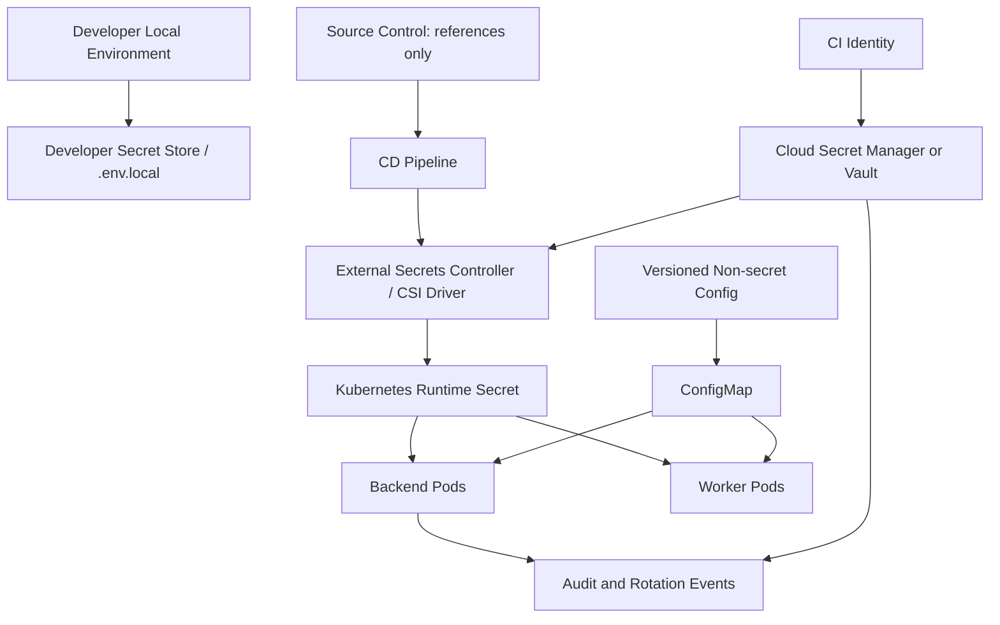
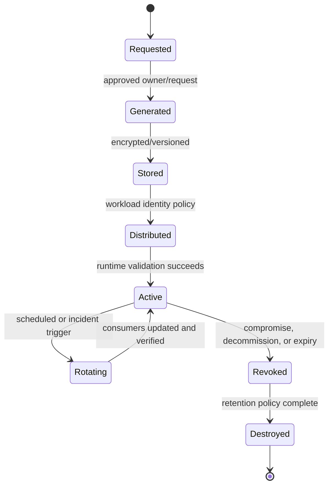
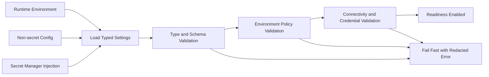

# E2 — Secrets Management & Configuration Implementation Specification

**Status:** Proposed implementation specification  
**Epic:** E2 — Secrets Management & Configuration  
**Priority:** P0 — external-production blocker  
**Source of truth:** `docs/SOFTWARE_ARCHITECTURE.md`, `docs/SECURITY_AUDIT.md`, `docs/PRODUCTION_READINESS.md`, `docs/IMPLEMENTATION_ROADMAP.md`, and `docs/specs/E1_IDENTITY_IMPLEMENTATION_SPEC.md`  
**Scope:** Secure configuration, secrets lifecycle, runtime injection, rotation, validation, deployment integration, and operational controls.  
**Out of scope:** Implementing application features unrelated to secret/configuration consumption.

## 1. Executive Summary

Enterprise-grade secrets management ensures that sensitive credentials are never hard-coded, never broadly distributed, are encrypted and access-controlled at rest and in transit, can be rotated without avoidable downtime, and are auditable throughout their lifecycle. Secure configuration complements this by making non-secret operational settings explicit, validated, versioned, environment-specific, and resistant to deployment drift.

The current codebase contains useful starting points—Pydantic settings, `.env` support, Docker/Kubernetes manifests, Kubernetes Secret references, non-root containers, and CI security scanning—but production credentials and usable default secrets are present in source-controlled configuration. Runtime settings are inconsistent across application code, CI, Docker Compose, Kubernetes, Helm, and Render. The application can start with unsafe defaults, and there is no managed secret lifecycle, rotation mechanism, or source-of-truth configuration hierarchy.

E2 establishes the security foundation required by E1 and every production epic. It replaces hard-coded and default secrets with managed, environment-scoped secret references; introduces strict configuration validation; defines secret ownership, lifecycle, rotation, and incident handling; and makes deployment artifacts use immutable configuration contracts.

**Success condition:** no production credential, signing key, private endpoint, or sensitive configuration value is committed to source control, embedded in an image, logged, exposed through a ConfigMap, or silently replaced by a development default.

## 2. Current Architecture

### 2.1 Current environment variable usage

The backend uses `pydantic-settings` in `backend/app/core/config.py`. Existing settings include environment name, API prefix, JWT secret, token durations, database URL, Redis URL, lockout controls, and metrics access controls. The settings class reads an `.env` file and ignores unknown environment fields.

The frontend uses Vite environment variables, most notably `VITE_API_BASE_URL`, from `frontend/src/lib/apiClient.ts`. Vite variables are build-time public values: any value prefixed with `VITE_` must be treated as non-secret.

### 2.2 Existing `.env` file posture

`.env` and common local environment-file variants are ignored by `.gitignore`. This is a positive baseline, but no versioned `.env.example`, environment schema, mandatory secret validation, local secret bootstrap process, or secret-scanning baseline is defined. The repository cannot demonstrate that developers use unique local secrets rather than copied production-like values.

### 2.3 Current secret storage locations

| Location | Current usage | Assessment |
|---|---|---|
| Backend `Settings` defaults | JWT secret and database URL/password defaults | Unsafe; usable defaults exist in source. |
| Root Docker Compose | PostgreSQL password in environment | Unsafe for any non-disposable environment. |
| Production Compose files | JWT, PostgreSQL, Grafana passwords in plaintext | Production blocker. |
| Kubernetes `Secret` manifest | Placeholder database/JWT/API-key values via `stringData` | Source-controlled secret pattern; unsafe if values become real. |
| Kubernetes `ConfigMap` | Database URL contains password | Secret is exposed through ConfigMap. |
| CI variables | Test secret uses `JWT_SECRET_KEY` | Inconsistent with application setting name `SECRET_KEY`; may be ignored. |
| Helm values | Image references, domains, resource values | No complete secret injection contract. |
| Frontend local state | Mock access/refresh tokens | Not a secret manager; insecure demo behavior addressed by E1. |

### 2.4 JWT signing-key management

The current JWT implementation signs HS256 tokens using `settings.SECRET_KEY`, which has a usable application default. There is no key identifier (`kid`), issuer/audience contract, key versioning, managed key store, rotation procedure, or validated overlap period. The deployment files also use inconsistent names (`SECRET_KEY`, `JWT_SECRET`, and CI `JWT_SECRET_KEY`).

### 2.5 Database and Redis credentials

- Development Compose uses fixed PostgreSQL credentials.
- Production Compose files contain fixed PostgreSQL credentials and a database URL in plaintext.
- Kubernetes `ConfigMap` contains a password-bearing database URL.
- Redis currently has no documented production authentication/TLS configuration in the reviewed manifests.
- The application has a SQLite fallback when database engine initialization fails, which is unsafe as a silent production fallback.

### 2.6 API keys and AI provider credentials

The project has models, provider-management modules, credential-vault concepts, connectors, and AI service architecture, but no unified documented secret contract for OpenAI, Anthropic, Gemini, Azure OpenAI, OpenRouter, OAuth providers, SMTP, webhooks, or encryption keys. The application currently contains mock/demonstration provider behavior in several areas. There is no demonstrated per-tenant key isolation, key rotation process, provider credential inventory, or usage-bound enforcement.

### 2.7 Docker configuration

Docker Compose and production Compose files use plaintext environment variables for stateful-service and application credentials. The backend Dockerfile runs non-root, which is good, but does not demonstrate a build-time/runtime secret boundary or BuildKit secret mounts. The frontend Docker build copies the repository context; without a `.dockerignore`, local artifacts or untracked secrets may be unintentionally added to the build context.

### 2.8 Kubernetes configuration

Kubernetes manifests reference an `aiflow-secrets` Secret, but `deploy/k8s/config.yaml` declares secret values using source-controlled `stringData`. It also puts `DATABASE_URL` with embedded credentials in a ConfigMap. Direct manifests and Helm values are not a single tested deployment source. No External Secrets, sealed-secrets workflow, workload identity, secret-store CSI driver, or certificate automation beyond ingress annotations is implemented.

### 2.9 Current weaknesses

| ID | Weakness | Severity | Impact |
|---|---|---|---|
| W1 | Usable JWT secret/default credentials in code and Compose | Critical | Token forgery, database/admin compromise. |
| W2 | Secret-bearing database URL in a ConfigMap | Critical | Broad Kubernetes read access can expose database credentials. |
| W3 | Source-controlled Kubernetes `stringData` secret pattern | Critical | Secrets can enter Git history and deployment logs. |
| W4 | Inconsistent secret names across app, CI, Compose, and Kubernetes | High | Settings may be ignored or deployments may start insecurely. |
| W5 | No fail-closed required-secret validation | High | Production can silently start with defaults. |
| W6 | No managed key rotation or versioning | High | Compromise response causes preventable downtime. |
| W7 | No defined AI/OAuth/provider credential lifecycle | High | Provider credential leakage and tenant cross-use risk. |
| W8 | Docker build context has no documented exclusion policy | High | Local `.env`, databases, caches, or credentials can enter images. |
| W9 | Redis production authentication/TLS posture is unspecified | High | Cache/session/queue data could be exposed. |
| W10 | Silent SQLite fallback | Medium | Production can operate against unintended local data store. |
| W11 | No configuration schema/version/drift control | Medium | Inconsistent deployment behavior and unsafe changes. |
| W12 | No secret expiry, rotation, or access monitoring | Medium | Expired/leaked credentials are detected late. |

## 3. Problems to Solve

### 3.1 Hard-coded secrets and weak defaults

Production-capable secrets must not appear in source, examples, Compose files, ConfigMaps, Docker image layers, test fixtures, or generated logs. A secret default that allows signing JWTs or connecting to an account is a secret leak even if it is labeled as a development default. Required production secrets must be absent from code and validated as present at runtime.

### 3.2 Secret leakage paths

The solution must address direct repository commits, Git history, CI logs, Docker contexts/layers, Kubernetes manifests, ConfigMaps, plaintext command lines, debug logging, exception output, metrics labels, audit logs, support bundles, backups, and browser builds. Vite build variables are explicitly public and cannot contain provider or signing credentials.

### 3.3 Missing validation and environment inconsistency

Current names and defaults differ across the backend, CI, Compose, and Kubernetes. The target platform needs one typed configuration contract with exact variable names, environment-specific requiredness, allowed values, validation errors, versioning, and compatibility rules.

### 3.4 Configuration drift

Direct manifests, Helm values, Docker Compose, Render configuration, and CI workflows can diverge. Drift changes security posture without application code changes. The target model needs one deployable source per environment, policy checks, rendered-manifest validation, and runtime configuration fingerprinting that does not expose secret values.

### 3.5 Rotation limitations and production deployment risks

Static HS256 signing keys, plaintext database passwords, and unversioned provider keys cannot be rotated safely. E2 must provide versioned keys, overlap periods, dual-read or reconnect behavior where needed, revocation processes, rollout health checks, and rollback procedures.

## 4. Target Architecture

### 4.1 Design principles

- Secrets are generated, stored, encrypted, versioned, and audited in an approved external secret manager.
- Source control contains only secret references, schemas, non-sensitive defaults, and examples with non-functional placeholders.
- Configuration is typed and validated before application readiness is reported.
- Production does not silently fall back to development secrets, local databases, insecure transports, or broad defaults.
- Applications receive only the secrets they need, at runtime, through workload identity and least-privilege policies.
- Secret values are never rendered in dashboards, logs, error responses, manifests, artifacts, or frontend bundles.

### 4.2 Environment hierarchy

| Environment | Purpose | Secret source | Rules |
|---|---|---|---|
| Local development | Individual developer productivity | Per-developer local store or ignored `.env.local` generated from approved bootstrap | No shared production secrets; local-only credentials; explicit `development` mode. |
| CI | Build, test, scan, ephemeral integration | CI secret store / ephemeral OIDC-issued credentials | Short-lived credentials; no production data; masked logs; isolated test tenant. |
| Test/QA | Shared functional testing | Managed non-production vault namespace | Synthetic data; scoped service accounts; rotation exercised. |
| Staging | Production-like verification | Managed staging vault namespace | Same schema/policy as production; distinct keys/accounts; no production credential reuse. |
| Production | Customer workloads | Managed production vault namespace and workload identity | Separate account/project, strict RBAC, audit trail, break-glass policy, HA/DR. |

### 4.3 Configuration hierarchy

Precedence is intentionally narrow and documented:

1. **Compiled-safe defaults:** only non-sensitive defaults that are safe in every environment.
2. **Versioned environment configuration:** Helm values/approved manifest parameters; no secrets.
3. **Runtime ConfigMap:** environment-specific non-secret operational configuration.
4. **Runtime secret injection:** secret manager values, highest precedence for secret fields only.
5. **Explicit local developer override:** allowed only in development and never used in CI/staging/production.

Configuration may not be overridden by arbitrary unknown environment variables. Every setting belongs to a declared schema and configuration version.

### 4.4 Secret lifecycle

Each secret has a machine-readable owner, classification, environment, creation source, version, rotation due date, consumers, and decommission date. Human access is minimized; emergency access is time-bound and audited.

### 4.5 Rotation policy

| Secret class | Routine rotation | Compromise response | Overlap/compatibility |
|---|---|---|---|
| JWT asymmetric signing keys | 90 days | Immediate new key; revoke/retire compromised private key | Publish old verification public key for bounded access-token window. |
| Database credentials | 90 days or provider policy | Immediate credential replacement | Dual-user/connection overlap; rolling reconnect. |
| Redis credentials | 90 days | Immediate replacement | ACL/user overlap where platform supports it. |
| AI/OAuth/provider keys | 60–90 days or provider policy | Immediate revocation and replacement | Per-provider dual-key cutover if supported. |
| Webhook secrets | 90 days | Immediate replace; verify signature grace policy | Accept current + previous only for defined window. |
| Encryption/KMS keys | Annual or managed policy | Provider-led emergency rotation | Envelope encryption/key-version support. |
| TLS certificates | Automated; renew before 30-day remaining lifetime | Reissue/revoke | Certificate manager manages overlap. |

### 4.6 Versioning strategy

- Secret-manager versions are immutable and tagged with status: `current`, `previous`, `pending`, `revoked`.
- Applications log only version identifiers/fingerprints, never values.
- Config schema has a semantic version. A deployed application declares the minimum/maximum supported config version.
- New settings use additive rollout, then mandatory enforcement after all consumers are upgraded.
- JWT signing keys use `kid`; provider/DB clients expose a non-sensitive credential version label for observability.

## 5. Secret Classification

| Classification | Secret | Purpose | Approved storage | Rotation | Owner | Maximum lifetime |
|---|---|---|---|---|---|---|
| Critical | JWT private signing key | Sign access tokens | HSM-backed cloud secret manager/KMS | 90 days | Security Platform | 90 days active, bounded verification overlap |
| Critical | Database password/credential | PostgreSQL access | Managed DB IAM/secret manager | 90 days | Data Platform | 90 days; prefer short-lived IAM auth |
| Critical | Encryption/pepper key | Protect credentials, sensitive data, password pepper | KMS/HSM; envelope encryption | Annual/policy | Security Platform | Per KMS policy |
| Critical | Kubernetes bootstrap/External Secrets credentials | Retrieve runtime secrets | Workload identity; no static token if possible | Provider-managed | Platform | Short-lived |
| High | Redis ACL password | Cache, session, queue access | Secret manager | 90 days | Platform | 90 days |
| High | OpenAI API key | AI inference | Per-environment/provider secret namespace | 60–90 days | AI Platform | Provider policy |
| High | Anthropic API key | AI inference | Per-environment/provider secret namespace | 60–90 days | AI Platform | Provider policy |
| High | Google Gemini key/service credential | AI inference | Cloud secret manager/service identity | 60–90 days | AI Platform | Provider policy |
| High | Azure OpenAI key/client secret | AI inference | Azure Key Vault/managed identity | 60–90 days | AI Platform | Provider policy |
| High | OpenRouter key | AI routing | Secret manager | 60–90 days | AI Platform | Provider policy |
| High | OAuth client secrets | Connector OAuth token exchange | Secret manager, per connector/environment | 90 days | Integrations | 90 days/provider policy |
| High | SMTP/API mail credential | Transactional email | Secret manager | 90 days | Platform | 90 days |
| High | Webhook signing secret | Authenticate inbound webhooks | Secret manager, tenant/connector scope | 90 days | Integrations | 90 days |
| High | Grafana/monitoring admin credential | Monitoring administration | Secret manager | 90 days | SRE | 90 days |
| Medium | TLS private key | HTTPS termination | Certificate manager/Kubernetes certificate secret | Automated | Platform | Certificate validity period |
| Medium | Third-party service endpoint token | Service integration | Secret manager | Provider policy | Service owner | Provider policy |
| Medium | Feature-flag provider SDK key | Feature flag evaluation/admin | Secret manager (server key); public key only where vendor permits | 90 days | Platform/Product | 90 days |
| Low | Public API base URL | Browser/API routing | Versioned config/ConfigMap/Vite public build variable | On change | Platform | N/A |
| Low | Feature-flag values | Non-sensitive behavior toggles | Config service/ConfigMap | On change | Product/Platform | N/A |
| Low | Log level and resource limits | Operational behavior | Versioned config/ConfigMap | On change | SRE | N/A |

**Tenant-supplied credentials:** customer-provided provider keys, OAuth tokens, and webhook secrets are High/Critical depending on capability. They require envelope encryption with a tenant-scoped data-encryption key reference, strict access policy, masking, audit logs, explicit use scopes, and deletion/rotation workflows. They must not be placed in shared environment variables.

## 6. Configuration Architecture

### 6.1 Application configuration

Application settings are grouped by domain and type:

| Domain | Examples | Secret? | Source |
|---|---|---:|---|
| Runtime | environment, region, service name, log level | No | ConfigMap/versioned values |
| HTTP | allowed origins, trusted proxies, request limits, cookie policy | No | ConfigMap/versioned values |
| Database | host, database name, pool budget, SSL mode | Mixed | Endpoint config + secret credential reference |
| Redis | host, database, TLS mode, timeouts | Mixed | Endpoint config + secret credential reference |
| Identity | issuer, audience, token TTLs, signing key reference | Mixed | Config + secret reference |
| Provider | provider enablement, endpoint, model allowlist, credential reference | Mixed | Config + secret reference |
| Observability | endpoint, sampling, metrics access policy | Mixed | Config + secret reference |
| Feature flags | flag keys/defaults | No unless vendor admin key | Config service/secret manager as appropriate |

### 6.2 Infrastructure configuration

Infrastructure configuration defines images by digest, replica ranges, resource limits, network policy, ingress hosts, DNS, storage classes, retention, managed-service endpoints, and secret references. It never embeds secret values. Infrastructure changes are version-controlled, reviewed, policy-checked, and rendered/tested before promotion.

### 6.3 Environment configuration

Each environment has a separate account/project/vault namespace and separate credentials. Staging matches production configuration structure, but never shares production values. The environment name, region, and configuration version must be visible in a non-sensitive startup diagnostic and health endpoint.

### 6.4 Runtime configuration

Pods receive non-secret settings from ConfigMaps and secrets through External Secrets or a CSI-mounted secret volume. Applications load secrets at startup and, where supported, reload rotation-safe secrets through a controlled watcher/reconnect mechanism. Secret refresh does not imply arbitrary runtime configuration mutation; immutable deployment configuration changes require a rollout.

### 6.5 Feature flags

Feature flags are configuration, not an authorization mechanism. Flags must be tenant-aware, auditable, expire after use, default safely, and never expose sensitive values to browsers. Server-side flag provider credentials remain secrets; client-side SDK keys may be public only when the vendor explicitly designates them as such.

### 6.6 Tenant configuration

Tenant configuration is stored in the tenant-scoped database/configuration service, validated against an allowlisted schema, audited, and separated from platform environment configuration. Tenant configuration cannot override security policy, infrastructure endpoints, internal service discovery, or other tenants' settings. Tenant secrets use encrypted credential-vault records, not environment variables.

### 6.7 Service discovery

Internal service names, DNS, ports, and TLS mode are non-secret configuration. Workloads use private DNS/service discovery, mTLS where required, explicit timeouts, and network policies. Discovery configuration must not include credentials inside URLs; credentials are injected separately.

### 6.8 Validation

Validation has four layers:

1. Static schema validation in CI for manifests, Helm values, and configuration files.
2. Startup validation of required/allowed settings, types, secret references, and environment invariants.
3. Readiness validation of real dependencies through authenticated TLS connections.
4. Runtime verification and drift monitoring with non-sensitive version/fingerprint telemetry.

## 7. Backend Design

### 7.1 Configuration loading

Replace the single flat settings model with typed domain settings composed into an immutable application configuration object. Each setting declares type, environment applicability, sensitivity, default policy, validation rule, and documentation reference. Unknown critical variables fail validation rather than being silently ignored.

### 7.2 Validation pipeline

### 7.3 Secret injection and dependency injection

- Application code receives typed interfaces, such as a `DatabaseCredentialProvider`, `SigningKeyProvider`, or `AIProviderCredentialResolver`, rather than reading raw environment variables throughout business logic.
- The composition root loads secret references once, validates them, constructs secure clients, and injects those clients/services into routes and engines.
- Secret values must be held only as long as required, masked in debug representations, and excluded from exception contexts.

### 7.4 Fallback strategy

Production and staging fail closed if a required secret, required secure transport, required managed service, or valid configuration version is missing. The SQLite fallback is permitted only in explicit local development/test profiles and must be impossible when `ENVIRONMENT` is staging or production. Redis/cache fallback behavior must be endpoint-specific and must not bypass session, rate-limit, queue, or revocation security controls.

### 7.5 Startup validation

Before readiness becomes healthy, the application verifies:

- environment is recognized and supported;
- required secret references are injected and non-placeholder;
- signing key/certificate parses and has an active key ID;
- database and Redis connections use required transport/authentication;
- critical endpoint URLs use approved schemes;
- CORS, trusted-proxy, metrics, and cookie settings meet environment policy;
- configured provider credentials resolve only for enabled providers;
- configuration schema version is compatible.

### 7.6 Runtime validation and error handling

Runtime credential failures are classified as configuration, authentication, authorization, or dependency failures. The API returns generic service errors and records correlation ID, secret reference/version identifier, provider/service name, and safe failure reason. It never logs raw secret values. Liveness remains focused on process health; readiness fails for unavailable critical dependencies; dependency-specific health checks expose only safe status.

## 8. Infrastructure Design

### 8.1 Docker secrets and Docker Compose

Local Compose may use an ignored local environment file or Docker Compose `secrets` for local-only values. Production secrets must not be supplied in Compose plaintext environment blocks. If Compose is retained for internal environments, it must consume an externally generated secret file excluded from Git and validate its required entries before start.

Docker builds must use BuildKit secret mounts only for unavoidable private dependency access and must not copy secrets into image layers. A `.dockerignore` must exclude `.env*`, local databases, logs, caches, build outputs, VCS metadata as appropriate, and credential files.

### 8.2 Kubernetes Secrets and ConfigMaps

| Resource | Allowed content | Prohibited content |
|---|---|---|
| ConfigMap | Non-sensitive runtime configuration, endpoints without credentials, feature defaults, resource/timeout settings | Passwords, private keys, bearer tokens, credential-bearing URLs, customer secrets. |
| Kubernetes Secret | Runtime materialized secret values only; created by controller/CSI integration | Source-controlled real values, long-lived cluster-admin credentials, tenant credential bulk store. |
| Pod spec | Secret references, mounted paths, identity bindings | Literal sensitive values, values in command lines, broad `envFrom` without review. |

### 8.3 Sealed Secrets, External Secrets, and CSI

The preferred production pattern is **External Secrets Operator** or a cloud secret-store CSI driver using workload identity. This permits source-controlled references without source-controlled values. Sealed Secrets are acceptable only where no external manager exists, with strict key custody and rotation; they are not the preferred primary store for high-value production credentials.

### 8.4 HashiCorp Vault integration

Vault is suitable for cloud-neutral or hybrid deployments. The recommended integration uses Kubernetes auth, per-service policies, dynamic PostgreSQL credentials, transit encryption for tenant-supplied credentials, short leases, audit devices, and automated renewal/revocation. Vault must be HA, backed up, monitored, and isolated from application namespaces.

### 8.5 Cloud secret managers

Where a single cloud is used, select the native managed service:

| Cloud | Preferred service | Identity mechanism |
|---|---|---|
| AWS | AWS Secrets Manager / Parameter Store + KMS | IRSA / EKS Pod Identity |
| Azure | Azure Key Vault | Managed Identity / Workload Identity |
| Google Cloud | Secret Manager + Cloud KMS | Workload Identity Federation |

Managed secret access must be granted to service-specific identities, scoped to exact secret paths and environments. Human administrator access must use MFA, just-in-time privileges, and audit logging.

### 8.6 Certificate management

TLS certificates use cert-manager or a cloud certificate manager, with DNS/ACME automation, monitored renewal, private-key protection, and certificate inventory. Ingress terminates TLS using managed certificate references. Internal mTLS is evaluated for database/service traffic according to threat model and compliance requirements.

## 9. AI Provider Configuration

### 9.1 Provider credential model

Provider configuration is split between non-secret policy and secret credential material.

| Provider | Non-secret configuration | Secret material | Preferred identity approach |
|---|---|---|---|
| OpenAI | Allowed models, endpoint, timeout, quota policy | API key | Environment/provider secret, optional tenant vault key |
| Anthropic | Allowed models, endpoint, timeout, quota policy | API key | Environment/provider secret, optional tenant vault key |
| Google Gemini | Model policy, project/region, endpoint | API key or service credential | Workload identity/service account preferred |
| Azure OpenAI | Deployment/model mapping, endpoint, API version | API key or managed identity configuration | Managed identity preferred where available |
| OpenRouter | Model routing policy, endpoint, cost policy | API key | Environment/provider secret, optional tenant vault key |
| Local LLMs | Model allowlist, endpoint, resource/tenant limits | Optional service token/mTLS key | Kubernetes service identity and private network |

### 9.2 Provider switching

Provider selection must use an allowlisted provider registry and policy configuration. It must not accept arbitrary provider endpoints or credential references from users. Switching evaluates availability, cost, data-residency, model capability, tenant policy, and rate limits. Provider credentials are resolved server-side only and never returned to the browser or embedded in workflow definitions.

### 9.3 Key rotation, rate limiting, and tenant isolation

- Support `current` and `next` provider key versions where the provider permits dual keys.
- Enforce global, provider, tenant, workspace, and user quotas before issuing provider requests.
- Tenant-provided keys are encrypted separately, scoped to the owner tenant/workspace, masked in all API responses, and require explicit permission to use/rotate/delete.
- AI telemetry records provider name, model, credential version identifier, tenant, cost, and safe status—not raw prompts, keys, or sensitive outputs.
- A provider-key compromise revokes its version, disables dependent routes/workflows safely, alerts owners, and initiates rotation/replay review.

## 10. Deployment Strategy

### 10.1 Development

Developers use a documented bootstrap command that creates unique local secrets and a local non-production profile. Development uses only local/test providers, isolated databases, and non-production email sinks. The application visibly identifies development mode and refuses a known production domain or production secret-manager path.

### 10.2 CI and testing

CI obtains short-lived cloud credentials through OIDC where possible. Test secrets are generated per run or fetched from a dedicated test namespace. CI masks output, scans for secrets, validates rendered manifests, tests missing/invalid configurations, and destroys ephemeral credentials/environments after use.

### 10.3 Staging

Staging uses the same configuration schema, External Secrets mechanism, Kubernetes identity pattern, TLS path, and startup checks as production, but separate secret namespaces/accounts and synthetic data. Rotation and rollback rehearsals happen in staging before production.

### 10.4 Production

Production uses a separate cloud account/project, managed secret store, workload identity, strict namespace/network boundaries, immutable image digests, and change-controlled deployment. A deployment cannot become ready until required secret/config validation passes. No interactive human secret injection occurs during normal releases.

### 10.5 Promotion, rollback, and disaster recovery

Configuration and secret references promote with versioned release artifacts, never by copying values between environments. Rollback restores the prior application/config reference and, when needed, prior compatible secret version; it never reactivates a known compromised secret. Disaster recovery restores secret-manager metadata, access policies, KMS keys, and certificate issuance capability as part of the platform DR plan.

## 11. Security Design

| Control | Required design |
|---|---|
| Secret rotation | Scheduled by class, tested in staging, monitored, and immediately triggered by suspected compromise. |
| Encryption at rest | Cloud secret manager/Vault encryption; KMS/HSM-backed keys; envelope encryption for tenant credentials. |
| Encryption in transit | TLS to secret manager, database, Redis, providers, and ingress; mTLS where threat model requires it. |
| RBAC | Separate platform, security, CI, app, worker, and human roles; per-secret-path permissions. |
| Least privilege | Workload identity grants only exact read/use paths; no broad namespace or wildcard production access. |
| Secret scanning | Pre-commit, pull request, branch protection, CI, container/image, artifact, and history remediation workflow. |
| Git protection | Protected branches, code owners for deploy/security files, signed commits where required, no plaintext production values. |
| Supply chain | OIDC CI identity, locked dependencies, signed images, SBOM, provenance, admission verification. |
| Key revocation | Version status, consumer inventory, alerting, emergency runbook, blast-radius assessment, forced session revocation for JWT-key compromise. |
| Incident response | Detect, contain, rotate, revoke, validate, communicate, and document; preserve evidence without exposing values. |
| Audit logging | Secret read/modify/rotate/access-policy events centralized and retained; application logs only safe identifiers. |

## 12. Validation Strategy

### 12.1 Environment variable validation

Every environment variable is declared in a typed schema with: name, type, sensitivity, allowed environments, default policy, validation rule, and owner. Production rejects unknown security-sensitive aliases such as `JWT_SECRET_KEY` when the approved field is `AUTH_SIGNING_KEY_REF`; aliases are supported only during a documented migration window and emit safe warnings/metrics.

### 12.2 Required-secret validation

The application verifies that required secret references resolve, values are non-empty/non-placeholder, expected key material parses, versions are active, and credentials can authenticate to required dependencies. Values are not printed. The only emitted data is a safe secret reference/version ID and failure class.

### 12.3 Configuration schema validation

CI validates Helm/manifest values against JSON Schema or equivalent. Rendered deployment manifests are policy-checked to ensure ConfigMaps contain no credential patterns, workloads use approved secret references, image tags are immutable, and containers do not pass secrets as command-line arguments.

### 12.4 Startup, health, and runtime verification

| Stage | Checks | Failure behavior |
|---|---|---|
| Startup | Schema, required secret references, key parsing, environment invariants | Fail process before readiness. |
| Readiness | Authenticated TLS connectivity to critical DB/Redis/secret-dependent services | Pod remains unready. |
| Liveness | Process/event-loop health only | Restart only when process unhealthy. |
| Runtime | Credential expiry, provider auth failures, secret/version drift | Alert, degrade only non-critical features, rotate/reconnect per policy. |

## 13. File-Level Implementation Plan

This is a design inventory only. It does not generate code or authorize modifications in this task.

### 13.1 Backend files

| File | Purpose | Reason | Dependencies | Expected implementation |
|---|---|---|---|---|
| `backend/app/core/config.py` | Application settings | Current usable defaults and flat/inconsistent names | E2.1, E2.2 | Typed domain settings, secret references, environment policy, fail-closed validation. |
| `backend/app/core/database.py` | Database setup | Credentials/SSL/fallback behavior need secure policy | E5.1–E5.3 | Separate endpoint and credential config, TLS/pool validation, no production SQLite fallback. |
| `backend/app/core/security.py` | JWT/crypto helpers | Must consume managed/versioned key provider | E1.3, E2.1 | Signing-key provider interface, `kid` support, no default signing key. |
| `backend/app/api/metrics.py` | Metrics access | Current controls can fail open | E2.2, E2.3 | Required production auth/network policy settings and safe diagnostics. |
| `backend/app/main.py` | Startup lifecycle | Must perform startup/readiness validation | E2.2, E2.3 | Configuration validation, dependency checks, safe failure behavior. |
| `backend/app/ai/provider_manager.py` | AI providers | Provider credentials need managed resolution | E2.1, E9.1 | Provider registry, credential references, version-safe reload, tenant policy. |
| `backend/app/ai/agent_runtime.py` | AI execution | Enforce provider policy and safe telemetry | E9.1 | Server-side credential resolution and quota/error handling. |
| `backend/app/connectors/*` | Integrations | OAuth/webhook secrets require secure lifecycle | E2.1, E13.3 | Credential-vault interfaces, secret references, masking, rotation hooks. |
| `backend/app/core/security_vault.py` | Credential vault | Tenant secret encryption boundary | E2.1, E9.1 | KMS/Vault-backed envelope encryption, key versioning, audit events. |
| `backend/app/logging/logger.py` | Structured logs | Prevent configuration/secret leakage | E8.2 | Redaction filter and safe configuration fingerprint fields. |
| `backend/app/logging/audit_logger.py` | Audit events | Track secret/config lifecycle safely | E8.2 | Central audit sink, secret reference/version event schema. |
| `backend/app/schemas/*` | API contracts | Prevent secret exposure in DTOs | E1, E9.1 | Write-only secret request fields and masked metadata responses. |

### 13.2 Frontend files

| File | Purpose | Reason | Dependencies | Expected implementation |
|---|---|---|---|---|
| `frontend/src/lib/apiClient.ts` | API base URL | Vite configuration must remain public-only | E2.2 | Validate public URL at build/runtime; no secret values or fallback to production endpoints. |
| `frontend/vite.config.ts` | Build configuration | Separate public configuration from secrets | E2.2, E10.1 | Define approved public build variables and build-time validation. |
| `frontend/src/modules/admin/pages/CredentialVaultPage.tsx` | Credential UI | Must not expose/store raw credentials after submission | E13.3 | Masking, write-only workflows, rotation state, permission-aware UX. |
| `frontend/src/modules/integrations/components/OAuthWizardModal.tsx` | OAuth setup | Secure connector credential flow | E13.3 | Redirect/state/PKCE flow; no client-secret handling in browser. |
| `frontend/src/modules/auth/*` | Identity UI | Supports E1 cookie/session and public config | E1.2, E12.1 | No mock values, safe error handling, explicit environment-safe API routing. |

### 13.3 Docker and Compose files

| File | Purpose | Reason | Dependencies | Expected implementation |
|---|---|---|---|---|
| `.dockerignore` (new) | Build-context protection | Prevent local secrets/artifacts entering image context | E2.1 | Exclude `.env*`, databases, logs, caches, VCS and credential files. |
| `backend/Dockerfile` | Backend image | Establish build/runtime secret boundary | E2.1, E10.2 | BuildKit secret mount policy, non-secret runtime configuration, no copied credentials. |
| `frontend/Dockerfile` | Frontend image | Ensure only public Vite config is built in | E2.2 | Public build variable validation and restricted build context. |
| `docker-compose.yml` | Local stack | Remove fixed shareable credentials | E2.1 | Local secret-file/references, generated dev credentials, explicit development profile. |
| `deploy/docker-compose.prod.yml` | Production-like Compose | Contains plaintext production credentials | E2.1 | Replace values with external secret references or retire as non-production artifact. |
| `deploy/docker-compose.production.yml` | Production-like Compose | Contains plaintext JWT/DB/Grafana secrets | E2.1 | Replace values with secret injection; document unsupported production use if retained. |

### 13.4 Kubernetes, Helm, and infrastructure files

| File/group | Purpose | Reason | Dependencies | Expected implementation |
|---|---|---|---|---|
| `deploy/k8s/config.yaml` | Secrets/ConfigMap | Currently stores secret patterns and credential URL | E2.1, E2.2 | Remove values; define references and non-secret ConfigMap only. |
| `deploy/k8s/backend.yaml` | Backend workload | Secret injection and identity policy | E2.1, E7.2 | Service account/workload identity, precise secret refs, no broad `envFrom` where avoidable. |
| `deploy/k8s/workers.yaml` | Worker workload | Same secret/identity control | E2.1, E6.1, E7.2 | Dedicated worker identity and exact provider/queue secret access. |
| `deploy/k8s/redis.yaml` | Redis deployment | Add credential/TLS reference pattern | E2.1, E5.1 | Managed service reference or secure ACL/TLS secret consumption. |
| `deploy/k8s/postgres.yaml` | Database deployment | Prevent static credential handling | E5.1 | Prefer managed DB; otherwise operator-managed secret integration. |
| `deploy/k8s/ingress.yaml` | TLS ingress | Certificate references/secure headers | E2.3, E7.2 | cert-manager/certificate manager integration and secure annotations. |
| `deploy/k8s/monitoring.yaml` | Monitoring deployment | Grafana currently has default admin password | E2.1 | Managed admin credentials and secret references. |
| `deploy/helm/Chart.yaml` | Helm dependencies | Define approved secret integration dependencies | E2.1, E7.1 | External Secrets/managed service strategy and pinned chart provenance. |
| `deploy/helm/values.yaml` | Environment values | Separate public config from references | E2.2 | Schema-backed non-secret values, secret-ref names only, immutable image digest support. |
| `deploy/terraform/main.tf` | Cloud infrastructure | Provision secret manager/KMS/identity policies | E2.1, E7.2 | Managed secret store, encryption keys, workload identity, private endpoints, audit logging. |

### 13.5 CI/CD and documentation files

| File/group | Purpose | Reason | Dependencies | Expected implementation |
|---|---|---|---|---|
| `.github/workflows/ci.yml` | CI gates | Enforce secret/config validation | E2.4, E10.1 | OIDC credentials, secret scanning, manifest policy, no leaked test settings. |
| `.github/workflows/cd-production.yml` | Promotion/deployment | Use managed runtime references | E2.1, E10.2 | Environment-scoped identity, rendered manifests, config validation, artifact provenance. |
| `.github/workflows/deploy.yml` | Deployment checks | Eliminate plaintext/test drift | E2.2, E10.3 | Correct settings names, ephemeral credentials, post-deploy validation. |
| `.github/workflows/backend.yml` | Backend CI | Test secure configuration behavior | E2.2 | Missing/invalid secret tests and proper test secret injection. |
| `.github/workflows/frontend.yml` | Frontend CI | Prevent secret public-build leakage | E2.2 | Validate approved `VITE_` variable allowlist. |
| `.env.example` (new) | Developer contract | Provide safe local bootstrap | E2.2 | Placeholder-only documented variables; no values capable of production access. |
| `docs/*` deployment/security guides | Operational documentation | Keep runbooks aligned with implementation | E2.1–E2.4 | Secret lifecycle, access, rotation, incident, and local setup guidance. |

## 14. Migration Strategy

### 14.1 Migration from current configuration

1. Inventory all code/configuration values, consumers, environments, and owners.
2. Classify every value as secret or non-secret; identify values already present in Git history, images, logs, or CI output.
3. Treat committed/default credentials as compromised and rotate them before enabling external access.
4. Create managed secret paths and workload policies for each environment.
5. Introduce typed settings that support current names only through a time-bound compatibility map with telemetry.
6. Deploy secret references and validation in staging; ensure application does not select SQLite or insecure defaults in production profile.
7. Promote to production with canary workloads; observe safe fingerprints and dependency authentication.
8. Remove legacy names, default values, plaintext Compose values, and source-controlled Secret payloads after cutover.

### 14.2 Zero-downtime rollout

- Use versioned/dual credentials where the dependency supports overlap.
- Add a new database/Redis user/key before revoking the old one; roll pods gradually; verify connection success; then revoke the previous version.
- JWT key rotation publishes a new signing `kid` while validators retain prior public keys only until all old access tokens expire.
- Provider key rotation uses `current`/`next` references, health checks, and controlled fallback only to approved providers.
- Never rotate a shared credential without first mapping every consumer, including workers, jobs, local operational scripts, and monitoring integrations.

### 14.3 Backward compatibility and rollback

New configuration is additive first. Applications understand both current and previous non-secret config versions during migration. Rollback points to the prior approved secret version only when it is not compromised; otherwise use a newly generated replacement. Rollback must not restore a plaintext secret to Git, ConfigMap, or image layer.

## 15. Testing Strategy

### 15.1 Unit tests

- Typed setting parsing, invalid type/format rejection, mandatory field behavior, environment policy invariants.
- Secret redaction in logs, exceptions, diagnostics, and model representations.
- Key version selection, signing-key parsing, provider credential resolver behavior, and cached client invalidation.
- Feature-flag and tenant configuration schema validation.

### 15.2 Integration tests

- Start application with injected test secrets and validate readiness.
- Verify failure when a required secret is missing, placeholder, expired, malformed, or unauthorized.
- Test authenticated TLS connections to ephemeral PostgreSQL/Redis/provider mocks.
- Ensure production profile rejects SQLite fallback and insecure transports.
- Test External Secrets/CSI/Vault secret materialization in a Kubernetes integration environment.

### 15.3 Secret rotation tests

- JWT `kid` overlap and retirement.
- Database and Redis dual-credential rolling reconnect.
- AI provider current/next key cutover and immediate revoked-key behavior.
- Webhook secret current/previous signature window.
- Token/session invalidation following signing-key compromise.

### 15.4 Deployment and security tests

- Rendered manifest scan rejects secret-like ConfigMap fields and plaintext values.
- Docker build context inspection proves `.env`, local DB, and credentials are excluded.
- CI secret scanning detects seeded canary secrets without printing them.
- RBAC tests prove workload identities cannot read unrelated secret paths.
- Supply-chain checks verify signed images, SBOM, provenance, and immutable image references.

### 15.5 Chaos and recovery tests

- Secret-manager/Vault outage behavior: fail readiness for critical startup requirements and degrade non-critical providers safely.
- Expired credential and revoked-key simulation with alert confirmation.
- External Secrets controller delay/failure and pod restart behavior.
- Restore secret-manager configuration, KMS keys, policies, and certificates in a DR exercise.
- Region failover verifies application can resolve the secondary environment's secrets without cross-environment access.

## 16. Monitoring Strategy

### 16.1 Metrics and dashboards

| Signal | Purpose | Alert condition |
|---|---|---|
| Secret expiry remaining | Avoid surprise expiry | Critical secrets below defined renewal threshold. |
| Rotation success/failure | Confirm lifecycle health | Failed rotation, consumer validation failure, or overdue rotation. |
| Secret-manager/Vault availability and latency | Detect dependency outage | SLO breach or authentication failures. |
| Configuration schema/version | Detect incompatible deployment | Unsupported or mixed config versions. |
| Drift fingerprint | Detect unexpected non-secret configuration changes | Runtime fingerprint differs from approved release. |
| Provider credential failures | Detect provider/key problems | Auth failure/error-rate spike by provider/version. |
| Secret access/audit events | Detect suspicious use | Unusual principal/path/time/volume or denied access spike. |
| Certificate expiry | Maintain TLS availability | Certificate within renewal threshold or failed issuance. |

### 16.2 Audit dashboards and incident alerts

Security/SRE dashboards show secret access by principal/environment/path classification, rotations due/overdue, failed secret resolution, application startup validation failures, configuration drift, signing-key versions in use, provider auth failures, and certificate state. Alerts route to named owners with runbooks and severity based on secret class. Raw secret names may be shown only where they do not disclose sensitive customer/provider details; values are never shown.

## 17. Acceptance Criteria

E2 is accepted only when all measurable criteria are satisfied:

1. No usable production secret, password, private key, token, credential-bearing URL, or default signing key is present in source-controlled files, Git history remediation scope, Docker image layers, ConfigMaps, or CI logs.
2. All production/staging secrets are stored in an approved managed secret system and accessed only through workload identity or tightly scoped CI identity.
3. Every runtime configuration field is declared in a typed schema with sensitivity, validation, owner, and environment policy.
4. Production startup fails before readiness when required secrets, approved transports, key material, or configuration invariants are invalid or missing.
5. Production cannot fall back to SQLite, default JWT signing keys, plaintext provider keys, or unauthenticated Redis for security-critical workloads.
6. Database, Redis, JWT, provider, webhook, and monitoring credentials have documented owners, rotation schedules, current versions, and tested rotation runbooks.
7. Kubernetes ConfigMaps contain no credentials; Kubernetes Secrets are materialized from approved external sources rather than committed values.
8. Frontend builds contain only explicitly approved public configuration; CI rejects secret-prefixed Vite values.
9. CI performs required secret scanning, configuration schema validation, rendered-manifest policy checks, dependency/container scanning, and provenance/SBOM generation.
10. Rotation, missing-secret, revoked-key, secret-manager outage, and restore tests pass in production-like staging.
11. Monitoring provides expiry, rotation, drift, access, and provider-credential alerts with documented owners and runbooks.
12. Security and platform owners formally approve the secret inventory and emergency revocation process.

## 18. Risks

| Risk | Type | Level | Impact | Mitigation |
|---|---|---|---|---|
| Committed credentials may already be copied outside the repository | Security | Critical | Ongoing unauthorized access after code cleanup | Rotate, revoke, search history/artifacts, investigate access logs, document incident response. |
| Secret-manager outage blocks deployments or runtime | Operational | High | Authentication/dependency outage | HA secret manager, cached validated credentials with strict bounds, readiness policy, tested outage behavior. |
| Misconfigured rotation breaks consumers | Technical | High | Broad service outage | Consumer inventory, dual-key overlap, staged rotation, canary validation, rollback runbook. |
| Overly broad workload identity policy | Security | High | Cross-service/tenant secret exposure | Per-service account, exact paths, policy review, audit alerts, periodic access review. |
| External secret solution adds platform complexity | Operational | Medium | Delivery delay or operator error | Choose managed native service where possible; standardize templates/runbooks/training. |
| Configuration validation is too strict initially | Technical | Medium | Staging rollout failures | Additive schema, compatibility window, clear redacted error messages, rollout pilots. |
| Tenant-provided credentials create compliance burden | Security | High | Data exposure or deletion/rotation failures | Envelope encryption, scoped access, lifecycle APIs, audit trail, retention/deletion policy. |
| CI secrets leak through logs or third-party actions | Supply chain | High | Credential compromise | OIDC short-lived credentials, action pinning, masking, minimal permissions, log review. |

## 19. Estimated Timeline

E2 is an XL P0 epic and should run in parallel with E1 identity work and E5 data-platform work. A dedicated platform/security/backend team should complete the foundation in **four to six weeks**, with ongoing rotation/monitoring work continuing thereafter.

| Week | Workstream | Effort | Deliverables |
|---|---|---|---|
| 1 | Discovery and containment | L | Complete inventory, classify values, rotate exposed credentials, select secret manager, create incident/remediation plan. |
| 2 | Architecture and schemas | L | Typed configuration contract, naming standards, environment hierarchy, workload identity design, migration plan. |
| 3 | Runtime integration | XL | Secret-manager integration, startup validation, managed key/provider/database credential interfaces, secure Docker policy. |
| 4 | Deployment integration | L | External Secrets/CSI/Vault integration, Helm/Kubernetes references, ConfigMap cleanup, CI OIDC and scans. |
| 5 | Rotation and observability | L | Rotation workflows, key-version support, alerting/dashboards, audit streams, staging rotation test. |
| 6 | Validation and enforcement | L | Chaos/recovery tests, production canary, legacy configuration retirement, formal security/platform sign-off. |

**Staffing assumption:** one platform/SRE engineer, one security engineer, one backend engineer, CI/CD support, and application owners for AI/integrations/database consumers. Delayed managed-service access, certificate/DNS ownership, or credential inventory gaps will extend the schedule.

## 20. Definition of Done

E2 is complete when:

- The acceptance criteria are met with evidence from CI, staging, and production readiness reviews.
- All Critical and High secret/configuration findings in `SECURITY_AUDIT.md` are closed or have a formally approved, time-bound exception.
- Managed secret storage, workload identity, typed configuration validation, strict startup readiness, and environment isolation are operating in staging and production.
- No application, worker, CI job, Docker image, Kubernetes ConfigMap, or frontend bundle uses plaintext production credentials or unsafe defaults.
- Rotation runbooks for JWT keys, database/Redis credentials, AI/provider keys, webhook secrets, and certificates are tested and owned.
- Drift/expiry/access monitoring is active and linked to actionable incident runbooks.
- Migration/rollback procedures are exercised without exposing or restoring compromised values.
- Security, platform, data, and AI/integrations owners approve the inventory, access model, and operational handoff.

