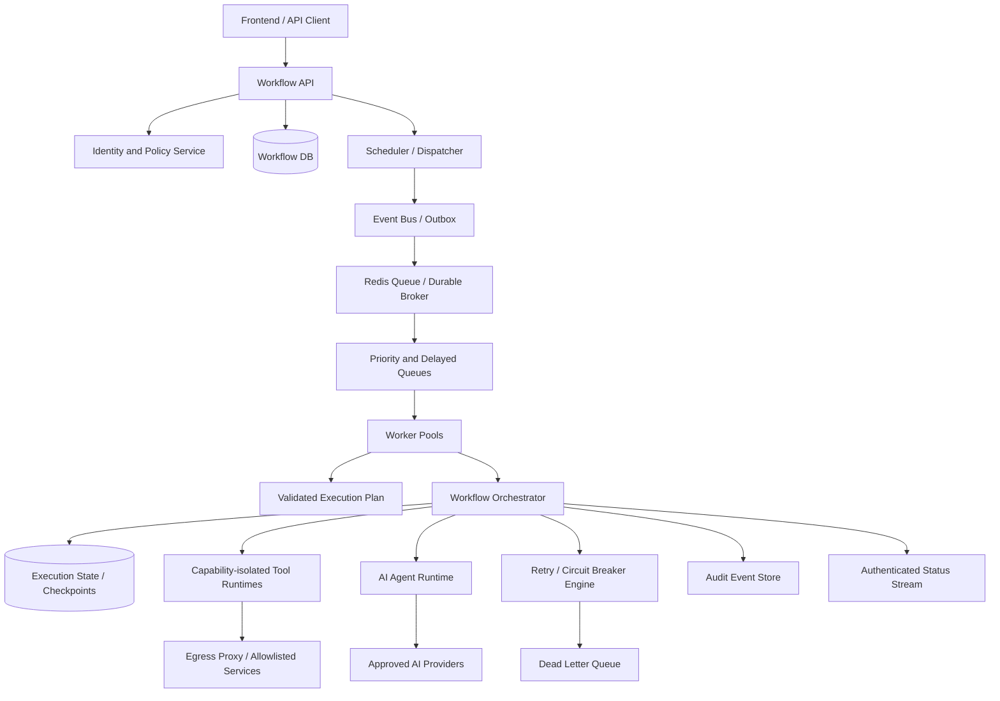
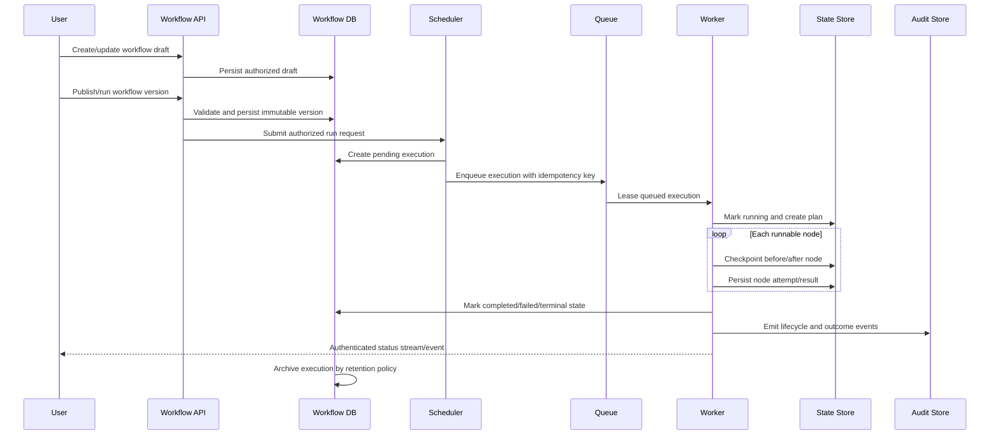
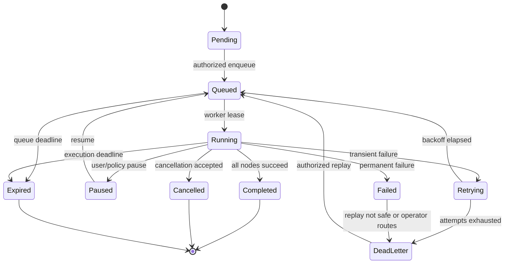
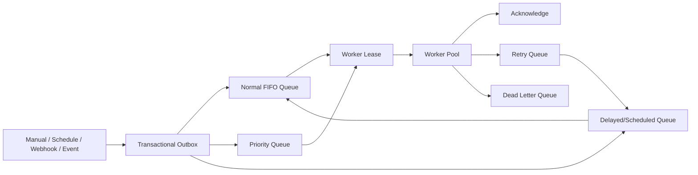
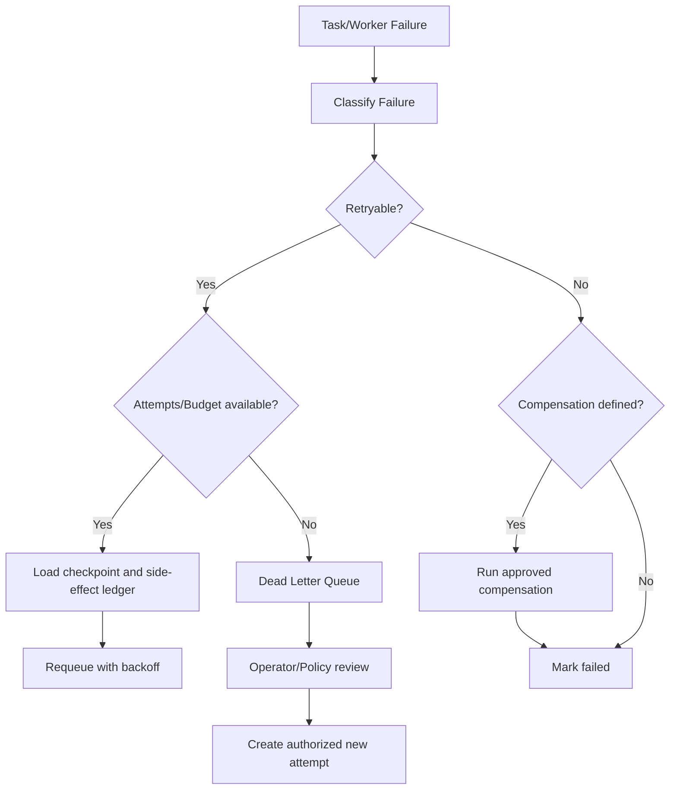

# E3 — Workflow & AI Execution Safety Implementation Specification

**Status:** Proposed implementation specification  
**Epic:** E3 — Workflow and AI Execution Safety  
**Priority:** P0 — external-production blocker  
**Source of truth:** `docs/SOFTWARE_ARCHITECTURE.md`, `docs/SECURITY_AUDIT.md`, `docs/PRODUCTION_READINESS.md`, `docs/IMPLEMENTATION_ROADMAP.md`, `docs/specs/E1_IDENTITY_IMPLEMENTATION_SPEC.md`, and `docs/specs/E2_SECRETS_IMPLEMENTATION_SPEC.md`  
**Scope:** Secure workflow compilation, distributed execution, AI-agent orchestration, tool isolation, durable state, retries, recovery, quotas, and auditability.  
**Out of scope:** Building new connector business logic or changing unrelated product modules.

## 1. Executive Summary

AIFlow workflows combine user-authored graphs, external APIs, AI agents, code-like tools, files, credentials, and long-running asynchronous work. At enterprise scale, execution must be safe even when a workflow is malformed, a prompt is adversarial, a provider is unavailable, a worker crashes, or a tenant submits a workload exceeding its limits.

The current workflow implementation demonstrates a DAG compiler, node runner abstraction, sequential execution engine, WebSocket status broadcasting, and AI/provider integration points. However, background task modules are placeholders, workflow APIs use in-memory mock state, code/tool boundaries are not actually sandboxed, arbitrary HTTP destinations are possible, queue and checkpoint durability are absent, and WebSocket/tenant authorization is incomplete.

E3 introduces a durable, distributed execution platform with:

- validated immutable workflow versions;
- a queue-backed scheduler and independently scalable worker pools;
- explicit state machines, checkpoints, snapshots, and idempotency keys;
- bounded parallel DAG execution with backpressure and quotas;
- isolated AI/tool execution with capability-based permissions;
- retry, circuit-breaker, compensation, and dead-letter behavior;
- tenant-scoped encrypted context and audit events; and
- observable, recoverable execution across worker, provider, and infrastructure failures.

**Success condition:** every execution is authorized, bounded, attributable, resumable or terminally failed, and safe to retry without producing unintended duplicate side effects.

## 2. Current Architecture

### 2.1 Current workflow engine

The backend workflow path is centered on `ExecutionEngine` and `DAGCompiler`:

1. A graph of nodes and edges is accepted by the workflow API.
2. The compiler builds an adjacency list and performs Kahn topological sorting.
3. Cycles are rejected.
4. The execution engine selects a runner by node type.
5. Nodes execute one at a time in topological order.
6. Outputs are placed in an in-memory execution context.
7. Status events are broadcast to in-process WebSocket subscribers.

The engine records a response-shaped list of node records, but durable execution history and restart recovery are not consistently connected to the execution path.

### 2.2 Current agent execution model

AI node types are adapted through `AIRunnerAdapter`, which calls the agent runtime with a session identifier, user message, model, and tool enablement. AI output, reasoning steps, citation count, and token usage are returned to the workflow context. Provider selection and AI engines exist as modular components, but execution isolation, budget enforcement, prompt policy, and durable agent state are not complete.

### 2.3 AI orchestration

The repository contains agent runtime, provider management, RAG, memory, tool-calling, agentic planning/reasoning, and multi-agent modules. These provide architectural seams for coordinator, planner, memory, and provider behavior. The current implementation does not yet define one authoritative orchestration protocol, capability token, agent hierarchy, or durable plan/execution contract.

### 2.4 Task execution and queue handling

`backend/app/tasks/task_queue.py` returns a fabricated queued response. `backend/app/workers/celery_worker.py` returns a fabricated success response. Kubernetes worker assets reference a Celery command/path that is not proven to match the repository worker module. There is no demonstrated durable broker contract, task acknowledgement policy, visibility timeout, retry queue, or dead-letter queue.

### 2.5 Background jobs

Scheduling, webhook handling, and task modules exist, but workflow requests can still execute synchronously in the API process. Long-running AI, document, connector, and browser tasks therefore compete with request workers and can be lost during process termination.

### 2.6 State management

Workflow definitions, knowledge metadata, and other domain data are frequently represented by in-memory mock collections. Execution context, WebSocket subscriber lists, failure trackers, and several agent/session structures are process-local. State is not consistently tenant-scoped, versioned, encrypted, or checkpointed.

### 2.7 Tool execution

The HTTP node runner accepts a resolved URL and calls it with `httpx` without destination allowlists, private-IP checks, redirect controls, or egress policy. The tool-calling engine uses Python `eval` for calculator expressions. Code runner output describes a sandbox but does not execute inside a demonstrated isolated runtime. Browser, GitHub, Docker, MCP, and database tool boundaries are not uniformly capability-controlled.

### 2.8 File processing

Knowledge upload reads the complete file into memory, extracts PDF/DOCX/text content, chunks the result, generates embeddings, and indexes vector records. Limits, malware scanning, parser isolation, object-storage lifecycle, and asynchronous ingestion are not fully implemented.

### 2.9 Memory handling

Agent, vector, and execution context abstractions exist. Current context is primarily process/memory based, and retrieval/checkpoint semantics are not consistently tied to an execution ID, workflow version, tenant, or authorization context.

### 2.10 Retry mechanisms

Retry policy modules and execution status fields exist, but a durable retry scheduler, exponential backoff, attempt records, idempotency, circuit breakers, compensation, and dead-letter processing are not demonstrated end to end.

### 2.11 Current weaknesses

| ID | Weakness | Severity | Impact |
|---|---|---|---|
| W1 | Code/tool boundary is not a real sandbox | Critical | Arbitrary code or host compromise risk. |
| W2 | Python `eval` accepts tool-controlled expressions | High | Code execution/resource exhaustion risk. |
| W3 | HTTP nodes can target arbitrary internal/external URLs | High | SSRF and data exfiltration. |
| W4 | Workflow/API state is in-memory or mock-backed | High | Lost data, cross-pod inconsistency, no durable recovery. |
| W5 | Queue/worker implementation is placeholder | Critical | Jobs can be lost or never execute durably. |
| W6 | Execution is serial and tied to API process | High | Low throughput and request-worker exhaustion. |
| W7 | No universal idempotency or duplicate suppression | High | Duplicate external side effects after retry/crash. |
| W8 | No checkpoint or snapshot recovery | High | Partial executions restart from unsafe/unknown state. |
| W9 | WebSocket subscriptions are unauthenticated/unscoped | Critical | Execution output disclosure. |
| W10 | Tenant scope is not enforced in execution context | Critical | Cross-tenant data/credential access risk. |
| W11 | File ingestion reads unbounded content in process | High | Memory exhaustion/parser denial of service. |
| W12 | AI prompt/tool/output policy is undefined | High | Prompt injection, data exfiltration, unsafe action. |
| W13 | Retry/cancellation/failure semantics are incomplete | High | Orphaned, duplicated, or stuck work. |
| W14 | Resource quotas and backpressure are absent | High | Noisy-neighbor and provider-cost incidents. |

## 3. Problems to Solve

### 3.1 Unsafe execution and arbitrary code

Workflow-authored code, tool arguments, plugin packages, prompts, and external content must be treated as untrusted. Removing builtins from Python `eval` is not a sandbox. Any execution capability must run in a separate restricted environment with explicit capabilities, no inherited secrets, bounded resources, and a kill mechanism.

### 3.2 Prompt injection and agent overreach

Retrieved documents, tool responses, web pages, emails, workflow payloads, and user prompts can contain instructions that attempt to override policy or exfiltrate secrets. AI agents must distinguish instructions from data, apply policy before tools, constrain output/arguments, and require approval for irreversible or privileged actions.

### 3.3 Infinite loops and resource exhaustion

Cycles must be rejected at compile time. Runtime loop/iterator nodes need maximum iterations, wall-clock deadlines, token budgets, memory limits, output-size limits, and provider request quotas. Queue and worker concurrency must be bounded per tenant and globally.

### 3.4 Worker crashes, lost jobs, and duplicates

Workers can die after a side effect but before acknowledgement. Durable queues need acknowledgement/visibility-timeout semantics, idempotency keys, attempt records, and recovery scans. External side effects require connector-specific idempotency or compensation.

### 3.5 Race conditions and state inconsistency

Concurrent retries, cancellation, duplicate delivery, WebSocket observers, and checkpoint writes can update an execution out of order. State transitions must use compare-and-set/version checks and transactional event/outbox patterns.

### 3.6 Workflow corruption

A workflow is an immutable versioned graph once an execution starts. Mutating a draft while an old run is active must not change the run. Graph validation must reject malformed nodes, unknown types, invalid edges, unreachable/ambiguous triggers, excessive graph size, and forbidden capabilities.

### 3.7 Tenant isolation failure

Every execution, queue message, checkpoint, memory lookup, tool credential, cache key, log, metric, and WebSocket stream must carry tenant/workspace scope. Resource IDs alone never authorize access. Worker code must revalidate scope at execution time.

## 4. Target Architecture

### 4.1 Workflow Engine

The engine consists of a control plane and execution plane:

- **Control plane:** workflow drafts, versions, validation, authorization, schedules, triggers, quotas, and run requests.
- **Execution plane:** immutable execution plan, queue dispatch, worker leases, node state, checkpoints, retries, side effects, and completion.

The compiler creates an immutable plan containing workflow version, node schemas, dependency graph, capability requirements, tenant scope, policy version, and resource budgets. Workers never execute a mutable draft.

### 4.2 Queue system

The queue layer provides durable enqueue, visibility timeout, acknowledgement, priority, delayed delivery, retry routing, dead-letter routing, consumer concurrency, and tenant fairness. Redis Streams or a managed queue may implement the contract; the abstraction must not expose broker-specific semantics to workflow code.

### 4.3 Worker pool

Worker pools are separated by trust and workload:

| Pool | Workloads | Isolation |
|---|---|---|
| Orchestrator | Graph state transitions, checkpoints, retries | Network-limited, no customer secret access by default |
| Standard connector | Approved HTTP/OAuth/SaaS connectors | Egress allowlist, tenant credential scope |
| AI inference | Provider calls, prompt assembly, retrieval | Provider allowlist, token/cost budget |
| Sandbox | Python/plugin/browser/command tools | Strong process/container/microVM isolation |
| File/document | Parsing, OCR, embedding, indexing | File sandbox, memory/time/page limits |

Pools scale independently and carry queue-depth, latency, and resource-based autoscaling signals.

### 4.4 AI agents

AI agents do not directly choose arbitrary tools or secrets. A coordinator generates a plan; a policy layer validates each proposed action; a tool broker issues a narrowly scoped capability; an execution agent invokes the tool; and a validation/recovery layer evaluates the result.

### 4.5 Tool execution

All tools implement a common manifest: name/version, input/output schema, required capabilities, tenant scope, network policy, resource limits, side-effect class, idempotency behavior, and audit requirements. The tool broker denies undeclared capabilities.

### 4.6 Scheduler, event bus, and state store

- Scheduler converts schedules, webhooks, manual runs, and event triggers into authorized run requests.
- Transactional outbox publishes run events only after workflow/run state commits.
- State store holds workflow version, execution, node/task records, leases, checkpoints, snapshots, attempts, and recovery metadata.
- Event bus distributes lifecycle events to workers, monitoring, audit, and authenticated status streams.

### 4.7 Retry engine and DLQ

The retry engine classifies failures as transient, rate-limited, dependency, validation, authorization, or permanent. It applies bounded exponential backoff with jitter, honors provider retry-after signals, records every attempt, trips circuit breakers, and sends exhausted/permanent work to a tenant-scoped DLQ for inspection and controlled replay.

## 5. Workflow Lifecycle

### Lifecycle stages

| Stage | Description | Required invariants |
|---|---|---|
| Workflow creation | User creates a draft in an authorized workspace | Tenant scope and draft ownership established. |
| Validation | Schema, graph, capability, policy, quota, and size checks | Invalid/unsafe graph cannot publish or run. |
| Scheduling | Trigger becomes an authorized run request | Trigger deduplication and schedule identity recorded. |
| Queue | Run is durably enqueued | Outbox and idempotency key prevent lost/duplicate enqueue. |
| Worker assignment | Worker leases a queue message | Lease/heartbeat and pool capability match are recorded. |
| Execution | Nodes run under plan and budgets | Every node has attempt, timeout, policy, and tenant context. |
| Checkpoint | State and side-effect boundary are persisted | Recovery can resume or safely compensate. |
| Completion | Terminal status and output are committed | Exactly one terminal state; audit emitted. |
| Archival | Old records move to retention/archive storage | Tenant retention and legal holds respected. |
| Audit | Immutable events retained | Actor, tenant, version, outcome, and correlation IDs present. |

## 6. Workflow State Machine

| State | Entry condition | Exit rule |
|---|---|---|
| Pending | Run request created and validated | Enqueue or expire. |
| Queued | Durable queue message exists | Lease, expire, or cancel. |
| Running | Worker owns valid lease | Checkpointed node progress drives terminal/paused/retry state. |
| Paused | Authorized pause or approval wait | Resume only from valid checkpoint. |
| Retrying | Retryable failure | Backoff enqueue or DLQ after policy limit. |
| Completed | All required nodes and commit steps succeed | Immutable terminal state. |
| Cancelled | Authorized cancellation | Compensate/cleanup then immutable terminal state. |
| Failed | Non-retryable failure | Archive or route to DLQ. |
| Expired | Deadline/lease/retention threshold exceeded | Cleanup/compensation, then terminal. |
| Dead Letter Queue | Operator-safe terminal failure | Explicit replay requires new attempt/policy evaluation. |

State changes use optimistic version checks or transactional compare-and-set. No worker may transition a terminal execution back to a non-terminal state.

## 7. AI Agent Design

### 7.1 Agent roles

| Agent | Responsibilities | Allowed capabilities |
|---|---|---|
| Coordinator Agent | Owns run-level plan, delegates bounded work, tracks budget | Read plan state; request approved agent tasks. |
| Planning Agent | Converts approved intent into a typed plan/DAG | No direct side effects or secrets. |
| Worker Agents | Perform bounded domain subtasks | Only declared task tools and tenant scope. |
| Tool Agents | Translate a validated action into tool invocation | Capability token only; no arbitrary tool discovery. |
| Memory Agent | Retrieve/store approved execution memory and RAG context | Tenant-scoped read/write with retention policy. |
| Execution Agent | Runs the approved step and normalizes output | No plan mutation beyond approved state transition. |
| Validation Agent | Checks schema, policy, output quality, and side effects | Read result; may reject/route for recovery. |
| Recovery Agent | Suggests retry, compensation, or operator action | Cannot bypass authorization or retry budget. |

### 7.2 Communication

Agents communicate through typed task envelopes and event records, not free-form hidden channels. Each envelope contains execution ID, node ID, tenant/workspace, workflow version, parent task, capability scope, input reference, output schema, budget, deadline, and correlation ID. Sensitive payloads are referenced in encrypted stores rather than copied into prompts or logs.

### 7.3 Isolation and scaling

Agents are logical roles over isolated worker pools. Planning/validation may share an orchestrator pool; sandbox/tool agents use stronger isolation. Agent concurrency is limited per execution, tenant, provider, and pool. Agent prompts and memory namespaces are tenant-scoped, versioned, and policy-filtered.

## 8. Queue Architecture

### Queue policies

- **FIFO:** Preserve ordering within a workflow/execution or tenant key where required; do not impose global FIFO that blocks unrelated tenants.
- **Priority:** Priority is bounded and policy-controlled; a tenant cannot starve others by submitting only high-priority work.
- **Delayed jobs:** Store next-attempt time and use broker-native delayed delivery or scheduler indexes.
- **Retry queue:** Includes attempt count, failure class, next eligible time, and idempotency key.
- **DLQ:** Retains original envelope reference, failure history, policy decision, tenant scope, and safe replay metadata.
- **Worker scheduling:** Match task capability, region, tenant residency, priority, and resource budget.
- **Concurrency:** Enforce per-worker, per-pool, per-tenant, per-user, per-provider, and per-workflow limits.
- **Backpressure:** Reject or defer new work when queue depth, provider budget, database pressure, or worker saturation exceeds policy.
- **Rate limiting:** Apply token-bucket or leaky-bucket limits to triggers and external side-effect tools; use Redis/queue atomicity.

## 9. Execution Safety

### 9.1 Sandboxing

Untrusted Python, shell, plugin, browser, and document code runs outside the API process in a sandbox worker. The preferred isolation order is microVM or hardened container, then a separate restricted process as a minimum development fallback. Sandboxes use a read-only base filesystem, temporary per-task workspace, non-root identity, dropped Linux capabilities, seccomp/AppArmor/SELinux policy where available, and no inherited application environment.

### 9.2 Resource controls

Every execution and node has:

- CPU quota and wall-clock deadline;
- memory and output-size limit;
- maximum child-process count;
- maximum file size/count and temporary storage quota;
- network egress policy and connection timeout;
- maximum iterations, tokens, provider calls, and tool calls;
- cancellation/kill escalation and cleanup deadline.

### 9.3 Input, prompt, and output controls

- Validate workflow nodes and tool arguments against versioned schemas.
- Treat retrieved documents, web pages, tool output, and workflow payloads as untrusted data, not instructions.
- Delimit trusted system policy from untrusted content in agent prompts.
- Detect prompt injection patterns and require policy/approval for sensitive actions.
- Validate AI output against a typed schema before it reaches the next node.
- Filter secrets, credentials, unsafe URLs, code, and disallowed content from outputs and logs.

### 9.4 Cancellation and cleanup

Cancellation is an authorized state transition. The orchestrator stops scheduling new nodes, signals the running task, waits a bounded grace period, force-terminates the sandbox if required, cleans temporary files/network leases, records outcome, and executes approved compensation for already-completed side effects.

### 9.5 Plugin validation

Plugins are signed/verified packages with manifest-declared permissions, dependency policy, version constraints, provenance, and resource limits. Installation and execution are separate approval steps. Plugins may not read arbitrary secrets, host files, internal metadata endpoints, or unrestricted network resources.

## 10. AI Tool Execution

| Tool type | Default policy | Required isolation and permissions |
|---|---|---|
| Python tools | Deny arbitrary execution by default | Sandboxed runtime, approved packages, CPU/memory/time limits, no host secrets. |
| Shell commands | Explicit allowlist only | No shell interpolation from untrusted input; sandbox, non-root, restricted binaries. |
| File system | Per-execution temporary directory | Path canonicalization, no host mounts, size/count limits, tenant-scoped object store. |
| Web search | Approved provider/proxy only | Query/response limits, content treated as untrusted, no arbitrary URL fetch. |
| MCP servers | Registry and capability allowlist | Authenticated server identity, tenant/session scope, tool schema validation. |
| Playwright/browser | Dedicated browser sandbox | Domain allowlist, no host credentials, download limits, isolated profile. |
| GitHub | OAuth/app installation scope | Repository/org allowlist, minimal permissions, idempotent write actions, audit. |
| Docker | Never expose host Docker socket | Dedicated sandbox service or isolated builder; image allowlist/signatures and quotas. |
| Database access | Parameterized, read-only by default | Dedicated service identity, tenant predicate, query timeout/row limit; writes require explicit permission. |
| External APIs | Connector registry and egress proxy | Secret reference only, destination allowlist, timeout/retry/idempotency policy. |

Each tool invocation receives a short-lived capability token specifying tool, tenant, execution, node, allowed operation, resource scope, expiry, and budget. The tool broker validates the token before dispatch and emits an audit event.

## 11. Persistence Design

| Data set | Required contents | Retention/consistency |
|---|---|---|
| Workflow database | Drafts, immutable versions, node/edge definitions, policies, schedules | Transactional; version immutable after publish. |
| Execution history | Execution ID, workflow version, tenant, status, timestamps, outcome, budget | Durable; tenant retention and archive policy. |
| Task history | Task/node attempts, worker, lease, input/output references, failure class | Append-only attempts; sensitive payloads referenced/encrypted. |
| Checkpoints | Completed node set, context version, side-effect ledger, next runnable nodes | Transactional and versioned; recoverable from latest valid checkpoint. |
| Snapshots | Compressed execution/context snapshot at safe boundaries | Encrypted; bounded size; lifecycle-managed. |
| Recovery metadata | Idempotency keys, retry count, compensation status, circuit state | Strong consistency for state transitions. |
| Audit logs | Actor, tenant, action, policy, tool, outcome, request/correlation IDs | Immutable/centralized; redacted and retained by policy. |
| Queue metadata | Message ID, enqueue/lease/ack times, priority, attempts, DLQ reason | Broker durability plus indexed operational record. |

Execution context uses encrypted references for large/sensitive values. Avoid storing raw provider tokens, passwords, or complete prompts in normal task history. Context versions use compare-and-set to prevent stale worker writes.

## 12. Failure Recovery

### 12.1 Worker crash recovery

Workers lease tasks with heartbeats. If a heartbeat expires, the queue reclaims the task only after inspecting the attempt/idempotency record. The recovery controller compares checkpoint and side-effect ledger state before replaying. It never blindly reruns an unknown side effect.

### 12.2 Node failure and retry strategy

Failure classes:

| Class | Examples | Response |
|---|---|---|
| Transient | Network timeout, provider 503, worker restart | Exponential backoff with jitter, bounded attempts. |
| Rate-limited | Provider 429, tenant quota | Honor retry-after or wait for quota window. |
| Validation | Invalid input/output/schema | No automatic retry; fail or route for correction. |
| Authorization | Expired permission/credential | Stop; require authorized remediation. |
| Permanent | Not-found, unsupported capability, deterministic application error | Fail and optionally compensate. |
| Unknown | Unclassified exception | Limited retry, alert, then DLQ. |

### 12.3 Checkpoint restore

Restore selects the latest committed checkpoint for the exact workflow version, execution, tenant, policy version, and context version. It revalidates current policy/credentials, reconstructs pending nodes, and records a recovery attempt. If policy has become stricter, the execution pauses for approval rather than bypassing the new policy.

### 12.4 Duplicate detection and idempotency

Every trigger and side-effect task has a deterministic idempotency key derived from tenant, workflow version, trigger identity, node, and logical attempt. Connectors support idempotency tokens or maintain a side-effect ledger. Duplicate messages produce the existing result when safe; unknown outcome messages pause for reconciliation.

### 12.5 Circuit breakers and compensation

Provider/connector circuit breakers open on configured failure/latency thresholds and close only after health probes. Compensation actions are declared in the workflow version, authorized separately, idempotent, and auditable. A rollback of business side effects is never assumed merely because a workflow status is set to failed.

### 12.6 Recovery workflow

## 13. Security Design

| Control | Required implementation |
|---|---|
| Workflow authorization | Publish, run, pause, cancel, replay, inspect, and export each require explicit permissions. |
| Tenant isolation | Tenant/workspace context is immutable in every envelope, query, cache key, capability, log, and stream. |
| Permission checks | Worker revalidates critical permissions and credential scope at execution boundaries. |
| Audit logging | Record workflow/version, actor, policy, tool, credential reference/version, state, outcome, and correlation IDs. |
| Encrypted context | Encrypt sensitive inputs/checkpoints; use E2-managed keys and tenant scope. |
| Secure prompts | Separate trusted policy from untrusted data; enforce prompt/output schemas and injection policy. |
| Secret handling | Tools receive short-lived capability references, never broad environment secrets. |
| Input validation | Versioned node/tool schemas, size limits, URL policy, graph constraints, and file validation. |
| Output filtering | Redact secrets/PII, validate schema, restrict downstream authority, and avoid raw exception propagation. |
| Malicious workflow detection | Static capability/risk scan, suspicious graph/prompt patterns, approval for high-risk actions. |
| Rate limiting | Tenant/workflow/user/provider/tool quotas and burst controls. |
| Isolation | Sandboxes, separate worker pools, no host socket, no unrestricted network/filesystem access. |

## 14. Performance Design

### 14.1 Horizontal scaling

API, scheduler, orchestrator, connector, AI, sandbox, and file workers scale independently. HPA/KEDA signals include queue depth, oldest message age, execution latency, active leases, CPU/memory, provider limits, and tenant quotas.

### 14.2 Queue optimization

Use broker-native acknowledgement/visibility timeouts, bounded message payloads, payload references for large data, priority fairness, batch dequeue where safe, and partitioning by tenant/region/workload. Queue metrics must expose backlog age rather than only count.

### 14.3 Large workflow execution

Compile and persist the plan once. Store node payloads and large outputs by reference. Use incremental checkpoints and bounded context windows. Avoid copying the complete context into every task message. Cap graph nodes/edges, branch fan-out, loop iterations, and nested agent plans.

### 14.4 Streaming and parallel execution

Execution status is streamed through an authenticated event layer, not an in-process subscriber list. Independent DAG nodes may run concurrently within budgets; ordered branches retain dependency barriers. AI token/output streaming is optional and must be backpressure-aware.

### 14.5 Batch processing and caching

Embedding, document, and compatible connector work can batch within tenant and provider constraints. Cache only safe, tenant-scoped, versioned results; never cache secrets or authorization decisions beyond an explicit bounded policy. Use request coalescing for duplicate provider lookups.

## 15. Monitoring

### 15.1 Metrics

| Domain | Metrics |
|---|---|
| Workflow status | Runs by state, completion/failure rate, cancellation, expiry, DLQ rate. |
| Queue | Depth, oldest age, enqueue/dequeue/ack latency, retries, visibility expiries, DLQ size. |
| Workers | Active/idle count, lease age, crashes, heartbeat misses, CPU/memory, pool saturation. |
| Execution | End-to-end/node p50/p95/p99, fan-out, checkpoint latency, context size. |
| AI providers | Request latency, rate limits, failures, tokens, cost, model/provider availability. |
| Resource use | Sandbox CPU/memory/disk/network, file parse duration, output sizes. |
| Security | Policy denials, unauthorized tools, prompt-injection detections, secret access failures. |

### 15.2 Dashboards and alerts

Required dashboards: control-plane health, queue/worker operations, workflow SLOs, AI provider health/cost, sandbox resource use, tenant quotas/noisy neighbors, and security/audit events.

Pageable alerts include: queue age/SLO breach, worker crash loop, lease/duplicate spike, DLQ growth, checkpoint failures, provider outage/rate-limit spike, sandbox quota violations, unauthorized tool attempts, and tenant quota bypass.

Every alert has an owner, severity, runbook, correlation links, and a test scenario.

## 16. File-Level Implementation Plan

This is a design inventory only; no implementation is generated by this specification.

### 16.1 Backend workflow and execution files

| File | Purpose | Reason | Dependencies | Expected implementation |
|---|---|---|---|---|
| `backend/app/engine/compiler.py` | DAG compilation | Current validation is minimal | E1, E2 | Versioned graph schema, cycle/size/capability/policy validation, immutable plan. |
| `backend/app/engine/execution_engine.py` | Orchestration | Current sequential in-process execution | E5, E6, E9 | Durable state transitions, leases, checkpoints, bounded parallel branches, idempotency. |
| `backend/app/engine/node_runners/base_runner.py` | Runner contract | No standard budgets/capabilities | E2, E4 | Typed runner context, capability, quota, timeout, cancellation, and result contract. |
| `backend/app/engine/node_runners/http_runner.py` | HTTP node | SSRF and retry safety gaps | E2, E4 | Egress proxy/allowlist, safe redirects, timeout/size limits, idempotency, classification. |
| `backend/app/engine/node_runners/code_runner.py` | Code node | Sandbox is declarative only | E2, E4, E7 | Submit to isolated sandbox service, capability manifest, resource limits, cancellation. |
| `backend/app/engine/node_runners/*` | Connector runners | Side effects need common safety policy | E1, E2, E6 | Idempotency, credential references, retries, tenant scope, audit hooks. |
| `backend/app/engine/retry_policy.py` | Retry classification | Current retry behavior incomplete | E6 | Failure taxonomy, backoff/jitter, attempt budgets, provider retry-after, DLQ routing. |
| `backend/app/engine/scheduler.py` | Trigger scheduling | Current scheduling not durable | E5, E6 | Durable schedules, deduplication, lease, missed-run policy, tenant quotas. |
| `backend/app/engine/webhook_engine.py` | Webhook triggers | Needs safe, durable trigger handling | E1, E2, E6 | Signature validation, idempotency, replay protection, enqueue-only behavior. |
| `backend/app/engine/variable_engine.py` | Context interpolation | Prevent injection/data leakage | E2, E4 | Typed variables, secret references, escaping, size limits, provenance. |
| `backend/app/engine/node_runners/communication_runner.py` | Outbound messages | Side effects and duplicate sends | E1, E2, E9 | Idempotency, approval/limits, provider circuit breaker, audit. |
| `backend/app/engine/node_runners/logic_runner.py` | Branch/loop nodes | Infinite loops/resource abuse | E4, E11 | Iteration/deadline budgets, branch limits, deterministic state. |
| `backend/app/api/v1/workflow.py` | Workflow CRUD/run API | Mock state and incomplete ownership | E1, E5 | Repository-backed drafts/versions, publish validation, authorized run requests. |
| `backend/app/api/v1/execution.py` | Execution API | Need durable status/control | E1, E5, E6 | Query/command endpoints, tenant scope, cancel/pause/replay policies. |
| `backend/app/api/v1/ws_execution.py` | Status stream | Currently unauthenticated/in-process | E1, E6 | Authenticated event-stream gateway and scoped subscriptions. |
| `backend/app/api/v1/schedules.py` | Schedule API | Needs durable scheduling/authorization | E1, E5, E6 | Tenant-scoped schedule lifecycle and deduplicated dispatch. |
| `backend/app/api/v1/webhooks.py` | Webhook API | Needs signature/tenant/replay controls | E1, E4, E6 | Validate, deduplicate, enqueue, and return quickly. |

### 16.2 Queue, worker, AI, and file files

| File/group | Purpose | Reason | Dependencies | Expected implementation |
|---|---|---|---|---|
| `backend/app/tasks/task_queue.py` | Queue abstraction | Currently fabricated response | E6 | Durable enqueue, priority/delay/retry/DLQ contract and idempotency. |
| `backend/app/workers/celery_worker.py` | Worker entry point | Placeholder and command mismatch | E6, E7 | Real worker bootstrap, pool routing, lifecycle, metrics, graceful shutdown. |
| `backend/app/agentic/*` | Agent roles/plans | Need typed bounded orchestration | E1, E4, E6 | Agent envelopes, budgets, policy gates, recovery/validation roles. |
| `backend/app/ai/agent_runtime.py` | AI execution | Needs provider/tool policy | E1, E2, E9 | Capability broker, tenant scope, token/cost limits, safe prompts/output schemas. |
| `backend/app/ai/tool_calling_engine.py` | Tool dispatch | Current `eval` and loose tool contract | E2, E4 | Remove unsafe evaluation; signed registry, capability tokens, schema checks. |
| `backend/app/ai/provider_manager.py` | Provider selection | Needs secure credentials/limits | E2 | Credential references, routing policy, rate/circuit limits, rotation. |
| `backend/app/ai/rag_engine.py` | RAG ingestion/retrieval | Needs async bounded processing | E2, E4, E5 | Queue ingestion, tenant scope, prompt/data policy, output references. |
| `backend/app/ai/vector_store.py` | Vector persistence | Needs durable production path | E2, E5 | pgvector-only production, indexed filters, bounded query and tenant checks. |
| `backend/app/api/v1/knowledge.py` | File/RAG API | Reads unbounded uploads in API | E1, E4, E6 | Upload validation, object storage, async parser queue, status lifecycle. |
| `backend/app/plugins/*` | Plugin lifecycle | Need package validation/isolation | E2, E4, E7 | Signed manifests, dependency scanning, sandbox dispatch, capability policy. |
| `backend/app/hyperautomation/*` | Browser/OCR/voice/vision | Potentially expensive/untrusted work | E4, E6, E7 | Dedicated pools, quotas, file/network policies, audit and cancellation. |

### 16.3 Models, services, and observability

| File/group | Purpose | Reason | Dependencies | Expected implementation |
|---|---|---|---|---|
| `backend/app/models/workflow.py` | Workflow versions/nodes/edges | Need immutable published plan | E1, E5 | Version state, publish metadata, validation policy, tenant indexes. |
| `backend/app/models/execution.py` | Execution/task history | Need durable attempts/checkpoints | E5 | Attempt, lease, checkpoint, idempotency, compensation, DLQ metadata. |
| `backend/app/models/ai.py` | Agent/vector/chat state | Need tenant/version/budget scope | E1, E5 | Session/plan/tool/citation state and encrypted references. |
| `backend/app/models/audit.py` | Audit persistence | Need execution evidence | E1, E2 | Immutable workflow/tool/secret/policy events. |
| `backend/app/core/security_vault.py` | Credential access | Avoid raw secrets in context | E2 | Capability-scoped secret resolution and audit. |
| `backend/app/monitoring/*` | Metrics/decorators/exporters | Add execution/queue/worker signals | E2, E8 | SLO metrics, safe labels, queue/worker/AI/sandbox telemetry. |
| `backend/app/logging/*` | Logs/audit | Redact execution context | E2, E8 | Correlation, redaction, centralized events, no raw prompts/secrets. |

### 16.4 Docker, Kubernetes, infrastructure, and monitoring files

| File/group | Purpose | Reason | Dependencies | Expected implementation |
|---|---|---|---|---|
| `backend/Dockerfile` | Backend image | Worker/API runtime and sandbox boundary | E2, E7 | Correct worker entrypoint, hardened runtime, no credentials/image secrets. |
| `docker-compose.yml` | Local stack | Need queue/worker and safe local workflow | E2, E6 | Add documented local broker/worker profiles and generated dev secrets. |
| `deploy/docker-compose*.yml` | Deployment-like stacks | Current queue/secret/state drift | E2, E6, E7 | Consistent service contracts or retire unsupported paths. |
| `deploy/k8s/workers.yaml` | Worker deployment | Command, queue, scaling, identity gaps | E6, E7 | Correct worker command, pool routing, HPA/KEDA, graceful leases, policies. |
| `deploy/k8s/backend.yaml` | API deployment | Needs execution state/stream resources | E1, E2, E7 | Readiness, service account, resource/termination policy, event gateway. |
| `deploy/k8s/redis.yaml` | Broker/cache | Need durable HA queue policy | E2, E6, E7 | Managed/HA Redis or broker, TLS/ACL, persistence and alerts. |
| `deploy/k8s/postgres.yaml` | Workflow persistence | Need HA/migration-safe DB | E2, E5, E7 | Managed pgvector/operator integration and backup policy. |
| `deploy/helm/*` | Release packaging | Need one tested deployment source | E2, E6, E7 | Worker pools, queue config, sandbox, KEDA, secret refs, policy schemas. |
| `deploy/monitoring/prometheus.yml` | Scraping | Need queue/worker/execution signals | E8 | Scrape and relabel safe bounded metrics. |
| `deploy/monitoring/alert_rules.yml` | Alerts | Need workflow/queue/DLQ/SLO alerts | E8 | Add ownership, runbooks, and actionable thresholds. |
| `.github/workflows/*` | CI/CD | Need safety/load/security gates | E2, E7, E8 | Queue/worker integration, image/SBOM, policy, load, chaos, rollback checks. |

## 17. Migration Strategy

### 17.1 Backward compatibility

Introduce a versioned execution contract alongside the current engine. Existing workflow drafts can be imported as version 1, validated, and published into immutable execution plans. Existing synchronous API responses remain available during a bounded compatibility period, but internally become enqueue-and-poll operations. Clients receive the same logical execution status fields plus a durable execution ID.

### 17.2 Rolling migration

1. Add durable workflow/execution/attempt/checkpoint schema and repositories.
2. Deploy queue/worker infrastructure in shadow mode; process synthetic executions only.
3. Run the new compiler in validation-only mode against existing graphs and measure rejects.
4. Route selected tenant/workflow types through the new engine using a feature flag.
5. Compare old/new outputs and status timelines for deterministic workflows.
6. Migrate AI/file/browser workloads after sandbox and quota gates pass.
7. Make the new engine the default; retain old execution only for explicitly pinned legacy versions.
8. Retire in-process synchronous execution after all active runs complete and rollback window expires.

### 17.3 Zero downtime

Workflow version IDs, queue message IDs, and execution IDs are compatible across old/new workers. Deploy workers that can consume both envelope versions before producers emit the new version. Drain old workers gracefully, preserve leases/checkpoints, and verify no message is acknowledged before durable state is committed.

### 17.4 Rollback

Rollback stops new routing to the new engine, drains in-flight workers where safe, and replays only executions whose checkpoint/idempotency state proves replay safety. A completed side effect is never rerun blindly. Database changes are additive; rollback uses a forward compatibility migration or a route flag, not destructive schema reversal.

## 18. Testing Strategy

### Unit tests

- Graph validation, cycle detection, unreachable node checks, capability/policy validation, graph size limits.
- State transitions, optimistic versions, terminal-state immutability, leases, checkpoints, idempotency keys.
- Retry classification, jitter/backoff, circuit breakers, quotas, cancellation, compensation.
- Agent envelope schemas, tool manifest/capability checks, prompt/output filters.

### Workflow tests

- Linear, branching, merging, loops with limits, failure branches, approval pauses, cancellation, and version immutability.
- Cross-tenant workflow/run/object access denial.
- Deterministic replay from every checkpoint boundary.

### Queue tests

- FIFO ordering by key, priority fairness, delayed jobs, acknowledgement, visibility timeout, duplicate delivery, retry, DLQ, replay, backpressure, and worker drain.

### Integration tests

- API → outbox → broker → worker → database → stream lifecycle.
- PostgreSQL/pgvector, Redis, secret manager, object storage, provider mocks, and authenticated WebSocket integration.

### AI execution tests

- Prompt injection corpus, untrusted retrieval/tool content, output-schema violations, provider timeouts/rate limits, token/cost quotas, model switching, and secret non-disclosure.
- Tool isolation tests for Python, shell, filesystem, browser, MCP, Docker, database, and external API policies.

### Load and chaos tests

- Concurrent runs, high fan-out, large graphs, large documents, AI provider latency, queue backlog, tenant noisy-neighbor behavior, worker crash, Redis outage, database failover, and sandbox exhaustion.

### Security and recovery tests

- SSRF/private IP/DNS rebinding, command injection, path traversal, plugin escape, unauthorized replay/cancel/stream, tenant IDOR, secret access, and audit redaction.
- Restore from checkpoint after worker crash; PITR/queue recovery; DLQ replay; duplicate side-effect reconciliation; region/failure-domain recovery.

## 19. Acceptance Criteria

E3 is accepted only when:

1. Published workflows are immutable, tenant-scoped, schema-validated, cycle-free, capability-validated, and size/loop bounded.
2. Every execution is represented by a durable state record and immutable workflow-version reference.
3. API requests enqueue durable work; long-running execution does not block request workers.
4. Queue messages have idempotency key, lease/heartbeat, acknowledgement, retry, delay, and DLQ behavior.
5. Worker crash recovery restores from a committed checkpoint and does not duplicate a completed side effect.
6. Execution state transitions are atomic/versioned and terminal states cannot regress.
7. Independent DAG branches can execute concurrently within tenant/global quotas and preserve dependency ordering.
8. Python, shell, plugin, browser, Docker, filesystem, database, MCP, and HTTP tools have explicit capability manifests and isolation controls; unsafe `eval` is absent.
9. HTTP tools reject private/link-local/loopback destinations, unsafe redirects, unsupported schemes, excessive responses, and unapproved hosts.
10. AI prompts, memory, tools, credentials, outputs, and logs are tenant-scoped and protected against prompt-injection-driven privilege escalation.
11. Workflow, node, tool, credential-reference, state-transition, retry, cancellation, replay, and recovery events are audited without raw secrets or sensitive payload leakage.
12. Authenticated status streaming enforces E1 identity, execution permission, and tenant ownership.
13. Resource quotas cover CPU, memory, time, disk, network, iterations, tokens, provider calls, tool calls, and output size.
14. Metrics and alerts cover queue age, worker health, execution SLOs, retries, DLQ, resource use, provider health, and policy denials.
15. Unit, workflow, queue, integration, AI, load, chaos, security, and recovery test suites pass in a multi-instance staging environment.
16. Migration, rollback, and recovery exercises demonstrate no lost or unsafe duplicate execution.

## 20. Risks

| Risk | Type | Level | Impact | Mitigation |
|---|---|---|---|---|
| Sandbox escape or inherited credential exposure | Security | Critical | Host or tenant compromise | MicroVM/hardened sandbox, no host mounts/socket, capability tokens, escape testing. |
| Duplicate external side effects | Technical | High | Repeated messages/payments/changes | Idempotency ledger, connector tokens, unknown-outcome reconciliation. |
| Queue/broker data loss | Infrastructure | Critical | Lost customer workflows | Durable broker, replication, acknowledgements, backup, recovery drills. |
| Prompt injection causes tool misuse | AI | High | Data exfiltration or unauthorized action | Tool broker, typed policies, prompt separation, approvals, output validation. |
| Tenant context omitted in a task | Security | Critical | Cross-tenant access | Mandatory envelope/schema fields, database policy, integration/IDOR tests. |
| Checkpoint inconsistency after crash | Technical | High | Corrupt or duplicated workflow state | Transactional checkpoints/outbox, version checks, recovery drills. |
| Unbounded AI cost/latency | Operational | High | Budget exhaustion and SLO failure | Token/provider quotas, circuit breakers, budgets, queue backpressure. |
| Worker pool noisy neighbor | Operational | High | One tenant starves others | Fair queues, tenant concurrency quotas, pool isolation, autoscaling. |
| Unsafe plugin/connector supply chain | Security | High | Malicious package execution | Signing/provenance, dependency policy, sandbox, review and revocation. |
| Migration leaves legacy runs unsupported | Operational | Medium | Interrupted customer automation | Dual envelope consumers, pinned versions, compatibility and drain window. |

## 21. Estimated Timeline

E3 is an XL P0 epic. With a dedicated backend/platform/security/AI team, implementation is estimated at **eight to ten weeks**, with foundational work in parallel with E1/E2/E5.

| Week | Focus | Effort | Deliverables |
|---|---|---|---|
| 1 | Execution contract and threat model | L | Envelope/state/capability design, trust boundaries, quota/SLO decisions. |
| 2 | Durable persistence and compiler | XL | Versioned plans, execution/task/checkpoint schema, validator baseline. |
| 3 | Queue and worker foundation | XL | Broker abstraction, leases, acknowledgements, worker pools, health/lifecycle. |
| 4 | Retry, idempotency, and state machine | L | Retry/DLQ, side-effect ledger, cancellation, recovery transitions. |
| 5 | Tool and sandbox safety | XL | HTTP SSRF controls, safe tool registry, sandbox service, resource limits. |
| 6 | AI orchestration and RAG/file workers | XL | Agent envelopes, provider budgets, prompt/output controls, async ingestion. |
| 7 | API/stream/security integration | L | Durable workflow/execution APIs, authenticated stream, tenant policy, audit. |
| 8 | Kubernetes/observability | L | Worker autoscaling, queue metrics, dashboards, alerts, deployment hardening. |
| 9 | Migration and performance | XL | Legacy routing, load/soak, large graph/vector tests, bottleneck fixes. |
| 10 | Chaos, recovery, and launch gate | L | Crash/failover/restore exercises, security sign-off, rollback evidence. |

Assumptions: E1 identity/session context and E2 secret injection are available by the security-integration phase; managed PostgreSQL/Redis, object storage, and sandbox infrastructure are provisioned in parallel.

## 22. Definition of Done

E3 is complete when:

- Every acceptance criterion is met with CI, staging, and recovery evidence.
- All Critical and High workflow/AI execution findings in `SECURITY_AUDIT.md` and `PRODUCTION_READINESS.md` are closed or have an explicitly approved, time-bound exception.
- The new queue-backed engine is the default for production workflows, with durable versioned state and safe legacy compatibility during migration.
- No workflow or AI tool can access arbitrary code, filesystem, network, database, Docker, MCP, provider, or secret capabilities without an approved capability policy and isolated runtime.
- Worker crashes, duplicate delivery, provider failure, cancellation, retry exhaustion, and checkpoint recovery have tested outcomes.
- Tenant/workspace authorization is enforced at workflow, execution, task, memory, tool, stream, queue, cache, and audit boundaries.
- Dashboards, SLOs, alerts, runbooks, DLQ operations, and incident/recovery procedures are owned and exercised.
- Performance/load/chaos/security/recovery suites pass at the approved target capacity.
- Product, security, platform, AI, and operations owners approve the production launch decision.

