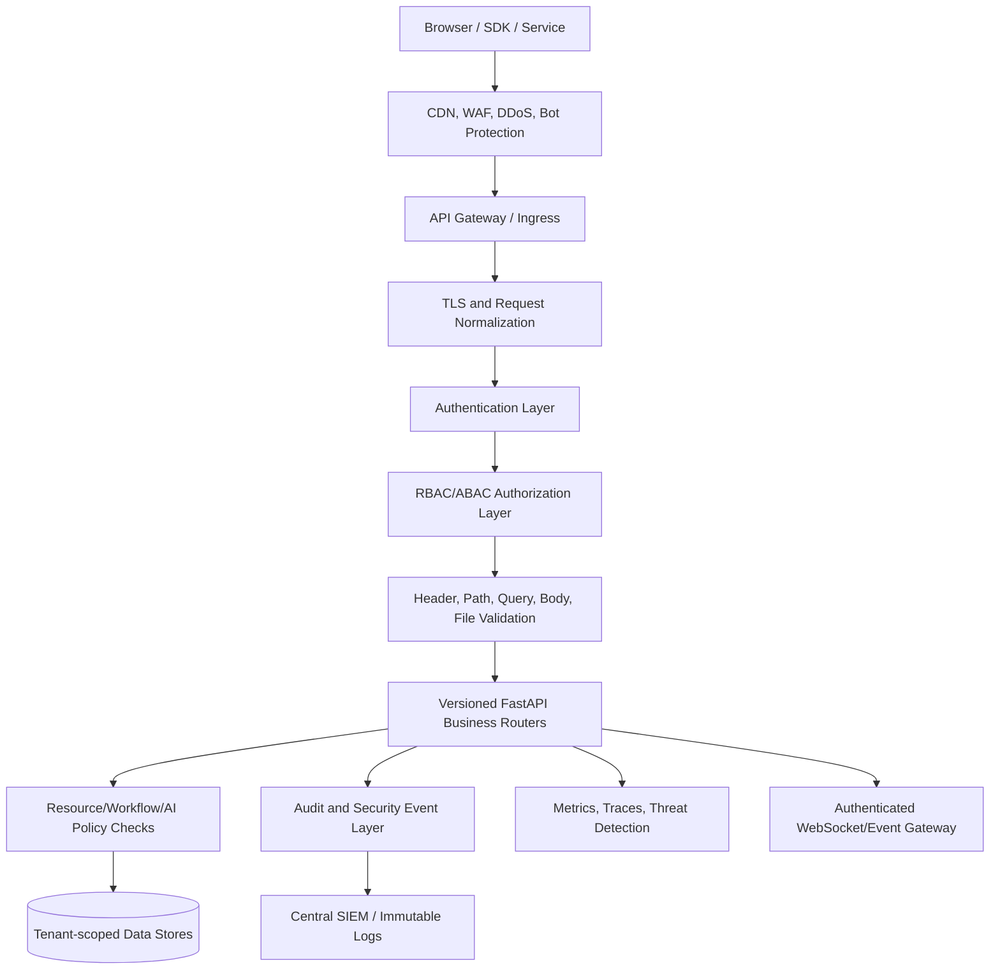
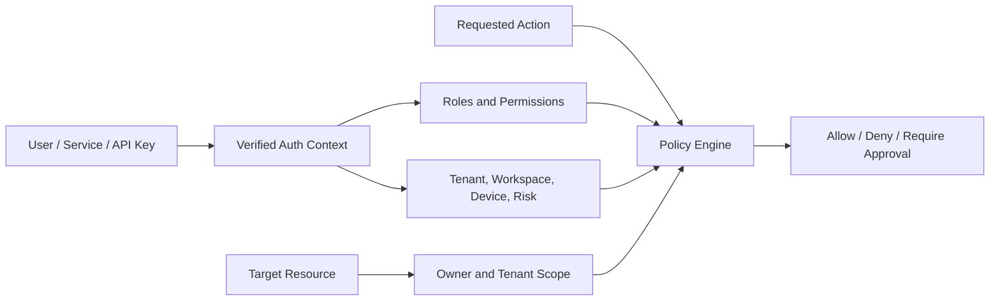
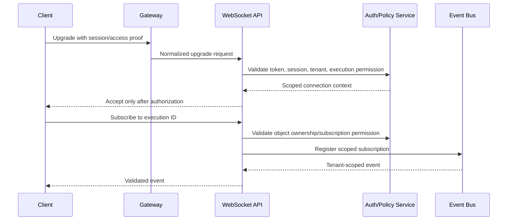
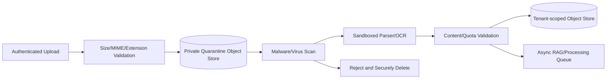
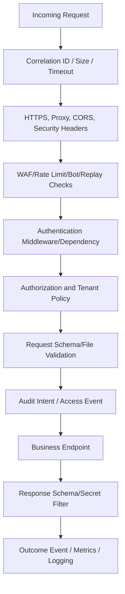

# E4 — API Security Implementation Specification

**Status:** Proposed implementation specification  
**Epic:** E4 — API Security  
**Priority:** P0 — external-production blocker  
**Source of truth:** `docs/SOFTWARE_ARCHITECTURE.md`, `docs/SECURITY_AUDIT.md`, `docs/PRODUCTION_READINESS.md`, `docs/IMPLEMENTATION_ROADMAP.md`, `docs/specs/E1_IDENTITY_IMPLEMENTATION_SPEC.md`, `docs/specs/E2_SECRETS_IMPLEMENTATION_SPEC.md`, and `docs/specs/E3_WORKFLOW_IMPLEMENTATION_SPEC.md`  
**Scope:** REST, WebSocket, upload, AI, workflow, administration, and service-to-service API protection.  
**Out of scope:** Implementing business features unrelated to API trust boundaries.

## 1. Executive Summary

AIFlow's APIs expose identity, tenant data, workflows, executions, credentials, AI providers, files, marketplace operations, and administrative controls. At enterprise scale, an API request must be treated as untrusted until its transport, identity, session, tenant, permissions, input, resource ownership, and intended side effects are independently validated.

E4 establishes a Zero Trust API security architecture with defense in depth:

- an edge API gateway/WAF and secure transport;
- authenticated human, machine, service-account, OAuth/OIDC, and API-key flows;
- deny-by-default RBAC/ABAC with tenant/workspace/object ownership checks;
- strict request and response schemas, upload controls, and safe error handling;
- distributed rate limits, quotas, replay protection, circuit breakers, and abuse detection;
- authenticated and authorized WebSockets;
- security logging, auditability, monitoring, and SIEM integration; and
- versioned API lifecycle protection from design through retirement.

The current backend has useful FastAPI routing, Pydantic schemas, middleware hooks, and JWT dependencies, but authentication is still partly demo behavior, sensitive routes lack uniform enforcement, CORS is broader than required, metrics can fail open, the execution WebSocket is unauthenticated, HTTP workflow nodes permit SSRF, upload processing is unbounded, and several APIs use in-memory mock data.

**Success condition:** every API request and event is authenticated where required, authorized for the correct tenant/resource, schema-validated, rate-controlled, observable, and safe to retry or reject without leaking secrets or internal details.

## 2. Current Architecture

### 2.1 FastAPI architecture

`backend/app/main.py` creates the FastAPI application, registers CORS, GZip, request-ID, security-header, rate-limit, and monitoring middleware, and mounts the metrics and `/api/v1` routers. The versioned router aggregates domain routers for authentication, workflows, execution, webhooks, schedules, AI, knowledge/RAG, administration, connectors, plugins, cloud, marketplace, intelligence, data, mobile, enterprise, agentic, SaaS, industry, and platform functionality.

### 2.2 REST endpoints

Endpoints are primarily declared in `backend/app/api/v1/`. Pydantic schemas validate many request and response bodies. However, endpoint protection is inconsistent: the workflow router applies an authentication dependency, while the admin router exposes system, audit, user, credentials, roles, and settings operations without equivalent route-level protection. Many domain endpoints return mock/in-memory data and therefore cannot consistently enforce persisted tenant ownership.

### 2.3 WebSocket endpoints

`/api/v1/ws/executions/{execution_id}` accepts a connection, stores it in an in-process subscriber dictionary, and streams execution events. It does not authenticate before accepting, verify execution/workspace ownership, enforce tenant scope, limit connections, validate event subscriptions, or reliably coordinate across replicas.

### 2.4 Authentication and authorization

The existing `HTTPBearer` dependency validates a decoded access JWT. Current login/signup behavior can issue tokens without real account verification, the frontend creates mock tokens locally, the JWT secret has a usable default, refresh/revocation state is in memory, and `require_role` defaults absent roles to `admin`. E1 defines the target identity/session model that E4 must consume.

### 2.5 Request and response validation

Pydantic request schemas provide baseline type validation. There is no universal request-size, content-type, schema-version, header, query, path, or tenant-scope validation policy. Response schemas exist for many endpoints, but raw dictionaries, mocked data, unfiltered exception details, and sensitive fields can still cross API boundaries.

### 2.6 Error handling

FastAPI/Starlette returns standard HTTP errors, but some endpoints return raw exception text in `500` details. Error responses are not yet standardized around safe messages, request IDs, error codes, retry guidance, and security logging. Unhandled exceptions are monitored, but sensitive request/prompt/document values can enter logs.

### 2.7 Middleware and dependency injection

The application has request-ID, security-header, rate-limit, GZip, CORS, and monitoring middleware. Rate limiting is process-local and IP-based. Trusted proxy handling is not centrally defined. Authentication dependencies are available but not applied consistently. Security policy is not centralized into a route inventory or permission matrix.

### 2.8 File, AI, workflow, and admin endpoints

| Endpoint family | Current behavior | Security concern |
|---|---|---|
| Authentication | Login/signup/refresh/logout/me | Demo issuance, mock client auth, weak secret/session model. |
| Workflow | CRUD, execute, duplicate, favorite, templates | Mock persistence, incomplete object/tenant authorization. |
| Execution | Status, controls, streams | WebSocket unauthenticated; output sensitivity. |
| Knowledge/files | Upload, indexing, vector search | Full upload read into memory, parser/resource limits absent. |
| AI | Agents, prompts, memory, provider calls | Prompt/tool abuse, token/cost exposure, secret scope. |
| Admin | Credentials, users, audit, roles, settings | Router lacks mandatory auth/permission dependencies. |
| Integrations | Connectors/OAuth/webhooks | Credential, callback, signature, replay, SSRF risks. |
| Metrics | `/metrics` | Production access can fail open if key/IP controls are unset. |

### 2.9 Current weaknesses

| ID | Weakness | Severity | Impact |
|---|---|---|---|
| W1 | Broken login/signup and client-only mock authentication | Critical | Arbitrary identity and protected UI access. |
| W2 | Admin and other sensitive routers lack consistent authorization | Critical | Anonymous privilege/data access. |
| W3 | Missing-role default administrator | Critical | Privilege escalation. |
| W4 | WebSocket accepts unauthenticated execution subscriptions | Critical | Cross-tenant execution disclosure. |
| W5 | Object IDs are not uniformly checked for tenant ownership | High | IDOR and cross-tenant access. |
| W6 | HTTP workflow node accepts arbitrary URL | High | SSRF/internal data exposure. |
| W7 | CORS permits broad Vercel subdomains with credentials | Medium/High | Credentialed cross-origin abuse. |
| W8 | Process-local rate limiting and revocation | High | Bypass across pods/restarts. |
| W9 | Uploads are unbounded and insufficiently inspected | High | Memory/parser denial of service. |
| W10 | Raw exceptions and sensitive request data can leak | Medium | Information disclosure and compliance risk. |
| W11 | Browser-persisted tokens are vulnerable to XSS theft | High | Account takeover. |
| W12 | API version, schema, replay, and deprecation policy is incomplete | Medium | Unsafe client compatibility and migration. |

## 3. Problems to Solve

### 3.1 Broken authentication and token theft

E4 must consume E1's real account/session model. No endpoint may accept a client-declared authentication state, mock token, default key, unverified identity, expired token, invalid issuer/audience, or revoked session. Browser access tokens must not be durable local-storage credentials.

### 3.2 Broken authorization and IDOR

Authentication proves identity, not entitlement. Every resource lookup must apply organization/workspace/tenant scope and object ownership before returning or mutating data. Admin, credentials, audit, billing, workflow, execution, AI, export, and WebSocket endpoints require explicit permissions. Missing permissions deny access.

### 3.3 Mass assignment

Request models must expose only fields clients may change. Server-managed fields such as owner, tenant, role, status, timestamps, approval state, security version, and billing tier cannot be accepted from generic dictionaries or copied wholesale into persistence models.

### 3.4 SSRF and request tampering

HTTP, browser, webhook, connector, and provider endpoints must use destination allowlists, DNS/IP checks, redirect controls, egress policies, method/header/body limits, signature validation, and request timeout budgets. Client-supplied headers must not override authorization, tenant, forwarding, or identity context.

### 3.5 CSRF, CORS, and replay

E1's secure cookie strategy requires Origin/Referer and CSRF controls for unsafe cookie-authenticated requests. CORS must use exact environment allowlists rather than a broad Vercel regex. Webhooks, signed API requests, OAuth callbacks, and retried tool requests need timestamp/nonce/replay validation.

### 3.6 API abuse and WebSocket abuse

Rate limits, quotas, bot detection, IP reputation, connection limits, heartbeat timeouts, message-size caps, subscription authorization, and tenant fairness are needed for both REST and WebSocket traffic. Process-local counters are insufficient for a multi-pod service.

### 3.7 AI endpoint abuse

AI APIs need prompt-size/token limits, provider budgets, model allowlists, prompt-injection filtering, tool capability checks, output schemas, secret redaction, tenant budgets, and circuit breakers. AI-generated text must not become authority without an explicit server-side policy decision.

## 4. Target Architecture

### 4.1 Trust boundaries

1. **Edge boundary:** WAF/gateway normalizes requests, enforces TLS, body limits, IP/bot policy, and request IDs.
2. **Identity boundary:** API validates human, machine, OAuth/OIDC, API-key, or service-account credentials.
3. **Authorization boundary:** Policy engine resolves tenant/workspace membership, permission, object ownership, and action risk.
4. **Validation boundary:** Typed schemas and content inspection reject malformed or dangerous input.
5. **Business boundary:** Domain service executes only authorized, validated operations.
6. **Persistence boundary:** Tenant-scoped repositories prevent unscoped reads/writes.
7. **Audit boundary:** Security and business events are emitted without raw secrets or sensitive payloads.

### 4.2 Defense in depth

No single control is sufficient. Gateway limits do not replace application authorization; JWT validation does not replace database ownership checks; Pydantic validation does not replace SSRF policy; CSP does not replace secure token storage; and audit logging does not replace prevention.

## 5. Authentication Architecture

### 5.1 Human users

E4 consumes E1's access-token/session model: short-lived access JWTs, opaque rotating refresh tokens in secure cookies, centralized session/revocation state, issuer/audience/key validation, and account status checks.

### 5.2 JWT

Access JWTs use managed asymmetric keys, `kid`, issuer, audience, subject ID, session ID, `jti`, issued/not-before/expiry timestamps, and security version. The API allows only approved algorithms, validates every required claim, and never trusts mutable role/tenant claims as the sole authorization source.

### 5.3 OAuth/OIDC

External login uses Authorization Code + PKCE, exact redirect URI allowlists, state/nonce validation, issuer/discovery validation, token audience validation, and provider identity mapping. Client secrets remain in the E2-managed secret store. External identity claims do not automatically grant administrator privileges.

### 5.4 API keys

API keys are opaque, high-entropy, prefix-identifiable values displayed once and stored hashed. They are scoped to an owner, tenant, workspace, resource, permission set, expiration, IP/region policy, and last-used metadata. Responses show only masked values. Keys can be individually revoked and rotated.

### 5.5 Service accounts and machine-to-machine access

Service accounts use workload identity/OIDC client credentials or mTLS rather than shared user passwords. Each service has a dedicated identity, audience, key/secret policy, tenant scope, expiry, and audit principal. CI uses OIDC short-lived credentials and does not receive long-lived production keys.

### 5.6 Token rotation and revocation

Refresh rotation, token-family replay detection, session versioning, key-version overlap, and logout-all behavior follow E1. API keys, OAuth tokens, webhook secrets, and service credentials follow E2 lifecycle and owner policies.

## 6. Authorization Design

### 6.1 RBAC and ABAC

RBAC grants stable resource/action permissions to roles. ABAC evaluates contextual facts: tenant/workspace, owner, resource status, environment, IP/device risk, workflow risk, credential scope, time, region, and approval state.

### 6.2 Policy rules

- Route permission is necessary but not sufficient.
- Resource repository queries include trusted tenant scope.
- Ownership/membership is checked before response serialization.
- High-risk actions (credentials, exports, workflow replay, destructive actions, provider changes) require explicit permissions and may require step-up authentication or approval.
- Permission inheritance is explicit and auditable; no unknown/default role is privileged.
- Admin controls are tenant- or platform-scoped and require separate `system:admin`/organization permissions.

### 6.3 Workspace and tenant isolation

Tenant/workspace scope is derived from authenticated membership and approved route context. It is copied into request context and every downstream task/event. Client-provided scope is treated as a requested target, not authority. Cache keys, logs, WebSocket subscriptions, exports, AI memory, workflow execution, and credentials all carry and enforce scope.

### 6.4 Least privilege

API keys, service accounts, workers, connector tools, AI tools, and administrators receive only the permissions and resource scopes required for their operation. Read metadata and read secret value are separate permissions. The default decision is deny.

## 7. Request Validation

### 7.1 Validation matrix

| Input | Required controls |
|---|---|
| Headers | Allowed/required headers, max size, content type, request ID format, trusted proxy rules, signature/auth header parsing. |
| Body | Pydantic/JSON Schema, strict types, max bytes, unknown-field policy, tenant fields ignored/validated, mass-assignment protection. |
| Query parameters | Type/range/enum validation, pagination caps, filter allowlist, no arbitrary sort/field names. |
| Path parameters | Format/length validation, tenant/object authorization before lookup, no path traversal semantics. |
| Uploaded files | Size/page/count limits, content sniffing, MIME/extension consistency, malware scan, quarantine, safe filename. |
| Multipart | Part count/name/size allowlist, boundary/timeout limits, no untrusted filesystem paths. |
| AI prompts | Length/token limit, content policy, tenant/provider budget, prompt-injection/data classification. |
| Workflow payloads | Versioned graph schema, node/edge/capability validation, size/fan-out/loop/deadline budgets. |

### 7.2 Schema and input policy

Requests use endpoint-specific DTOs. Generic `dict` payloads are prohibited for security-sensitive operations unless validated by a versioned schema. Server-controlled fields are ignored or rejected. Validation errors expose field-safe details but no stack traces, SQL, internal paths, credentials, or authorization logic.

## 8. Response Security

### 8.1 Output validation

Every response is serialized through a typed response schema or a documented safe envelope. Secrets, password hashes, refresh tokens, private keys, internal service URLs, raw provider errors, and unneeded PII are excluded. AI/tool outputs are schema-validated before downstream use.

### 8.2 Error sanitization

Errors contain a stable error code, safe message, HTTP status, and request/correlation ID. Internal logs contain diagnostic detail under access control; clients do not receive raw exception text, SQL, filesystem paths, provider credentials, or tenant existence clues.

### 8.3 Headers, caching, compression, and streaming

- Apply HSTS, CSP, `X-Content-Type-Options`, `X-Frame-Options`, `Referrer-Policy`, and `Permissions-Policy` at the edge and API.
- Never cache authenticated/private responses in shared intermediaries without explicit tenant/user cache keys and policy.
- GZip/Brotli is applied only to bounded responses; compression side-channel risk is evaluated for secret-bearing dynamic responses.
- Streaming endpoints enforce authentication, authorization, idle timeout, message limits, output filtering, and tenant scope.

## 9. API Protection

### 9.1 Rate limiting and quotas

Limits are distributed through Redis or the gateway and keyed by IP, account, tenant, API key, service account, route class, provider, and WebSocket connection. Critical auth endpoints use stricter account/IP/device limits. Limits return `429` with safe retry guidance and emit security metrics.

### 9.2 Circuit breakers and dependency controls

Provider, database, Redis, file, search, and connector calls use bounded timeouts, circuit breakers, bulkheads, retry-after handling, and fallback behavior that never bypasses authorization. A circuit-open response does not expose credentials or internal topology.

### 9.3 Bot and DDoS mitigation

The edge applies managed WAF rules, IP reputation, bot/challenge policy where appropriate, connection/request body limits, geographic/rate policies, and DDoS protection. Application limits remain necessary because the gateway cannot evaluate tenant/resource semantics.

### 9.4 Replay protection and request signing

High-risk webhooks, API-key service calls, and machine-to-machine requests may require HMAC or asymmetric signatures over method/path/timestamp/nonce/body digest. The server validates clock skew, nonce uniqueness, key version, signature, content digest, and tenant scope. Nonces are stored for the validity window in Redis. Replay returns a generic rejection and security event.

## 10. WebSocket Security

Required controls:

- Authenticate before `accept` when feasible, or accept only into a short pre-auth state that cannot access data.
- Authorize execution/workspace/tenant subscription for every requested stream.
- Limit connections per user, tenant, IP, and service account.
- Require heartbeat/ping, idle timeout, maximum message size, and server-side event filtering.
- Validate client messages against schemas; ignore/deny client attempts to change tenant/execution scope.
- Reconnect with bounded exponential backoff and reauthorize each connection.
- Remove subscriptions on disconnect and support multi-replica event routing.

## 11. File Upload Security

File upload endpoints use an asynchronous quarantine pipeline:

- Enforce ingress, API, per-file, per-tenant, page, archive expansion, and total-storage limits.
- Validate magic bytes and MIME independently of filename extension.
- Generate server-side object names; do not use raw filenames as filesystem paths.
- Quarantine before scanning; never parse untrusted input inside API workers.
- Use isolated parser workers with no secrets and restricted network.
- Delete rejected/temp files according to a documented retention policy.
- Encrypt object storage, use tenant-scoped paths/keys, and authorize every download.
- Return upload/job IDs and status rather than blocking on full parsing.

## 12. AI Endpoint Security

AI endpoints are high-cost, high-data-sensitivity API surfaces. Controls include:

| Threat | Protection |
|---|---|
| Prompt injection | Delimit policy/data, classify retrieved/tool content, detect injection patterns, require action policy checks. |
| Jailbreaks | Model/provider safety policy, content filters, refusal handling, human approval for high-risk actions. |
| Tool abuse | E3 capability broker, allowlisted tools, short-lived capability token, argument/output schema. |
| Model abuse | Model allowlist, tenant/user quotas, request limits, abuse detection, content policy. |
| Provider abuse | Provider rate/cost budgets, circuit breakers, key versioning, per-tenant credential scope. |
| Cost exhaustion | Token/max-output limits, concurrency quotas, budget preauthorization, anomaly alerts. |
| Data leakage | Tenant-scoped retrieval, secret/PII redaction, provider residency policy, no raw prompt logs. |
| Output manipulation | Typed output validation, content/security filter, downstream authorization recheck. |

AI-generated decisions never grant permissions, reveal credentials, change tenant scope, or invoke privileged tools without an independent server-side policy decision.

## 13. Middleware Architecture

| Layer | Responsibility |
|---|---|
| Authentication | Parse bearer/cookie/API-key/service credential, validate identity/session/key. |
| Authorization | Evaluate permission, tenant/workspace membership, object ownership, risk/approval. |
| Audit | Record security intent, policy decision, state change, outcome, actor, scope, request ID. |
| Logging | Structured redacted access/error logs with correlation and trace IDs. |
| Security headers | CSP, HSTS, frame/content/referrer/permissions policies at edge/API. |
| Exception | Map internal exceptions to safe stable API errors; preserve internal diagnostics securely. |
| Validation | Enforce headers, body/query/path schemas, content limits, files, prompts, workflows. |
| Correlation IDs | Accept only safe client IDs or generate trusted UUIDs; propagate to queue/provider/audit. |

Middleware must remain ordered so authentication and policy execute before business effects, while exception/audit instrumentation captures failures without logging secrets.

## 14. Security Logging

### 14.1 Audit events

Record signup, verification, login success/failure, lockout, logout, token refresh/replay, password changes, role/membership changes, API-key creation/revocation, workflow/API access decisions, exports, file access, provider use, tool invocation, WebSocket subscription, policy denial, rate-limit block, and incident actions.

### 14.2 Access and security logs

Access logs contain method, normalized route template, status, latency, response size, actor principal ID where available, tenant/workspace, client category, request ID, and safe user agent/IP policy. Security logs contain the detection type, rule, outcome, and safe evidence reference. Never log raw Authorization headers, cookies, passwords, refresh tokens, provider keys, prompts, full document content, or sensitive response bodies.

### 14.3 Metrics and threat detection

Metrics include auth failures, authorization denials, IDOR/policy blocks, rate limits, replay attempts, SSRF blocks, upload rejects, WebSocket connections, AI token/cost limits, provider errors, and API latency/error SLOs. Threat detection correlates spikes by user, IP, tenant, API key, route, provider, and device.

### 14.4 SIEM, retention, and compliance

Security/audit events are shipped to a centralized SIEM or immutable log store with tenant-aware access, encryption, retention/legal-hold policies, time synchronization, and alert routing. Retention is defined by contractual/regulatory requirements; deletion and export operations are audited.

## 15. File-Level Implementation Plan

This is a planning inventory only. It does not generate code or authorize changes in this task.

### 15.1 Backend API/security files

| File/group | Purpose | Reason | Dependencies | Expected implementation |
|---|---|---|---|---|
| `backend/app/main.py` | Application/middleware composition | Current policy order and CORS/validation are incomplete | E1, E2 | Secure middleware order, exact CORS, global limits/timeouts, safe exception handling. |
| `backend/app/api/deps.py` | Auth dependencies | Authentication/tenant context must be authoritative | E1 | `AuthContext`, membership, permission, object-scope dependencies. |
| `backend/app/core/rbac.py` | Permission policy | Current default/admin behavior is unsafe | E1 | Deny-by-default RBAC/ABAC and policy inheritance. |
| `backend/app/core/security.py` | JWT/API-key primitives | Need managed key, session, and request auth validation | E1, E2 | JWT claim validation, API-key hash validation, service identity hooks. |
| `backend/app/core/config.py` | Security configuration | Current defaults/aliases can fail open | E2 | Typed security settings, policy validation, no unsafe defaults. |
| `backend/app/middleware/rate_limit.py` | Abuse controls | Process-local/IP-only limits are bypassable | E1, E2 | Distributed limits, route classes, tenant/account/key dimensions. |
| `backend/app/middleware/security_headers.py` | Browser/transport headers | Frontend/edge coverage incomplete | E2 | Central policy, CSP/HSTS/edge coordination, tested headers. |
| `backend/app/middleware/request_id.py` | Correlation | Need trusted propagation | E8 | Validated ID, trace/audit/queue propagation. |
| `backend/app/middleware/exception.py` (new) | Error boundary | Raw details can leak | E8 | Stable safe errors, internal diagnostics, correlation IDs. |
| `backend/app/middleware/replay.py` (new) | Nonce/signature validation | Webhook/M2M replay risk | E1, E2 | Timestamp/nonce/body-digest checks using Redis. |
| `backend/app/policy/*` (new) | Authorization/ABAC | Central route/resource policy needed | E1 | Policy registry, decisions, risk/approval rules. |
| `backend/app/api/metrics.py` | Metrics endpoint | Access can fail open | E2, E8 | Mandatory production auth/network restrictions and safe metrics. |

### 15.2 API routers and schemas

| File/group | Purpose | Reason | Dependencies | Expected implementation |
|---|---|---|---|---|
| `backend/app/api/v1/auth.py` | Identity endpoints | Existing demo auth must be replaced | E1 | Secure login/signup/refresh/logout/session APIs. |
| `backend/app/api/v1/admin.py` | Admin API | Currently lacks uniform protection | E1 | Explicit admin permissions, scoped repositories, safe responses. |
| `backend/app/api/v1/workflow.py` | Workflow API | Mock state/ownership and mass assignment | E1, E3 | Typed command DTOs, scope checks, execution permissions. |
| `backend/app/api/v1/execution.py` | Execution API | Sensitive output/control operations | E1, E3 | Read/cancel/replay policies, output filtering, quotas. |
| `backend/app/api/v1/ws_execution.py` | Execution WebSocket | Currently unauthenticated | E1, E3 | Authenticate before data access, scoped subscriptions, limits. |
| `backend/app/api/v1/webhooks.py` | Inbound webhooks | Signature/replay/tenant risk | E1, E3 | Signed request validation, idempotency, enqueue-only behavior. |
| `backend/app/api/v1/knowledge.py` | File/RAG APIs | Unbounded files and sensitive retrieval | E1, E3 | Upload quarantine, authorization, size limits, safe search responses. |
| `backend/app/api/v1/ai_agents.py` and AI routers | AI API | Prompt/tool/cost abuse | E1, E3 | Prompt validation, quotas, capability/policy checks, redaction. |
| `backend/app/api/v1/connectors.py` | Connector API | Credential/OAuth/SSRF risk | E1, E2, E3 | Permissioned connector operations, callback/signature validation. |
| `backend/app/api/v1/plugins.py` | Plugin API | Untrusted package/capability risk | E3 | Signed package/policy validation and safe responses. |
| `backend/app/schemas/*` | Request/response contracts | Generic dicts and secret exposure | E1, E3 | Strict DTOs, field allowlists, sanitized response models. |

### 15.3 Frontend files

| File/group | Purpose | Reason | Dependencies | Expected implementation |
|---|---|---|---|---|
| `frontend/src/lib/apiClient.ts` | API client | Needs refresh/error/CSRF/replay behavior | E1, E2 | Secure access-token memory, single-flight refresh, safe errors, request ID. |
| `frontend/src/store/authStore.ts` | Client identity state | Browser-persisted mock tokens are unsafe | E1 | Remove mock state; in-memory user/session/capability cache. |
| `frontend/src/routes/ProtectedRoute.tsx` | Route guard | Boolean client state is insufficient | E1 | Bootstrap/session/permission-aware routing. |
| `frontend/src/routes/AppRoutes.tsx` | Route metadata | Needed for permission-aware UI | E1 | Required permission/resource metadata. |
| `frontend/src/components/layout/Sidebar.tsx` | Navigation | Client should not advertise unauthorized actions | E1 | Permission-aware navigation while API remains authoritative. |
| `frontend/src/modules/auth/*` | Login/recovery UI | Connect to secure API lifecycle | E1 | Real login/signup/reset/verification, safe errors, no tokens in storage. |
| `frontend/src/modules/executions/components/LiveExecutionMonitor.tsx` | WebSocket client | Needs authenticated scoped stream | E1, E3 | Token/session acquisition, reconnect/heartbeat, event validation. |
| `frontend/src/modules/ai/*` | AI screens | Prompt/tool/output and quota UX | E3 | Limits, consent, safe errors, output rendering policy. |
| `frontend/src/modules/admin/pages/CredentialVaultPage.tsx` | Credential UI | Must not expose secrets | E2, E3 | Write-only/metadata-only operations and permission controls. |

### 15.4 Infrastructure, CI/CD, and monitoring files

| File/group | Purpose | Reason | Dependencies | Expected implementation |
|---|---|---|---|---|
| `backend/Dockerfile`, `frontend/Dockerfile` | Container edge/runtime | Need hardened headers, user, context, and limits | E2, E3 | Non-root, `.dockerignore`, no secret layers, secure Nginx/API defaults. |
| `deploy/k8s/ingress.yaml`, `deploy/nginx/nginx.conf` | Edge security | TLS/WAF/header/body policy | E2 | Exact routes/origins, TLS, body/connection limits, security headers. |
| `deploy/k8s/backend.yaml`, `frontend.yaml`, `workers.yaml` | Workloads | Identity, resource, network, and API security | E1–E3 | Service accounts, network policies, probes, immutable images, limits. |
| `deploy/k8s/config.yaml` | Config/secrets | Current secret-bearing ConfigMap risk | E2 | References only, External Secrets/CSI integration, no credentials. |
| `deploy/helm/*` | Deployment policy | Need consistent API/security configuration | E2, E3 | Schema-backed values, secret refs, gateway/WAF/worker policy. |
| `deploy/monitoring/prometheus.yml`, `alert_rules.yml` | API/security telemetry | Add threat/SLO alerts | E8 | API abuse, WebSocket, auth, upload, SSRF, and policy metrics. |
| `.github/workflows/*.yml` | Security gates | Need API/OWASP/secret/SBOM gates | E2, E3 | SAST, DAST, dependency/container scan, secret scan, load/security tests. |
| `deploy/terraform/main.tf` | Cloud edge/IAM | Need WAF, private networking, identity | E2, E7 | Gateway/WAF, workload identity, secret-manager and audit integration. |

## 16. Migration Strategy

### 16.1 Backward compatibility and API versioning

Introduce E4 controls behind additive middleware and versioned endpoint contracts. Existing safe clients may continue using `/api/v1` while auth/permission responses are upgraded with stable error codes and request IDs. Breaking schema or auth changes use a new version or compatibility adapter with an announced sunset date. No compatibility mode may preserve demo authentication, default-admin authorization, or unscoped access.

### 16.2 Rolling deployment

1. Inventory endpoints and create a route/permission/tenant policy matrix.
2. Add observability-only policy evaluation to measure would-be denials without granting access.
3. Apply authentication and authorization to internal/staging traffic first.
4. Deploy gateway/WAF, rate limits, error envelopes, and validation in shadow/enforceable stages.
5. Migrate WebSocket, upload, AI, workflow, and admin endpoints by risk priority.
6. Enable strict deny-by-default for production after client and E1/E2 dependencies are ready.
7. Remove compatibility/mocking paths after telemetry confirms no active legacy usage.

### 16.3 Zero downtime and rollback

Use additive policies, dual-readable error envelopes, and gateway route overlap. API pods must support old/new auth key versions and event envelopes during rollout. Rollback disables new enforcement only if it does not re-open a Critical vulnerability; otherwise route high-risk endpoints to maintenance/deny mode. Database and audit changes are forward-compatible and never destructively rolled back.

## 17. Testing Strategy

### 17.1 Unit tests

- JWT/API-key/service-token validation and claim/algorithm/key-version rejection.
- RBAC/ABAC, tenant membership, ownership, inheritance, and risk policy decisions.
- Pydantic/JSON Schema strictness, unknown fields, limits, error sanitization, response filtering.
- Rate-limit, nonce, timestamp, signature, idempotency, and circuit-breaker behavior.
- File MIME/magic-byte/path/size policy and AI prompt/output filters.

### 17.2 Integration tests

- Gateway → FastAPI → auth → policy → repository request lifecycle.
- PostgreSQL/Redis/secret-manager integration for distributed limits, sessions, replay, and tenant scope.
- REST, multipart upload, provider mocks, webhook signatures, OAuth/OIDC callback, and API-key clients.

### 17.3 OWASP API and security tests

Cover OWASP API Security Top 10 scenarios: broken object-level authorization, broken authentication, property-level authorization/mass assignment, unrestricted resource consumption, broken function-level authorization, unrestricted access to sensitive business flows, SSRF, security misconfiguration, improper inventory/versioning, and unsafe consumption of APIs.

Include JWT tampering, token theft, credential stuffing, account enumeration, CORS/CSRF, injection, SSRF/private IP/DNS rebinding, path traversal, header smuggling, request replay, WebSocket abuse, error leakage, and secret exposure tests.

### 17.4 Penetration, load, chaos, and WebSocket tests

- Independent authenticated/unauthenticated penetration test before release.
- Load tests for login, API reads/writes, uploads, AI calls, workflow execution, WebSocket connections, and rate limits.
- Chaos tests for gateway, Redis, database, auth provider, secret manager, worker, and provider outages.
- WebSocket tests for pre-auth rejection, tenant subscription, heartbeat, reconnect, message limits, slow clients, and multi-replica events.
- Authorization tests iterate every route/resource/role/tenant combination.

## 18. Acceptance Criteria

E4 is accepted only when:

1. Every API route and WebSocket operation has a documented authentication and permission policy.
2. No sensitive route is anonymously accessible; missing/unknown permissions deny by default.
3. Object-level and tenant/workspace authorization tests pass for every data-bearing resource.
4. JWT, refresh, API-key, OAuth/OIDC, and service-account validation uses E1/E2 managed key/session/secret controls.
5. CORS is exact and environment-scoped; CSRF protection is verified for cookie-authenticated unsafe requests.
6. Request headers, path/query/body/multipart/file/AI/workflow inputs have strict size, type, schema, and semantic validation.
7. Responses have typed schemas, secret/PII filtering, stable sanitized errors, security headers, and safe caching/compression/streaming behavior.
8. Distributed rate limits, quotas, replay protection, circuit breakers, and DDoS/edge controls are active and tested.
9. WebSockets authenticate before data access, enforce execution/tenant scope, cap connections/messages, and clean up reconnects.
10. Uploads are quarantined, scanned, size/MIME validated, sandbox parsed, tenant-scoped, encrypted, and deleted per policy.
11. AI endpoints enforce prompt/tool/output/token/cost/provider policies and cannot convert model output into authority.
12. Security, audit, access, threat, and API metrics flow to centralized monitoring/SIEM with retention and redaction controls.
13. CI blocks secret leaks, dependency/image vulnerabilities, schema/policy regressions, and failed security tests.
14. OWASP API tests, penetration tests, load tests, chaos tests, WebSocket tests, and authorization matrices pass in staging.
15. API versioning, migration, rollback, runbooks, owners, and exception expiry are documented and approved.

## 19. Risks

| Risk | Category | Level | Impact | Mitigation |
|---|---|---|---|---|
| Authorization policy misses a sensitive route | Security | Critical | Privilege/data exposure | Route inventory, deny-by-default dependencies, generated policy coverage tests. |
| Incorrect tenant predicate or cache key | Security | Critical | Cross-tenant data disclosure | Scoped repositories, integration/IDOR tests, cache/log partition checks. |
| Gateway and app policies disagree | Infrastructure | High | Bypass or availability failure | Single policy source, rendered config tests, canary enforcement. |
| Strict validation breaks existing clients | Operational | High | Integration outage | Versioned contracts, compatibility window, client telemetry, staged migration. |
| Distributed rate limiter unavailable | Infrastructure | High | Abuse or auth outage | Managed HA Redis/gateway limits, bounded fail-closed policy by endpoint class. |
| WebSocket event fan-out overload | Operational | High | Connection/event outage | Brokered streams, caps, backpressure, slow-client eviction, load testing. |
| AI policy false positives/negatives | AI | High | Unsafe denial or harmful tool action | Layered controls, approval paths, adversarial evaluation, conservative defaults. |
| Upload scanner/parser failure | Security/Operational | High | Malware or ingestion outage | Quarantine, fail closed, isolated workers, retry and operator workflow. |
| Logs contain prompts/PII/secrets | Compliance | High | Regulatory/customer exposure | Redaction, schema review, DLP tests, centralized access control. |
| API version drift and undocumented endpoints | Operational | Medium | Unprotected shadow surface | API inventory, OpenAPI review, deprecation and gateway route controls. |

## 20. Estimated Timeline

E4 is an XL P0 epic. With dedicated backend/security/platform/frontend/QA capacity, implementation is estimated at **six to eight weeks**, following E1/E2 foundations and parallel to E3 execution safety.

| Week | Focus | Effort | Deliverables |
|---|---|---|---|
| 1 | API inventory and threat model | L | Endpoint/WebSocket inventory, route-policy matrix, data classification, SLO/risk priorities. |
| 2 | Auth/policy/validation foundation | XL | Auth context, deny-by-default policy, tenant/object checks, schema/error contract. |
| 3 | Edge and abuse controls | L | Gateway/WAF/CORS/headers, distributed limits, replay/signature, trusted proxy policy. |
| 4 | High-risk API surfaces | XL | Admin/workflow/execution/AI/upload/WebSocket enforcement and safe response behavior. |
| 5 | AI/file/WebSocket hardening | L | Prompt/tool/output policies, quarantine pipeline, authenticated stream, connection controls. |
| 6 | Observability and CI gates | L | Security audit events, SIEM/metrics dashboards, OWASP/security scans, API inventory gates. |
| 7 | Migration and testing | XL | Rolling enforcement, compatibility, load/penetration/chaos/WebSocket/authorization tests. |
| 8 | Launch readiness | M | Remediation, rollback exercise, runbooks, security/platform/product sign-off. |

Assumptions: E1 identity/session services, E2 secret/configuration controls, E3 capability/queue abstractions, managed Redis/PostgreSQL, gateway/WAF access, and dedicated security testing are available.

## 21. Definition of Done

E4 is complete when:

- All acceptance criteria are met with CI, staging, penetration, load, and recovery evidence.
- Critical and High API security findings from `SECURITY_AUDIT.md` are closed or have approved, time-bound exceptions.
- The route and WebSocket inventory is complete, versioned, owner-assigned, and enforced by deny-by-default policies.
- E1 identity, E2 secrets, and E3 execution capabilities are integrated without mock auth, default roles, plaintext credentials, arbitrary tool access, or unscoped execution streams.
- Gateway, application, data, tenant, file, AI, WebSocket, and audit boundaries have tested controls.
- Secure errors, headers, CORS/CSRF, rate limits, replay protection, upload quarantine, AI budgets, and output filtering operate in production-like staging.
- Security logs, SIEM alerts, dashboards, runbooks, retention, and incident ownership are active.
- The migration and rollback plan has been exercised without service interruption or re-opening a Critical vulnerability.
- Security, platform, backend, frontend, compliance, and operations owners approve the production launch decision.

