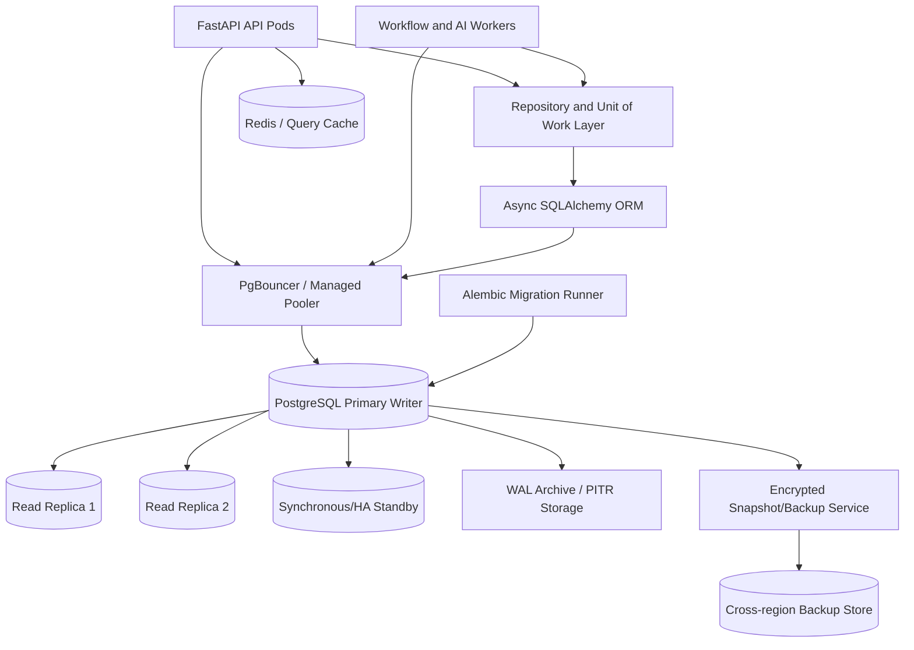
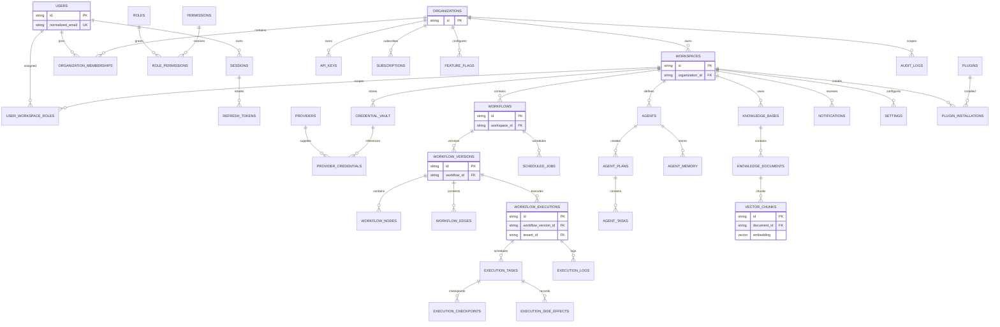
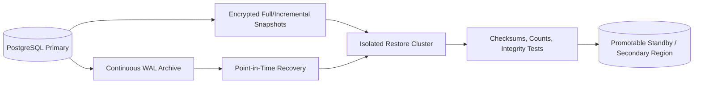

# E5 — Database Foundation Implementation Specification

**Status:** Proposed implementation specification  
**Epic:** E5 — Database Foundation  
**Priority:** P0 — external-production blocker  
**Source of truth:** `docs/SOFTWARE_ARCHITECTURE.md`, `docs/SECURITY_AUDIT.md`, `docs/PRODUCTION_READINESS.md`, `docs/IMPLEMENTATION_ROADMAP.md`, `docs/specs/E1_IDENTITY_IMPLEMENTATION_SPEC.md`, `docs/specs/E2_SECRETS_IMPLEMENTATION_SPEC.md`, `docs/specs/E3_WORKFLOW_IMPLEMENTATION_SPEC.md`, and `docs/specs/E4_API_SECURITY_IMPLEMENTATION_SPEC.md`  
**Scope:** PostgreSQL/pgvector, tenancy, schema integrity, repositories, migrations, connection management, backup/recovery, and database observability.  
**Out of scope:** Implementing application features or changing files as part of this specification.

## 1. Executive Summary

E5 establishes the durable data foundation for identity, tenant isolation, workflows, execution safety, AI/RAG, billing, marketplace, and platform operations. The database must preserve correctness under concurrency and failure, support large multi-tenant workloads, protect sensitive data, and recover predictably.

The current codebase has a broad SQLAlchemy model catalog and an asynchronous engine, but important APIs use in-memory mock stores, startup executes `Base.metadata.create_all()`, connection pools are oversized per process, direct Kubernetes PostgreSQL is a single instance without demonstrated pgvector, and migrations, constraints, indexes, backup automation, row-level tenancy controls, and recovery evidence are incomplete.

The target design uses managed multi-AZ PostgreSQL with pgvector, a primary writer and read replicas, a connection pooler, repository/unit-of-work boundaries, versioned Alembic migrations, tenant-scoped queries/RLS, encrypted backups, point-in-time recovery, and measurable operational SLOs.

**Success condition:** every persistent resource has a clear owner/scope, enforced foreign keys and constraints, predictable transaction behavior, migration history, recovery evidence, and performance capacity for the approved one-million-user workload.

## 2. Current Database Architecture

### 2.1 PostgreSQL and SQLite usage

The intended backend database URL is PostgreSQL through `asyncpg`. The SQLAlchemy engine is asynchronous and configured with `pool_pre_ping`, `pool_size=50`, and `max_overflow=100`. If engine creation fails, the code falls back to `sqlite+aiosqlite:///./aiflow.db`.

The fallback is acceptable only for explicit local development/test profiles. In staging or production it can create an unintended local database, split state between pods, bypass PostgreSQL features, and hide a real outage.

### 2.2 ORM layer

SQLAlchemy declarative models in `backend/app/models/` define users, organizations, workspaces, workflows, executions, AI/RAG, AIOps, connectors, marketplace, cloud, mobile, enterprise, intelligence, platform, SaaS, and industry entities. Async sessions are supplied by `AsyncSessionLocal` and `get_db`.

The application frequently imports models globally and performs startup `Base.metadata.create_all()`. Repository boundaries are not consistently present; several routers return in-memory mock collections rather than using ORM persistence.

### 2.3 Current schema and relationships

Core foreign keys exist for selected relationships such as workspace→organization, workflow→workspace, execution→workflow/workspace, knowledge documents→knowledge bases, and role assignments→users/workspaces/roles. Many entity relationships are represented by string IDs without foreign keys or database-enforced ownership. JSON and text fields hold workflow graphs, configuration, metadata, and execution payloads.

### 2.4 Transactions

Some vector insertion paths use a single async transaction. API domain operations and mock collections are not universally transactional. There is no standard Unit of Work, outbox, optimistic version check, idempotency ledger, transaction timeout, or explicit isolation policy for concurrent execution/state updates.

### 2.5 Migrations

An Alembic dependency and one migration file exist, but application startup still calls `Base.metadata.create_all()`. There is no demonstrated complete migration history, expand/contract policy, migration lock/observability, rollback evidence, or production migration pipeline.

### 2.6 Indexes and constraints

Some IDs, email, workflow, execution, tenant, and status columns are indexed. Coverage is inconsistent across high-volume event/audit/task tables, composite tenant/time queries, partial active records, vector filtering, retention/archival, and uniqueness rules. Database constraints do not fully enforce tenant ownership, state transitions, valid enum/status values, idempotency, or duplicate memberships.

### 2.7 Current connection pooling

`pool_size=50` and `max_overflow=100` are per application process. With multiple Gunicorn workers and Kubernetes replicas, the potential connection count can exceed practical PostgreSQL capacity by a large margin. There is no demonstrated PgBouncer or global connection budget.

### 2.8 Current weaknesses

| ID | Weakness | Severity | Impact |
|---|---|---|---|
| W1 | Production-capable SQLite fallback | Critical | Split-brain/lost data and hidden database outages. |
| W2 | Startup `create_all()` instead of controlled migrations | High | Race conditions, privilege issues, unsafe schema changes. |
| W3 | Single PostgreSQL instance in direct Kubernetes manifests | Critical | Availability and recovery bottleneck. |
| W4 | No demonstrated pgvector production image/extension in direct manifest | High | RAG schema/search can fail at startup. |
| W5 | Oversized per-process connection pools | High | Connection exhaustion and database overload. |
| W6 | Mock/in-memory router persistence | Critical | Data loss, inconsistent replicas, no auditability. |
| W7 | Incomplete foreign keys, uniqueness, CHECK, and tenant constraints | High | Orphans, duplicates, invalid states, cross-tenant risk. |
| W8 | No consistent repository/Unit of Work boundary | High | Weak transactions and duplicated query/security logic. |
| W9 | Missing idempotency/version/checkpoint transaction model | High | Duplicate workflow side effects and race conditions. |
| W10 | Incomplete indexes/partitioning/retention | High | Poor performance and unbounded operational tables. |
| W11 | No verified PITR/backup/restore automation in deployable assets | Critical | Unproven disaster recovery. |
| W12 | No comprehensive RLS/tenant query enforcement | Critical | Cross-tenant data exposure. |

## 3. Problems to Solve

### 3.1 Integrity and constraints

Every relationship that matters for ownership, execution, billing, credentials, and audit must use foreign keys, unique constraints, CHECK constraints, non-null rules, and controlled status transitions. The database must reject invalid records rather than relying on application convention.

### 3.2 Duplicate, orphan, and inconsistent data

Unique normalized emails, slugs, memberships, active sessions, idempotency keys, workflow version numbers, provider credentials, and connector installations. Cascades or restricted deletes must be explicit. Soft-deleted records must not accidentally appear in normal reads or violate uniqueness.

### 3.3 Multi-tenant risks

All tenant-bound records require organization/workspace ownership. Repository queries and, where supported, PostgreSQL Row Level Security (RLS) must enforce scope. Database connection/session tenant context must never be inferred from an untrusted request field.

### 3.4 Transactions and consistency

Define transaction boundaries for identity lifecycle, workflow publish/run, queue outbox, execution checkpoint, credential rotation, billing, and audit events. Use optimistic locking for user-editable resources and pessimistic/row locks for token rotation, queue leases, idempotency, and state transitions.

### 3.5 Scalability and retention

High-volume execution, task, logs, audit, metrics, usage, chat, and vector tables require query indexes, time/tenant partitioning where justified, archive storage, retention jobs, and bounded payloads. Large JSON/text/blob content belongs in encrypted object storage with database references.

## 4. Target Architecture

### 4.1 PostgreSQL cluster

Use a managed multi-AZ PostgreSQL service or a tested HA operator with:

- one write primary;
- synchronous or appropriately configured HA standby;
- asynchronous read replicas for read-heavy workloads;
- encrypted storage, private networking, TLS, and managed patching;
- pgvector extension/version compatibility;
- automated failover and DNS/service endpoint stability;
- connection and replication monitoring.

### 4.2 Connection pool

Application pools are sized from a global connection budget, not independently guessed per worker. PgBouncer or a managed pooler protects PostgreSQL from pod churn and burst traffic. Separate pool policies apply to API, workers, migrations, and administrative jobs.

### 4.3 ORM and repository layer

Routes call domain services, services call tenant-scoped repositories, and repositories use an explicit Unit of Work. No router directly constructs unscoped queries for customer data. Read repositories may use replicas only for data where replica lag is acceptable; writes and read-after-write consistency use the primary.

### 4.4 Migration layer

Alembic is the only production schema-change mechanism. A release pipeline runs migrations as a controlled, observable job before application readiness is promoted. Applications do not execute DDL at startup.

## 5. Database Design

The following inventory defines the target logical schema. Physical table names may be plural snake_case, but names, ownership, retention, and constraints must remain stable through migrations.

### 5.1 Identity, tenancy, and authorization tables

| Table | Purpose | Relationships | Indexes | Constraints | Retention |
|---|---|---|---|---|---|
| `users` | Global user identity and lifecycle | Organizations/workspaces through memberships; sessions; audit | normalized email; status; created_at | unique normalized email; valid status; non-null hash/status | Retain per account/compliance policy; soft delete. |
| `organizations` | Tenant billing/security root | Has workspaces, members, settings, subscriptions | slug/status; created_at | unique slug; valid status | Retain while contractual records exist. |
| `workspaces` | Operational isolation boundary | Belongs to organization; owns workflows/data | organization_id+slug; status | unique organization/slug; FK restrict | Soft delete and archive. |
| `organization_memberships` | User-to-organization membership | User↔organization | user_id+organization_id; status | unique pair; valid membership status | Retain audit history; soft revoke. |
| `roles` | Role definitions | Role permissions; user/workspace assignments | code; scope | unique code; valid scope | System roles retained; custom role lifecycle. |
| `permissions` | Resource/action catalog | Role permissions | code; resource/action | unique code; valid action | Retain as policy history. |
| `role_permissions` | Role↔permission mapping | Roles and permissions | role_id+permission_id | composite unique; cascade role removal only by policy | Retain with role history. |
| `user_workspace_roles` | Scoped role assignment | User/workspace/role | user_id+workspace_id; workspace_id+role_id; status | FKs; unique active assignment; valid status | Soft revoke; audit permanently. |
| `sessions` | Authenticated device/session | User; refresh-token families | user_id+status; expiry; last_seen | valid status; user FK; timestamps | Expired sessions purged after audit window. |
| `refresh_tokens` | Rotating token lineage | Session; parent token | token_hash; session+family; expiry/revoked | unique hash; one-time rotation; FK | Hash rows retained for replay window/audit. |
| `api_keys` | Machine/client access | User/org/workspace owner; audit | key_hash; owner; status; expiry | unique hash; scope required; no plaintext key | Revoke then purge per policy. |
| `audit_logs` | Immutable security/business evidence | Actor, organization, workspace, resource | tenant+timestamp; actor+timestamp; action | append-only policy; valid outcome | Compliance-defined, partitioned/archive. |

### 5.2 Secrets, providers, and integrations

| Table | Purpose | Relationships | Indexes | Constraints | Retention |
|---|---|---|---|---|---|
| `credential_vault` | Tenant-scoped encrypted credentials | Organization/workspace; connector/provider | tenant+type; owner+status | ciphertext only; key version required; status enum | Retain until deletion/retention policy. |
| `secret_versions` | Credential/key rotation history | Credential; actor/audit | credential+version; active status | one current version; no plaintext | Retain versions for audit/recovery, then destroy. |
| `providers` | Approved AI/integration provider catalog | Provider credentials, models | code/status | unique code; approved endpoint/scheme | Retain catalog history. |
| `provider_credentials` | Tenant/provider credential reference | Provider; credential vault; tenant | tenant+provider; status/expiry | unique active credential per policy; no raw key | Revoke/archive on rotation. |
| `connector_definitions` | Approved connector capabilities | Installed connectors/templates | code/version/status | unique code/version; signed provenance | Retain supported versions. |
| `installed_connectors` | Tenant connector installation | Workspace, definition, credential | workspace+definition; status | unique active installation; tenant FK | Soft uninstall; retain audit. |
| `webhooks` | Inbound/outbound webhook configuration | Workflow, workspace, secret version | workspace+status; endpoint hash | signed secret reference; replay policy | Retain active/history per policy. |

### 5.3 Workflow and execution tables

| Table | Purpose | Relationships | Indexes | Constraints | Retention |
|---|---|---|---|---|---|
| `workflows` | Workflow identity/draft metadata | Workspace; versions; executions | workspace+status; updated_at | workspace FK; valid lifecycle; soft delete | Retain/archive by customer policy. |
| `workflow_versions` | Immutable published graph | Workflow; policy/capability snapshot | workflow+version; published_at | unique workflow/version; immutable after publish | Retain versions referenced by executions. |
| `workflow_nodes` | Normalized node definitions (if used) | Workflow version | version+node_id; node_type | unique version/node ID; schema-valid config | Retain with version. |
| `workflow_edges` | Graph relationships | Workflow version/nodes | version+source; version+target | source/target FK; no self edge unless approved | Retain with version. |
| `workflow_executions` | Run-level state | Workflow/version; tenant; actor | tenant+created; workflow+status; status+updated | state machine/check constraint; idempotency unique | Hot retention then archive. |
| `execution_tasks` | Node/task attempts | Execution; workflow node | execution+status; lease expiry; idempotency key | unique execution/node/attempt; valid status | Retain for operational/audit window. |
| `execution_checkpoints` | Durable resumable state | Execution/task | execution+sequence; execution+created | monotonic sequence; encrypted context reference | Retain latest + required history. |
| `execution_side_effects` | Idempotency/compensation ledger | Execution/task | idempotency key; tenant+target | unique key; outcome state | Retain through reconciliation window. |
| `execution_logs` | Run/task diagnostic logs | Execution/task | execution+timestamp; severity | bounded message/PII policy | Short hot retention, archive selectively. |
| `scheduled_jobs` | Durable schedules | Workflow/workspace | next_run; workspace+active | valid cron/timezone/status | Retain schedule history. |
| `webhook_requests` | Trigger deduplication/audit | Workflow/webhook | webhook+external_id; received_at | unique replay/idempotency key | Retain replay window/audit period. |
| `queue_messages` | Operational queue metadata | Execution/task | status+available_at; tenant+priority | unique message ID; valid state | Purge after ack/audit window; DLQ retained longer. |
| `dead_letter_messages` | Exhausted/unsafe work | Queue/execution/task | tenant+created; reason/status | replay requires authorization | Retain until disposition/legal policy. |

### 5.4 AI, RAG, and agent tables

| Table | Purpose | Relationships | Indexes | Constraints | Retention |
|---|---|---|---|---|---|
| `agents` | Agent definitions/policies | Workspace/provider/model | workspace+status; code/version | unique scoped code/version; capability policy | Retain versions referenced by runs. |
| `agent_plans` | Typed agent plans | Agent/execution | execution+sequence; status | immutable plan version; schema-valid | Retain with execution. |
| `agent_tasks` | Agent subtask lifecycle | Plan/execution/worker | execution+status; idempotency | unique task key; state machine | Retain execution period. |
| `agent_memory` | Tenant-scoped durable memory | Agent/workspace/user | tenant+agent; embedding/filter indexes | scope required; retention/classification | TTL/forgetten-data policy. |
| `prompt_templates` | Versioned prompts | Workspace/provider | workspace+name/version | unique scoped name/version | Retain versions used by runs. |
| `agent_sessions` | Conversational sessions | Workspace/user/agent | workspace+user; status | tenant scope/status | Customer retention policy. |
| `chat_messages` | Conversation messages/citations | Agent session | session+created | role/content limits; sensitive data policy | Retention/deletion policy. |
| `knowledge_bases` | RAG corpus | Workspace | workspace+status; name | unique scoped name; tenant FK | Retain while documents referenced. |
| `knowledge_documents` | Uploaded document metadata | Knowledge base/object store | kb+status; checksum | checksum uniqueness per KB; lifecycle status | Retain/customer policy. |
| `vector_chunks` | Chunk text/embedding/metadata | Document/knowledge base | HNSW/IVFFlat embedding; tenant+KB; document | dimension/type; tenant scope | Retain with document; purge on delete. |
| `tool_invocations` | Capability/tool audit and result reference | Execution/task/agent/tool | tenant+created; tool+status | capability/scope required; no raw secret | Retain execution/audit period. |

### 5.5 Platform, billing, notification, and catalog tables

| Table | Purpose | Relationships | Indexes | Constraints | Retention |
|---|---|---|---|---|---|
| `jobs` | General durable background jobs | Tenant/actor/type | status+available_at; tenant+created | job type/status; idempotency | Purge/archive after completion policy. |
| `notifications` | User/workspace notifications | User/workspace | recipient+read; created_at | valid channel/status | TTL after read; compliance exceptions. |
| `subscriptions` | Tenant subscription plan | Organization/tenant | tenant+status; renewal date | one active subscription; valid plan | Billing retention. |
| `billing_accounts` | Payment/customer identity | Organization | provider customer ID | unique provider ID; no card data | Financial retention. |
| `billing_events` | Idempotent provider events | Billing account/subscription | provider event ID; received_at | unique provider event ID | Financial/audit retention. |
| `feature_flags` | Tenant/platform flags | Organization/workspace | scope+key; active | unique scope/key; typed values | Retain history/expiry. |
| `settings` | Typed tenant/workspace settings | Organization/workspace | scope+key | unique scope/key; schema/type check | Retain history for audited settings. |
| `plugins` | Approved plugin catalog | Publisher/tenant policies | name/version/status | signed artifact/provenance | Retain supported versions. |
| `plugin_installations` | Tenant plugin use | Workspace/plugin/credential | workspace+status | approved capability scope | Soft uninstall; audit. |
| `marketplace_publishers` | Publisher identity | Packages | owner/status | verified publisher constraints | Commercial retention. |
| `marketplace_packages` | Marketplace listing | Publisher/versions | publisher+status; slug | unique publisher/slug | Commercial retention. |
| `marketplace_package_versions` | Immutable package release | Package | package+version | unique version; signed artifact | Retain versions used by tenants. |
| `marketplace_installations` | Tenant package installation | Workspace/package version | workspace+package; status | unique active installation | Retain audit/usage. |

## 6. Entity Relationship Design

### 6.1 Cascade and ownership rules

- Organization deletion is restricted while financial, audit, legal-hold, or active tenant records exist.
- Workspace deletion soft-deletes and archives owned resources; physical deletion is an explicit retention job.
- Workflow versions referenced by executions cannot be physically deleted.
- Session/token children may be revoked/deleted under user lifecycle policy; security audit events remain.
- Knowledge document deletion cascades to chunks only after retention/legal checks.
- Execution/task/checkpoint records are retained or archived together; side-effect ledgers survive execution hot retention through reconciliation.
- Role/permission definitions are restricted from destructive deletion when historical audit references exist.

## 7. Multi-Tenant Strategy

### 7.1 Isolation model

The primary isolation model is shared PostgreSQL with explicit organization/workspace tenant IDs, repository-enforced predicates, and PostgreSQL RLS for defense in depth. Higher isolation tiers may use separate schemas/databases/clusters, but application contracts remain tenant-scoped.

### 7.2 Tenant context

An authenticated request receives an E1 `AuthContext` containing user, organization, workspace, and session. The repository/unit-of-work sets a transaction-local tenant context after verifying membership. It cannot be set from an untrusted body field. Background jobs carry signed/validated tenant context and re-check scope.

### 7.3 Row Level Security

RLS policies apply to tenant-bound tables and use a transaction-local application tenant ID plus role. Platform maintenance jobs use separate, audited roles with explicit bypass policy. RLS is a defense-in-depth control; application repositories still include explicit scope predicates so query plans and tests remain understandable.

### 7.4 Cross-tenant protection

All foreign keys and joins validate scope consistency. Composite keys or trigger/policy checks prevent linking a resource from organization A to a workspace/resource from organization B. Integration tests attempt foreign IDs across every API and repository boundary.

## 8. Repository Layer

### 8.1 Repository pattern

Repositories expose domain-specific operations such as `get_workflow_for_workspace`, `create_execution`, `rotate_refresh_token`, `list_tenant_audit_events`, and `search_vectors_for_knowledge_base`. They do not expose arbitrary unscoped `select` calls to routers.

### 8.2 Unit of Work

A Unit of Work owns one async session and transaction. Domain services compose repositories inside the Unit of Work, commit once after all invariants pass, publish outbox events after commit, and roll back on any error. Nested operations use savepoints only where required.

### 8.3 Read/write separation

Write repositories use the primary. Read repositories may use replicas for explicitly stale-tolerant queries. Read-after-write requests carry a primary/read barrier or use the primary until the operation is consistent. Audit/security state and authorization decisions do not use an unqualified stale replica.

### 8.4 Caching

Cache-aside is permitted for safe, tenant-scoped, versioned reads. Cache keys include tenant and authorization-relevant version. Authorization/session/credential decisions have bounded TTLs and explicit invalidation; sensitive values are never cached in plaintext. Cache failures do not bypass security.

### 8.5 Optimistic and pessimistic locking

- Optimistic version columns protect workflow drafts, settings, role assignments, and user-editable resources from lost updates.
- Pessimistic row locks protect refresh-token rotation, execution leases, idempotency records, billing event consumption, and queue claims.
- Unique constraints remain the final duplicate protection when concurrent requests race.

## 9. Migration Strategy

### 9.1 Alembic

Alembic is the sole production migration mechanism. Every migration has an owner, description, dependency, forward validation, data-safety assessment, lock/latency estimate, and rollback/forward-fix plan. Startup never runs `create_all()`.

### 9.2 Expand/contract evolution

1. **Expand:** add nullable columns/tables/indexes concurrently where possible.
2. **Backfill:** batch by primary key with throttling, checkpoints, and progress metrics.
3. **Dual-write/read:** application supports old/new fields during transition.
4. **Validate:** compare counts/checksums and run shadow reads.
5. **Contract:** enforce non-null/constraints, remove old fields only after all consumers migrate.

### 9.3 Zero-downtime migration

Migrations run as a pre-deploy controlled job against the primary, with advisory locks and timeout/lock monitoring. Long indexes use concurrent methods where supported. New application versions remain backward-compatible with the previous schema until rollout completes.

### 9.4 Rollback

Prefer forward-fix migrations. A migration is not considered rollback-safe if it destroys data or removes a column needed by the previous application version. Application rollback is tested against the expanded schema, and backups/PITR cover corruption or accidental destructive change.

## 10. Performance Design

### 10.1 Indexing

- Primary keys and foreign keys are indexed where used for joins.
- Composite indexes begin with tenant/workspace scope, then query filter/status/time.
- Partial indexes cover active sessions, active jobs, non-deleted workflows, unexpired tokens, and open DLQ records.
- B-tree indexes support equality/range/order queries.
- GIN indexes support carefully bounded JSONB/search fields.
- HNSW/IVFFlat indexes support pgvector retrieval with tenant/knowledge-base filtering strategy.
- Indexes are reviewed from query plans and write amplification, not added indiscriminately.

### 10.2 Partitioning and archiving

Execution logs, audit logs, usage/billing events, queue metadata, chat messages, and metrics are candidates for time/tenant partitioning after workload measurement. Archive cold records to encrypted object storage or lower-cost tables while retaining searchable compliance metadata.

### 10.3 Query optimization

All list endpoints paginate with bounded limits. Queries select required columns, avoid unbounded `.all()`, use `EXPLAIN (ANALYZE, BUFFERS)` in performance environments, and include tenant predicates. N+1 relationships use explicit eager loading or batched queries. Large payloads are references, not repeated JSON columns.

### 10.4 Materialized views and caching

Materialized views are permitted for dashboards/analytics where freshness is defined and refresh is incremental or scheduled. Operational authorization and security data never rely solely on stale materialized views. Tenant-scoped cache invalidation follows E2/E4 rules.

### 10.5 Connection pooling

Define a global PostgreSQL connection budget across API, workers, migrations, and admin jobs. PgBouncer transaction pooling is considered for stateless query paths; session features requiring connection affinity are documented. Alert at 70/85/95% utilization and reject non-critical work before database exhaustion.

## 11. Security Design

| Control | Required design |
|---|---|
| Encryption at rest | Managed PostgreSQL/storage encryption with KMS; encrypted replicas, snapshots, WAL, and object archives. |
| Column encryption | Envelope-encrypt credentials, provider keys, sensitive tokens, and selected PII; store key version and ciphertext only. |
| RLS | Tenant policies on all tenant-bound tables; audited maintenance bypass role. |
| Database roles | Separate migration, application read/write, worker, read-replica, backup, monitoring, and break-glass roles. |
| Least privilege | No application superuser; no schema-DDL rights at runtime; exact table/function grants. |
| Secrets handling | Credentials from E2-managed secret manager; no password-bearing ConfigMaps/URLs or logs. |
| Audit logging | DDL, role grants, credential reads/changes, sensitive queries, migrations, and admin actions tracked. |
| Backup encryption | KMS-managed encryption, cross-account/cross-region copies, restricted restore roles. |
| Network security | Private endpoints, TLS verification, security groups/network policies, no public database exposure. |
| Data minimization | Avoid raw prompts, provider secrets, file bodies, and unnecessary PII in relational rows. |

## 12. Backup & Recovery

### Recovery design

- Continuous WAL archiving supports PITR to a defined RPO.
- Automated encrypted full snapshots and incremental backups are stored cross-account/cross-region.
- Replicas are monitored for lag and can be promoted under an approved failover runbook.
- Restore tests run at least weekly in an isolated environment; full regional recovery is exercised quarterly.
- Backup verification includes checksum, encryption, object accessibility, schema version, row counts, foreign-key checks, vector/index rebuild behavior, and application smoke tests.
- RTO/RPO targets are measured, not assumed: target RTO under 15 minutes and RPO under one minute require evidence.
- Redis/queue metadata, object storage, secret-manager metadata, KMS key access, and certificate recovery are included in the platform DR plan.

## 13. Observability

### 13.1 Metrics

| Domain | Metrics |
|---|---|
| Query performance | Query count, p50/p95/p99 latency, slow-query count, lock wait, plan regressions. |
| Connections | Pool size, checked-out/idle, wait time, exhaustion, PgBouncer client/server pools. |
| Storage | Database size, table/index growth, bloat, disk/IOPS/latency, WAL volume. |
| Replication | Replica lag, replay/flush/write LSN, slot health, failover state. |
| Transactions | Commit/rollback rate, deadlocks, serialization failures, long transactions. |
| Migrations | Duration, lock wait, current revision, failures, drift. |
| RAG | Vector query latency, index size, filtered row counts, ingestion failures. |
| Backups | Last success, age, WAL archive gap, restore-test result. |

### 13.2 Dashboards and alerts

Dashboards cover primary/replica health, connection budget, query latency/top SQL, locks/deadlocks, storage/partition growth, replication, migrations, backups, vector retrieval, and tenant noisy-neighbor usage.

Alerts include connection pool >85%, replication lag/RPO breach, backup age/gap, disk >80/90%, slow-query spike, deadlock/lock wait, migration failure, primary/replica outage, vector index failure, and restore-test failure. Each alert has an owner, severity, runbook, and escalation.

### 13.3 Tracing

OpenTelemetry spans include request ID, tenant-safe scope identifier, repository operation class, database operation name, rows/bytes where safe, and latency. Raw SQL values, credentials, prompt content, and sensitive query parameters are excluded.

## 14. File-Level Implementation Plan

This is a planning inventory only; no implementation is generated by this specification.

### 14.1 Backend ORM, repository, and service files

| File/group | Purpose | Reason | Dependencies | Expected implementation |
|---|---|---|---|---|
| `backend/app/core/database.py` | Engine/session | Current pool/fallback/DDL behavior unsafe | E2, E7 | Managed PostgreSQL URL, pool budget, TLS, no production SQLite, transaction helpers. |
| `backend/app/models/*.py` | ORM schema | Missing constraints/relationships/version fields | E1–E4 | Complete entities, FKs, indexes, status checks, tenant scope, optimistic versions. |
| `backend/app/models/workflow.py` | Workflow schema | Immutable versions/state missing | E3 | Published version, execution references, graph integrity, uniqueness. |
| `backend/app/models/execution.py` | Execution schema | No durable attempts/checkpoints/side effects | E3 | Tasks, leases, attempts, checkpoints, idempotency, DLQ/recovery metadata. |
| `backend/app/models/ai.py` | AI/RAG schema | Tenant/budget/state gaps | E3 | Agent plans/tasks/memory, vector scope, prompt/provider references. |
| `backend/app/models/audit.py` | Audit schema | Need immutable database evidence | E1–E4 | Scoped security/data events, partition/retention metadata. |
| `backend/app/core/rbac.py` | DB permission policy | Authorization requires persisted scope | E1 | Repository/transaction-aware permission queries. |
| `backend/app/repositories/*` (new) | Repository layer | Routers currently mock/direct query | E1, E3, E4 | Tenant-scoped repositories and read/write separation. |
| `backend/app/services/unit_of_work.py` (new) | Transaction boundary | Inconsistent commit/rollback behavior | E3, E4 | Async Unit of Work, savepoints, outbox integration, transaction context. |
| `backend/app/services/*` | Domain persistence | Replace in-memory domain state | E1, E3, E4 | Service orchestration through repositories and policies. |
| `backend/app/core/tenant_context.py` (new) | Tenant scope | Prevent unscoped database operations | E1, E4 | Transaction-local tenant context and validation. |

### 14.2 Migration files

| File/group | Purpose | Reason | Dependencies | Expected implementation |
|---|---|---|---|---|
| `backend/migrations/env.py` | Alembic runtime | Standardize async migration config | E2 | Secret-managed DB access, safe logging, migration environment validation. |
| `backend/migrations/versions/*` | Schema history | Current history incomplete | E1–E4 | Expand/contract identity, workflow, execution, RAG, audit, indexes, RLS, constraints. |
| `backend/migrations/README.md` (new) | Migration policy | Operational consistency | E2, E7 | Revision, lock, rollback/forward-fix, backfill, and release rules. |
| `scripts/*` migration/backup utilities | Operations | Need verified backfill/restore | E2, E7 | Idempotent, logged, dry-run, tenant-safe maintenance commands. |

### 14.3 API and worker files

| File/group | Purpose | Reason | Dependencies | Expected implementation |
|---|---|---|---|---|
| `backend/app/api/v1/workflow.py` | Workflow persistence | Mock workflow store | E3, E4 | Repository-backed CRUD/version/publish operations. |
| `backend/app/api/v1/execution.py` | Execution persistence | Durable run/task state | E3, E4 | Scoped reads/commands, pagination, status transitions. |
| `backend/app/api/v1/knowledge.py` | RAG persistence | Mock document metadata/unbounded path | E3, E4 | Document repository, object references, async status. |
| `backend/app/api/v1/admin.py` | Admin data | Mock users/audit/credentials | E1, E2, E4 | Scoped repositories, immutable audit access, safe credential metadata. |
| `backend/app/tasks/task_queue.py` | Queue metadata | Placeholder enqueue behavior | E3 | Durable queue message/outbox repository. |
| `backend/app/workers/celery_worker.py` | Worker persistence | Placeholder worker | E3, E7 | Lease/checkpoint/attempt repository integration. |
| `backend/app/engine/execution_engine.py` | State transitions | In-memory context/serial path | E3 | Transactional state/checkpoints/idempotency. |

### 14.4 Docker, Kubernetes, CI/CD, monitoring, and infrastructure files

| File/group | Purpose | Reason | Dependencies | Expected implementation |
|---|---|---|---|---|
| `backend/Dockerfile` | Runtime | Database client/TLS/migration separation | E2, E7 | No migration at app startup; safe runtime user/config. |
| `docker-compose.yml`, `deploy/docker-compose*.yml` | Local/prod-like DB | Current credentials/singletons/drift | E2, E7 | Safe local secrets, pgvector-compatible DB, pooler/backup profiles. |
| `deploy/k8s/postgres.yaml` | DB workload | Single non-pgvector instance | E2, E7 | Managed DB/operator reference, HA/backup/TLS/secret policies. |
| `deploy/k8s/backend.yaml`, `workers.yaml` | App access | Runtime DB identity/pool sizing | E2, E3, E7 | Service accounts, pool env, readiness, migration separation. |
| `deploy/k8s/config.yaml` | Config/secret refs | Password-bearing ConfigMap risk | E2 | Non-secret config only; external secret references. |
| `deploy/helm/*` | Release packaging | Need HA/pgvector/backup values | E2, E7 | Schema-backed DB/replica/pool/migration/backup configuration. |
| `deploy/terraform/main.tf` | Cloud DB/infrastructure | Current EKS-only skeleton | E2, E7 | Managed DB, replicas, KMS, backup storage, private network, IAM. |
| `deploy/monitoring/prometheus.yml`, `alert_rules.yml` | DB telemetry | Need connection/replica/backup alerts | E8 | Database exporter/service monitor and actionable alerts. |
| `.github/workflows/*` | Migration/release gates | No real migration/restore/policy gate | E2, E7, E10 | Validate migrations, schema drift, query tests, backup/restore evidence. |

## 15. Testing Strategy

### Unit and repository tests

- Repository tenant predicates, ownership, status filters, pagination, sorting allowlists, and response projection.
- Constraint/error mapping for unique, foreign-key, CHECK, RLS, and optimistic-lock conflicts.
- Unit of Work commit/rollback/savepoint behavior and outbox ordering.
- Read/write routing and replica-lag consistency policy.

### Migration tests

- Upgrade from every supported baseline to current head.
- Expand/contract backfill idempotency, checksums, row counts, constraints, indexes, and RLS policies.
- Migration lock/timeout behavior and application compatibility across old/new versions.

### Transaction and concurrency tests

- Concurrent refresh rotation, workflow publish, execution checkpoint, queue lease, idempotency, billing event, and role assignment races.
- Deadlock/serialization retry behavior and terminal state invariants.
- Duplicate request/worker delivery produces one logical side effect.

### Load and performance tests

- API/worker connection budget, PgBouncer saturation, read replica routing, hot tenant isolation, large execution/task tables, vector search, dashboard queries, and archival/partition performance.
- p95/p99 query latency and database resource thresholds under one-million-user workload model.

### Failover, backup, recovery, and chaos tests

- Primary/standby failover, replica lag, pooler reconnect, DNS/service endpoint behavior.
- PITR to target timestamps, full restore, encrypted backup access, WAL gaps, and application smoke validation.
- Database/network/volume/lock/migration/secret-manager failure drills.
- Chaos tests confirm API/worker behavior does not write to unintended SQLite or lose tenant/security state.

## 16. Acceptance Criteria

E5 is accepted only when:

1. Production uses managed or tested HA PostgreSQL with pgvector enabled and verified.
2. No production/staging process silently falls back to SQLite; failure is explicit and readiness-safe.
3. All schema changes run through versioned Alembic migrations; application startup performs no DDL.
4. Global connection budget, pooler configuration, timeouts, and saturation alerts are documented and load-tested.
5. All requested domain tables have ownership/tenant scope, FKs, uniqueness, status/validity constraints, indexes, retention, and deletion rules.
6. Repository/Unit of Work boundaries are used by core identity, workflow, execution, AI/RAG, credentials, billing, and audit paths.
7. RLS or equivalent defense-in-depth tenant policies and cross-tenant integration tests pass.
8. Workflow execution/task/checkpoint/idempotency state survives API/worker restart and concurrent delivery safely.
9. High-volume tables use appropriate composite/partial/vector indexes, pagination, partitioning/archival, or approved scaling alternatives.
10. Backups are encrypted, cross-region/account where required, continuously archived, monitored, and restored successfully with evidence.
11. Replication lag, connections, slow queries, locks, storage, migrations, vector health, and backup state are visible in dashboards with alerts/runbooks.
12. Database roles follow least privilege; application roles cannot perform arbitrary DDL or access unrelated tenant data.
13. Unit, repository, migration, transaction, load, concurrency, failover, backup, recovery, and chaos tests pass in staging.
14. Security, data, platform, and operations owners approve schema, migration, tenant-isolation, backup, and recovery runbooks.

## 17. Risks

| Risk | Category | Level | Impact | Mitigation |
|---|---|---|---|---|
| Incorrect tenant predicate/RLS policy | Data/Security | Critical | Cross-tenant exposure or blocked service | Defense-in-depth policies, generated scope tests, security review, canary. |
| Migration lock or destructive backfill | Migration | High | Production outage/data loss | Expand/contract, concurrent indexes, throttled/idempotent jobs, PITR. |
| Connection budget underestimated | Performance | High | Database exhaustion and cascading outage | Pooler, load test, global budget, early saturation alerts. |
| Replica lag used for security/authorization reads | Performance/Security | High | Stale permission or ownership decision | Primary reads for auth/security and read barriers. |
| Mock-to-persistent migration loses user state | Data | High | Customer data/feature regression | Reconciliation, dual-read comparison, backups, staged rollout. |
| PostgreSQL/pgvector version incompatibility | Technical | High | RAG startup/search failure | Compatibility matrix, staging extension test, migration gate. |
| Backup appears successful but cannot restore | Operational | Critical | Unrecoverable outage | Automated isolated restore and checksum/integrity verification. |
| Long-lived audit/execution data grows without bound | Performance/Compliance | Medium | Cost, slow queries, retention breach | Partitioning, archival, lifecycle jobs, legal-hold policy. |
| Overly broad database role | Security | High | Credential compromise expands blast radius | Separate roles, grants review, secret rotation, audit. |
| Cross-region failover creates split brain | Infrastructure | High | Divergent writes/data conflict | Single promotion authority, fencing, tested runbook. |

## 18. Estimated Timeline

E5 is an XL P0 epic. With dedicated data/platform/backend/security capacity, the foundation is estimated at **six to eight weeks**, with managed database provisioning and backup work parallelized.

| Week | Focus | Effort | Deliverables |
|---|---|---|---|
| 1 | Schema/inventory and capacity design | L | Model inventory, ownership matrix, workload/SLO/connection budget, HA choice. |
| 2 | Managed PostgreSQL and migration baseline | XL | HA pgvector environment, roles/TLS, Alembic baseline and migration policy. |
| 3 | Core repositories and Unit of Work | XL | Identity/tenant/workflow/execution repository contracts and transaction tests. |
| 4 | Workflow/AI/RAG persistence | L | Checkpoints, task attempts, idempotency, vector/document scope, archive design. |
| 5 | Constraints, indexes, RLS, and backfills | XL | Integrity constraints, tenant policies, performance indexes, data reconciliation. |
| 6 | Backup, recovery, and observability | L | WAL/snapshots/PITR, restore automation, metrics/dashboards/alerts. |
| 7 | Load/failover/chaos and migration rollout | XL | Concurrency, failover, replica/pooler, recovery, and rolling migration evidence. |
| 8 | Production readiness | M | Remediation, runbooks, DR sign-off, ownership handoff, launch decision. |

Assumptions: E1 tenant/auth context, E2 secret manager, E3 execution contract, E4 API policies, managed infrastructure access, and a dedicated database/platform owner are available.

## 19. Definition of Done

E5 is complete when:

- All acceptance criteria pass with CI, staging, and DR evidence.
- Critical/High database findings in the readiness, security, and roadmap documents are closed or have approved time-bound exceptions.
- The complete schema is represented by versioned migrations, constrained, indexed, tenant-scoped, and accessed through repositories/Unit of Work.
- Production runs on HA PostgreSQL/pgvector with controlled pool capacity, encrypted private connectivity, least-privilege roles, and no silent local fallback.
- Identity, workflow, execution, AI/RAG, credential, billing, marketplace, notification, feature, webhook, plugin, and audit data have defined ownership, retention, archival, and deletion behavior.
- PITR, snapshots, replication/failover, restore verification, and chaos recovery are tested against approved RTO/RPO.
- Slow queries, locks, connection/replica/storage health, migration state, vector performance, and backup status are monitored with actionable alerts.
- Migration, rollback/forward-fix, data reconciliation, and launch runbooks are approved by data, security, platform, backend, and operations owners.

