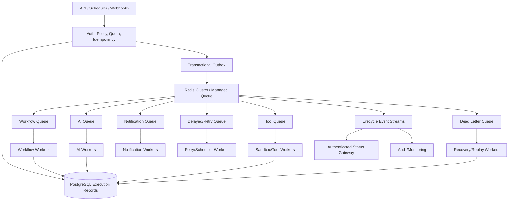
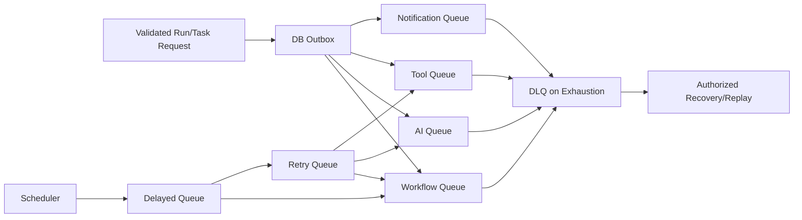
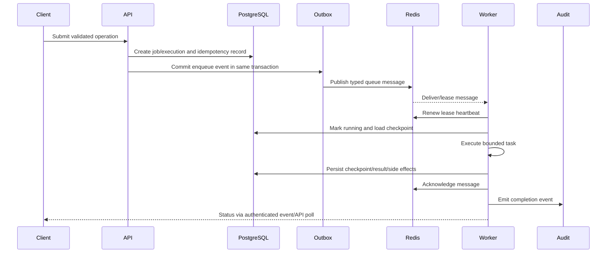

# E6 — Redis & Distributed Workers Implementation Specification

**Status:** Proposed implementation specification  
**Epic:** E6 — Redis & Distributed Workers  
**Priority:** P1/P0 dependency for durable workflow execution  
**Source of truth:** `docs/SOFTWARE_ARCHITECTURE.md`, `docs/SECURITY_AUDIT.md`, `docs/PRODUCTION_READINESS.md`, `docs/IMPLEMENTATION_ROADMAP.md`, `docs/specs/E1_IDENTITY_IMPLEMENTATION_SPEC.md`, `docs/specs/E2_SECRETS_IMPLEMENTATION_SPEC.md`, `docs/specs/E3_WORKFLOW_IMPLEMENTATION_SPEC.md`, `docs/specs/E4_API_SECURITY_IMPLEMENTATION_SPEC.md`, and `docs/specs/E5_DATABASE_FOUNDATION_IMPLEMENTATION_SPEC.md`  
**Scope:** Redis topology, broker/queue contracts, worker pools, leases, retries, recovery, autoscaling, security, and observability.  
**Out of scope:** Product-specific connector implementation and unrelated data-model changes.

## 1. Executive Summary

Redis and distributed workers are required to move AIFlow's long-running, high-latency, and failure-prone work out of API request processes. Workflow execution, AI inference, file parsing, embeddings, browser automation, notifications, scheduled jobs, cleanup, and recovery all require durable asynchronous processing that can scale independently from HTTP traffic.

The current implementation has Redis initialization and cache hooks, but queueing and worker modules are placeholders, execution state is process-local, WebSocket subscribers are in memory, and there is no durable lease, retry, idempotency, dead-letter, or autoscaling contract. A worker crash can lose work or duplicate side effects, while a single Redis or database instance creates a platform-wide bottleneck.

E6 establishes an enterprise distributed execution platform with a highly available Redis deployment or managed broker, explicit queue classes, independently scalable worker pools, lease/heartbeat semantics, at-least-once delivery with idempotent effects, retry/circuit/DLQ policies, tenant fairness, backpressure, and complete operational telemetry.

**Success condition:** every asynchronous job is durably accepted, authorized, observable, bounded, recoverable, and either completed exactly once at the business-effect level or placed in a controlled dead-letter/recovery workflow.

## 2. Current Architecture

### 2.1 Current queue implementation

`backend/app/tasks/task_queue.py` exposes `enqueue_workflow_task`, but returns a fabricated task ID and status. It does not persist a broker message, record a lease, support priorities, retries, acknowledgements, delayed delivery, or a DLQ.

### 2.2 Current background workers

`backend/app/workers/celery_worker.py` exposes a placeholder dispatcher that returns success without processing a durable job. Kubernetes worker assets invoke a Celery command/path that is not demonstrated to match the repository module. There is no verified worker bootstrap, broker configuration, graceful drain, or health/readiness contract.

### 2.3 Async execution and workflow processing

The current execution engine runs graph nodes sequentially in the API process and stores context in memory. API requests can therefore perform long-running AI, HTTP, communication, file, or code-like work. Independent branches are not parallelized. Worker restart or pod rescheduling can lose in-process context.

### 2.4 AI execution

AI nodes call the agent runtime directly through `AIRunnerAdapter`. Provider calls, token usage, reasoning, citations, and tool enablement are exposed through the execution path, but there is no dedicated AI worker pool, provider queue, token budget admission, circuit breaker, or durable agent-task state.

### 2.5 Redis usage

The application creates an async Redis client during FastAPI lifespan, pings it, initializes `fastapi-cache2`, and registers Redis metrics. Redis availability is treated as optional. This is acceptable for non-critical cache reads but unsafe for sessions, rate limits, revocation, queues, leases, and workflow state unless each security-critical path has an explicit fail-closed policy.

Docker/DR documentation describes Redis AOF/RDB persistence, but direct Kubernetes manifests provide a single Redis deployment/PVC and do not demonstrate HA Sentinel/Cluster operation, TLS, ACLs, or recovery testing.

### 2.6 Celery/RQ/Arq status

Celery is referenced by worker manifests and documentation, but no complete, tested Celery application/broker/result contract is present. RQ and Arq are not established as implemented queue frameworks. E6 defines a broker abstraction so the platform can use Redis Streams, Celery, or a managed queue without exposing implementation-specific behavior to domain code.

### 2.7 In-memory queues and job persistence

In-memory collections are used for WebSocket subscribers, failed login tracking, revoked tokens, mock workflows, knowledge metadata, and other state. Job and task lifecycle data is not consistently persisted in the E5 execution/task tables. There is no outbox pattern connecting database commits to queue publication.

### 2.8 Current weaknesses

| ID | Weakness | Severity | Impact |
|---|---|---|---|
| W1 | Queue function fabricates success instead of durably enqueueing | Critical | Jobs can be lost and clients receive false status. |
| W2 | Worker dispatcher is a placeholder/command mismatch | Critical | Background execution is not reliable. |
| W3 | API process performs long-running execution | High | Request worker exhaustion and poor throughput. |
| W4 | No lease/heartbeat/acknowledgement contract | High | Crashed workers leave ambiguous jobs. |
| W5 | No distributed idempotency or side-effect ledger | High | Duplicate external actions after retries/crashes. |
| W6 | No retry, delayed, or dead-letter queues | High | Transient failures become lost/permanent failures. |
| W7 | Redis is optional for security-critical state | Critical | Multi-pod auth/rate-limit/revocation inconsistency. |
| W8 | Single Redis deployment in direct Kubernetes assets | High | Broker/cache outage and data loss. |
| W9 | No backpressure, quotas, or fair scheduling | High | Noisy-neighbor/resource exhaustion. |
| W10 | No queue-depth/oldest-age-based autoscaling | High | Cannot adapt to demand. |
| W11 | In-memory WebSocket/event state | High | Events disappear across replicas/restarts. |
| W12 | No graceful drain/recovery/restore tests | High | Rolling deployment and failure lose work. |

## 3. Problems to Solve

### 3.1 In-memory queues and lost jobs

All accepted asynchronous work must have a durable queue message and a database execution/task record. A successful API response means the work is durably accepted, not merely placed in a local list.

### 3.2 Duplicate execution and idempotency

Delivery is at-least-once. Every job has a stable idempotency key, execution/task attempt, side-effect ledger, and connector idempotency behavior. Exactly-once external effects are achieved through idempotency/transactional coordination, not by assuming the broker delivers exactly once.

### 3.3 Worker crashes and leases

Workers acquire time-bounded leases, renew heartbeats, acknowledge only after durable state/side-effect commit, and allow safe reclamation after lease expiry. A recovery controller inspects checkpoints and side-effect state before requeueing.

### 3.4 Starvation, no retry policy, and poison messages

Priority must not allow a tenant to starve others. Retryable and permanent errors are classified. Poison messages are bounded by attempts, routed to a DLQ, and require authorized replay or remediation.

### 3.5 No distributed execution or autoscaling

Workers need independent pools and autoscaling based on backlog age, throughput, resource saturation, provider quotas, and tenant fairness. API pods should only validate and enqueue long-running work.

### 3.6 Backpressure and resource safety

Admission control prevents queue growth from exhausting Redis, PostgreSQL, AI budgets, worker memory, or external providers. Per-tenant/global concurrency, token, storage, and execution deadlines must be enforced before job acceptance and during execution.

## 4. Target Architecture

### 4.1 Components

| Component | Responsibility |
|---|---|
| Redis Cluster/managed broker | Durable queue primitives, streams, delayed/retry metadata, leases, distributed counters, coordination. |
| Queue layer | Typed envelopes, priority/fairness, acknowledgement, visibility timeout, retries, DLQ, ordering. |
| Scheduler | Schedules, webhook/manual/event triggers, due-job dispatch, deduplication, leader coordination. |
| Worker pools | Specialized, independently scaled consumers with trust/capability boundaries. |
| API pods | Authenticate, authorize, validate, persist intent, enqueue, and return operation IDs. |
| AI workers | Provider calls, prompt/RAG assembly, token/cost budgets, output validation. |
| Tool workers | Isolated HTTP/browser/code/plugin/database operations with capabilities. |
| Event bus | Durable lifecycle events for status, audit, metrics, and integrations. |
| Retry engine | Failure classification, backoff, circuit breakers, attempt budgets, DLQ routing. |
| Dead-letter queue | Safe terminal storage, operator review, authorized replay, and evidence. |

## 5. Redis Architecture

### 5.1 Topology choice

| Deployment | Use | Target decision |
|---|---|---|
| Managed Redis Cluster | Preferred production queue/cache/session service | Multi-AZ, automated failover, TLS/ACL, backups, provider support. |
| Redis Sentinel | Suitable for smaller HA deployment with one primary and replicas | Automated failover, client Sentinel support, tested promotion. |
| Single Redis | Local development only | No production sessions, queue, or critical state. |

Redis Cluster is preferred for horizontal throughput and memory partitioning. Sentinel is acceptable where workload size and managed-service capabilities do not require cluster sharding. The broker contract must support the chosen topology without application-level assumptions.

### 5.2 Persistence

- **AOF:** Enable for queue/task durability where supported; choose append/fdatasync policy based on RPO/latency requirements.
- **RDB:** Use periodic snapshots for efficient backup and disaster-recovery checkpoints.
- **Replication:** Use primary/replica replication with monitored lag and automatic failover.
- **Backups:** Encrypt snapshots/AOF archives, store cross-region/account, and test restore.
- **Queue semantics:** Redis persistence complements, but does not replace, PostgreSQL execution/task records and outbox reconciliation.

### 5.3 Failover and connection pooling

Clients use topology-aware connection pools with bounded max connections, health checks, timeouts, reconnect backoff, and separate pools for queue, cache, locks, and metrics where needed. Failover tests verify no acknowledged message disappears and no security state silently fails open.

### 5.4 Security

- TLS in transit with certificate verification.
- ACL users per application class: API, workers, scheduler, monitoring, migration/recovery.
- Separate logical databases or clusters for cache, broker, security state, and coordination where blast-radius analysis requires it.
- Private endpoints/network policies; no public Redis port.
- E2 secret-manager injection; no passwords in ConfigMaps, images, logs, or command lines.
- Key prefix and ACL policy prevent one tenant/application class from reading unrelated keyspaces.

### 5.5 Memory and eviction

Queue, lease, security, and audit-related keys must not be evicted. Use separate instances/keyspaces or `noeviction` for durable queue/security workloads. Cache-only Redis can use an approved LRU/LFU policy. Monitor fragmentation, used memory, maxmemory, evictions, blocked clients, latency, and stream length. Apply TTLs to transient locks, counters, idempotency records, and delayed metadata.

## 6. Queue Design

| Queue | Workload | Ordering/priority | Limits and policy |
|---|---|---|---|
| Workflow queue | Graph orchestration and node scheduling | Per-execution ordering; tenant-fair priority | Execution deadlines, tenant concurrency, lease. |
| AI queue | Prompt/provider inference and embeddings | Provider/model/tenant priority | Token/cost budget, provider rate limit, circuit breaker. |
| Tool queue | HTTP/browser/code/plugin/database actions | Side-effect class priority | Capability, egress, resource, idempotency policy. |
| Priority queue | Explicit approved urgent work | Bounded priority bands | Cannot starve normal tenants; audit priority use. |
| Delayed queue | Scheduled and backoff work | Due-time ordering | Clock skew and maximum future delay. |
| Retry queue | Eligible retry attempts | Next-attempt ordering | Attempt/failure classification and jitter. |
| DLQ | Poison/permanent/unsafe messages | Operator order | No automatic replay; authorization and new attempt ID. |
| Notification queue | Email, push, webhook notifications | Per-recipient/provider ordering | Duplicate suppression and provider limits. |
| Cleanup queue | Temp files, expired sessions, archives | Low priority | Budgeted, resumable, non-critical. |
| Maintenance queue | Migrations/backfills/reindex/repair | Explicit maintenance priority | Approval, lock budget, pause/resume. |

Queue envelopes contain message ID, job/execution/task ID, tenant/workspace, workflow version, actor/service principal, type/version, priority, idempotency key, attempt, available/expiry timestamps, policy/config versions, payload reference, and trace/correlation ID. Large inputs are stored in E5 object/data stores by reference.

## 7. Worker Architecture

| Worker pool | Responsibilities | Concurrency/isolation | Scaling signals |
|---|---|---|---|
| Workflow workers | Compile/advance plans, schedule runnable nodes, checkpoint state | Bounded per tenant/execution; DB transaction budget | Queue age, active leases, CPU. |
| AI workers | Provider calls, RAG/embedding, output validation | Provider/model/tenant concurrency and token budget | Queue age, provider latency, token rate. |
| Tool workers | HTTP/browser/code/plugin/database actions | Strong sandbox, capability and egress isolation | Queue age, resource usage, tool class. |
| Scheduler workers | Due schedules, webhook/manual/event dispatch, reconciliation | Leader/partition coordination; idempotent | Due-job age, dispatch latency. |
| Cleanup workers | TTL, temporary files, archive/delete jobs | Low priority, resumable | Backlog age/storage growth. |
| Notification workers | Email/push/outbound webhooks | Provider/recipient limits, idempotency | Provider latency/failure/backlog. |
| Maintenance workers | Backfills, reindex, migrations, repair | Explicit approval, low-rate/lock-aware | Progress, lock waits, resource budget. |
| Recovery workers | Lease expiry scans, DLQ handling, checkpoint recovery | Restricted permissions, audited replay | Expired leases, DLQ growth, recovery age. |

All workers use dedicated service identities and E2-managed secrets. A worker receives only the queue/keyspace, database role, provider reference, and tool capabilities required for its pool. Workers heart-beat, drain gracefully, stop claiming new work on termination, and finish or safely return leased work within a bounded window.

## 8. Job Lifecycle

### Lifecycle stages

| Stage | Required behavior |
|---|---|
| Job creation | Validate identity, scope, schema, quota, idempotency, and resource budget; persist record. |
| Validation | Resolve capabilities/provider policy and reject unsafe/oversized work. |
| Queue | Transactional outbox publishes after DB commit; durable message has envelope version. |
| Lease | Worker atomically claims message with visibility timeout and heartbeat. |
| Execution | Worker runs with tenant/capability context, timeout, resource budget, and attempt ID. |
| Checkpoint | Persist progress and side-effect ledger before acknowledgement. |
| Completion | Mark terminal state exactly once; acknowledge and emit audit/event. |
| Retry | Classify failure, persist attempt, schedule delayed retry, or route DLQ. |
| DLQ | Store terminal failure and evidence; replay requires policy/operator authorization. |
| Audit | Record actor, tenant, job, worker, state, attempts, policy, and outcome without secrets. |

## 9. Distributed Locking

### 9.1 Redis locks and leases

Locks use unique random ownership tokens, atomic acquire-if-absent with TTL, and compare-and-delete release. A worker may renew only a lock it owns. Locks are advisory coordination, not the sole source of durable truth; PostgreSQL state/version constraints remain authoritative.

### 9.2 Lease renewal and expiration

Each claimed message has a visibility/lease deadline and heartbeat interval. If heartbeat fails or deadline expires, the recovery worker marks the attempt suspect and reclaims only after checking the database attempt/side-effect state. A late worker cannot write over a newer owner because task updates use owner token and version conditions.

### 9.3 Leader election

Scheduler/recovery singleton duties use a Redis lease with fencing token and a durable leader epoch. Work is partitionable wherever possible; leader loss is safe and re-election is bounded. A stale leader cannot publish or mutate state after its fencing token expires.

### 9.4 Duplicate prevention and coordination

Idempotency keys, unique database constraints, task attempt rows, broker message IDs, and lock ownership jointly prevent duplicates. Redis locks alone are never used to guarantee exactly-once business effects.

## 10. Retry Strategy

### 10.1 Failure classification

| Failure | Retry | Policy |
|---|---:|---|
| Worker crash/lease loss | Yes | Reconcile checkpoint/side effect, then bounded retry. |
| Provider 5xx/timeout | Yes | Exponential backoff, jitter, provider circuit breaker. |
| Provider 429 | Yes | Honor retry-after/quota window. |
| Validation/schema failure | No | Fail with actionable error; no poison retry loop. |
| Authorization/credential failure | No automatic | Pause/notify/rotate credential; retry only after policy change. |
| Deterministic application error | Usually no | Fail or approved compensation. |
| Unknown exception | Limited | Retry a small number, alert, then DLQ. |

### 10.2 Backoff and limits

Use exponential backoff with jitter, maximum delay, maximum attempts, total wall-clock deadline, and tenant/provider retry budgets. Retry metadata includes original job ID, attempt ID, failure class, first/last failure, next eligible time, and policy version.

### 10.3 Circuit breakers and poison messages

Circuit breakers open on provider/queue/DB failure or latency thresholds, stop new calls, and probe for recovery. Messages with invalid schema, impossible state, repeated deterministic failure, or unsafe capability are classified as poison and routed to DLQ without consuming unbounded retries.

### 10.4 Manual replay

Replay requires an authenticated operator permission, tenant/workspace scope, failure review, current policy validation, a new attempt ID, and a selected checkpoint. Replaying a message never mutates or deletes the original failure record.

## 11. Reliability Design

### 11.1 Delivery semantics

The broker provides at-least-once delivery. The database/outbox and idempotency ledger provide effectively-once business outcomes for supported connectors. Exactly-once transport is not assumed.

### 11.2 Checkpoint recovery

Workers persist checkpoints before acknowledgement. Recovery loads the latest checkpoint for the exact workflow version and tenant, validates current policy, reconstructs pending work, and reconciles side effects. A changed policy causes pause/approval rather than an unsafe automatic continuation.

### 11.3 Worker restart and graceful shutdown

On SIGTERM, a worker stops claiming messages, renews or safely releases current leases, flushes metrics, and exits after a bounded drain period. A crash is detected by heartbeat/visibility timeout. Queue messages are not acknowledged until durable state is committed.

### 11.4 Queue durability

Redis persistence, replicas, and backups protect broker state, while PostgreSQL remains the authoritative execution/job record. Reconciliation scans compare database pending jobs to queue messages and re-enqueue missing messages idempotently.

## 12. Performance Design

- Scale worker pools horizontally from queue depth, oldest message age, throughput, active leases, CPU/memory, provider quotas, and cost budget.
- Use bounded concurrency per tenant, pool, provider, and worker; prevent one tenant from consuming all slots.
- Batch compatible embedding, notification, cleanup, and maintenance operations without violating ordering/idempotency.
- Keep queue messages small; use E5 object/data references for large payloads and compressed checkpoint snapshots.
- Use Redis pipelining/stream reads where safe, bounded key cardinality, TTLs for transient metadata, and separate memory/eviction domains.
- Avoid polling storms; use blocking stream reads, scheduler indexes, and exponential recovery scans.
- Apply backpressure before Redis/PostgreSQL/AI provider exhaustion; expose `429`/accepted-later semantics to APIs.
- Benchmark throughput, latency, memory fragmentation, connection pools, queue age, and recovery behavior under one-million-user workload assumptions.

## 13. Security Design

| Control | Required design |
|---|---|
| Redis authentication | ACL users per service/pool; no shared default password. |
| TLS | TLS for client/replica/sentinel/cluster links with certificate verification. |
| Network isolation | Private endpoints, security groups, Kubernetes NetworkPolicies, no public Redis. |
| Worker permissions | Dedicated service account, queue/keyspace ACL, least-privilege DB/secret/tool roles. |
| Secret handling | E2-managed references; secrets never in queue payloads, logs, images, or command lines. |
| Tenant isolation | Tenant/workspace in every envelope/key/persistent record; scoped consumer and repository checks. |
| Audit logging | Job creation, claim, retry, lease expiry, replay, DLQ, worker identity, and policy events. |
| Data protection | Encrypt sensitive payload references/checkpoints; avoid raw credentials/prompts in Redis. |
| Abuse controls | Per-tenant queue quotas, priority limits, connection limits, and provider budgets. |
| Lock safety | Unique owner token, TTL, fencing, and database authority; no lock-only correctness. |

## 14. Monitoring & Observability

### 14.1 Metrics

| Domain | Metrics |
|---|---|
| Queues | Depth, oldest age, enqueue/dequeue/ack latency, throughput, visibility expiry, retries, DLQ count. |
| Workers | Active/idle, concurrency, leases, heartbeat misses, crashes, drain time, CPU/memory/disk. |
| Redis | Memory, fragmentation, evictions, command latency, blocked clients, connections, replication lag, AOF/RDB status. |
| Jobs | State counts, duration p50/p95/p99, attempts, idempotency collisions, checkpoint latency. |
| Providers | AI latency, rate limits, failures, tokens, cost, circuit state. |
| Security | Unauthorized queue access, replay, tenant-policy denial, secret resolution, abnormal priority use. |

### 14.2 Dashboards and alerts

Dashboards cover queue operations, worker pools, Redis health, workflow SLOs, retry/DLQ/recovery, AI/provider usage, tenant fairness, and capacity/cost.

Pageable alerts include queue oldest age/SLO breach, DLQ growth, retry storm, worker crash loop, heartbeat/lease expiry spike, Redis memory/eviction/replication failure, AOF/RDB backup failure, connection exhaustion, provider circuit open, and tenant quota bypass. Every alert has an owner, severity, runbook, and test scenario.

### 14.3 Tracing

OpenTelemetry spans propagate from API request through outbox, queue message, worker claim, DB checkpoint, provider/tool call, retry, and final event. Trace attributes include job/task/pool IDs and safe tenant/scope identifiers, never secrets or raw prompts.

## 15. Infrastructure Design

### 15.1 Docker and Compose

Local Compose provides Redis and worker profiles for development/test only, with generated local credentials and non-production data. Production-like Compose is either updated to consume external secret references and durable volumes or explicitly marked unsupported. Images use non-root users, `.dockerignore`, pinned dependencies, and no secret-bearing build layers.

### 15.2 Kubernetes

Production uses a managed Redis service or an operator-backed Redis Cluster/Sentinel deployment with:

- StatefulSet/Operator-managed replicas and persistent volumes;
- TLS/ACL secret references through E2 External Secrets/CSI;
- anti-affinity/topology spread and PodDisruptionBudgets;
- NetworkPolicies isolating API, workers, monitoring, and data planes;
- resource requests/limits and eviction safety;
- readiness/liveness probes for topology and broker health;
- KEDA/HPA based on queue depth/oldest age and resource metrics;
- backups, restore testing, failover, and alerting.

Worker Deployments are separate by pool, with service accounts, queue ACLs, graceful preStop drain, max concurrency, and immutable image digests.

### 15.3 Helm and Terraform

Helm is the authoritative deployment package, with schema-validated values for Redis topology, queue names, worker pools, autoscaling, resource budgets, secret references, and monitoring. Terraform provisions managed Redis, networking, KMS, IAM/workload identity, backup storage, and monitoring integrations. Direct manifests must not drift from the tested chart.

## 16. File-Level Implementation Plan

This is a planning inventory only. No implementation is generated by this specification.

### 16.1 Backend queue, worker, and execution files

| File/group | Purpose | Reason | Dependencies | Expected implementation |
|---|---|---|---|---|
| `backend/app/tasks/task_queue.py` | Queue abstraction | Current function fabricates status | E2, E5 | Typed envelopes, durable enqueue, priority/delay/retry/DLQ, idempotency. |
| `backend/app/workers/celery_worker.py` | Worker bootstrap | Current dispatcher is placeholder | E3, E7 | Real worker app, pool routing, heartbeat, drain, metrics, safe identity. |
| `backend/app/engine/execution_engine.py` | Workflow orchestration | Currently in-process/sequential | E3, E5 | Queue dispatch, leases, checkpoints, recovery, bounded concurrency. |
| `backend/app/engine/scheduler.py` | Scheduling | Need durable due-job dispatch | E3, E5 | Leader-safe scheduler, delayed queue, missed-run/idempotency policy. |
| `backend/app/engine/retry_policy.py` | Retries | Current policy incomplete | E3 | Failure taxonomy, backoff, circuit, DLQ/replay contract. |
| `backend/app/engine/execution_state.py` (new) | State machine | Need durable compare-and-set | E3, E5 | State transition, lease, checkpoint, recovery services. |
| `backend/app/engine/idempotency.py` (new) | Duplicate control | No universal idempotency | E3, E5 | Idempotency repository/side-effect ledger and replay policy. |
| `backend/app/queue/*` (new) | Broker clients | Need Redis abstraction | E2, E5 | Redis topology client, streams/queues, locks, metrics, health. |
| `backend/app/workers/*` | Pool implementations | Need specialized workers | E3 | Workflow, AI, tool, scheduler, cleanup, notification, maintenance, recovery pools. |
| `backend/app/api/v1/execution.py` | Run/control API | Need enqueue-only long work | E3, E4 | Create/cancel/pause/retry/DLQ/replay operations with policy and status. |
| `backend/app/api/v1/ws_execution.py` | Status events | In-process subscriber list unsafe | E3, E4 | Brokered authenticated streams, limits, reconnection, tenant filtering. |

### 16.2 AI, tool, and provider files

| File/group | Purpose | Reason | Dependencies | Expected implementation |
|---|---|---|---|---|
| `backend/app/ai/agent_runtime.py` | AI tasks | Needs dedicated AI queue/budget | E2, E3 | Submit/consume AI jobs, token/cost quotas, checkpointed agent state. |
| `backend/app/ai/provider_manager.py` | Provider client | Provider calls need pool/circuit policy | E2, E3 | Queue-aware provider clients, rotation, rate limit, circuit breakers. |
| `backend/app/ai/tool_calling_engine.py` | Tool dispatch | Unsafe/eager execution | E3, E4 | Capability broker and tool queue, no unsafe `eval`. |
| `backend/app/ai/rag_engine.py` | RAG tasks | Ingestion/search can block API | E3, E5 | Async ingestion/embedding jobs, durable status, retries and tenant scope. |
| `backend/app/ai/vector_store.py` | Vector persistence | Needs queue/DB recovery path | E5 | Batch workers, indexed production pgvector, bounded operations. |
| `backend/app/plugins/*` | Plugin execution | Need isolated worker pool | E3, E4 | Signed manifest, queue dispatch, sandbox capability and resource policy. |
| `backend/app/hyperautomation/*` | Browser/OCR/voice/vision | Expensive/untrusted workloads | E3, E4 | Dedicated pools, quotas, leases, cancellation, artifact references. |

### 16.3 Models, repositories, and services

| File/group | Purpose | Reason | Dependencies | Expected implementation |
|---|---|---|---|---|
| `backend/app/models/execution.py` | Execution/task state | Need leases/checkpoints/DLQ | E5 | Attempt, lease, idempotency, checkpoint, side-effect, queue metadata. |
| `backend/app/models/workflow.py` | Workflow versions | Queue must bind immutable plan | E3, E5 | Published version/policy/capability references. |
| `backend/app/models/audit.py` | Queue/worker evidence | Need operational audit | E4, E5 | Claim/retry/replay/DLQ/worker events. |
| `backend/app/repositories/*` | Durable access | Prevent unscoped/inconsistent writes | E5 | Queue/job/lease/checkpoint/idempotency repositories. |
| `backend/app/services/unit_of_work.py` | Atomic persistence | Outbox/checkpoint correctness | E5 | Transaction boundaries for enqueue and state changes. |
| `backend/app/services/outbox_service.py` (new) | Transactional publish | Avoid DB/queue split | E5 | Outbox polling/publish/retry/reconciliation. |
| `backend/app/services/recovery_service.py` (new) | Crash/DLQ recovery | No recovery controller exists | E3, E5 | Lease scan, checkpoint restore, DLQ replay policy. |

### 16.4 Docker, Kubernetes, Helm, Terraform, CI/CD, monitoring

| File/group | Purpose | Reason | Dependencies | Expected implementation |
|---|---|---|---|---|
| `backend/Dockerfile` | API/worker runtime | Need correct worker image/entrypoint | E2, E7 | Worker dependencies, non-root runtime, no credentials, health/drain support. |
| `docker-compose.yml` | Local Redis/worker | Current stack lacks durable worker contract | E2, E5 | Local broker/worker profiles, generated secrets, health conditions. |
| `deploy/docker-compose*.yml` | Deployment-like topology | Current Redis/worker/secret drift | E2, E7 | HA/secret references or retired unsupported mode. |
| `deploy/k8s/redis.yaml` | Redis topology | Single Redis lacks HA/security | E2, E7 | Operator/managed reference, TLS/ACL/PVC/replication/health. |
| `deploy/k8s/workers.yaml` | Worker Deployment | Placeholder command and no pool controls | E3, E7 | Correct entrypoint, per-pool deployments, drain, HPA/KEDA, policies. |
| `deploy/k8s/backend.yaml` | API workers | Long-work admission and Redis access | E3, E4, E7 | Queue service identity, resource/readiness, enqueue-only behavior. |
| `deploy/k8s/config.yaml` | Runtime config | Secret/queue values need E2 references | E2 | Non-secret queue config; External Secrets/CSI references. |
| `deploy/helm/*` | Release package | Need queue/pool/autoscaling schema | E2, E3, E5 | Redis, queue, worker, KEDA, PDB, NetworkPolicy, monitor values. |
| `deploy/terraform/main.tf` | Cloud infra | Need managed Redis/queue and identity | E2, E7 | Managed Redis, KMS, private network, backup, workload IAM. |
| `deploy/monitoring/prometheus.yml` | Scraping | Need queue/worker/Redis metrics | E8 | Targets/exporters and safe labels. |
| `deploy/monitoring/alert_rules.yml` | Alerts | Need backlog/lease/DLQ/failover alerts | E8 | Actionable SLO/resource/queue alerts and runbooks. |
| `.github/workflows/*.yml` | Delivery gates | Need queue/load/chaos/recovery validation | E3, E5, E7 | Broker integration, image/signing, manifest, load/security/recovery checks. |

## 17. Migration Strategy

### 17.1 Migration from current queue

1. Add E5 execution/task/outbox/attempt/checkpoint schema and repositories.
2. Introduce a queue envelope version and broker abstraction without changing existing API response contracts.
3. Deploy Redis/worker infrastructure in shadow mode with synthetic jobs.
4. Route new workflow runs through outbox/queue while allowing existing in-process runs to drain.
5. Persist/compare outcomes for deterministic workflows.
6. Move AI, tool, file, notification, and scheduler workloads by pool.
7. Make durable queue execution the default; retain legacy mode only for pinned compatibility workloads.
8. Remove placeholder queue/worker paths after all legacy runs and messages are reconciled.

### 17.2 Zero downtime and backward compatibility

Deploy consumers that understand old and new envelopes before producers emit the new version. Additive database migrations precede routing changes. Queue message claims are drained before worker replacement. API clients continue receiving operation IDs/status fields while execution becomes asynchronous.

### 17.3 Rollback

Stop new routing to the new pools, let safe in-flight jobs complete or return leases, and replay only reconciled jobs. Keep new schema fields/tables. Do not acknowledge or delete messages during a rollback until database and side-effect state is verified. Redis failback is not performed without a tested topology/fencing plan.

## 18. Testing Strategy

### Unit and queue tests

- Envelope serialization/versioning, queue routing, priorities, delayed availability, acknowledgement, lease expiry, heartbeat, retry/DLQ classification, idempotency, lock ownership, and scheduler leadership.

### Worker tests

- Pool capability routing, concurrency limits, graceful shutdown/drain, crash/restart, cancellation, backpressure, tenant fairness, and secret/ACL scope.

### Load and performance tests

- Queue throughput, backlog/oldest-age SLOs, Redis memory/latency, connection pools, worker autoscaling, large payload references, AI provider limits, and one-million-user workload scenarios.

### Concurrency and chaos tests

- Duplicate deliveries, simultaneous claims, stale lease owners, scheduler split-brain, Redis failover, replica lag, network partitions, worker crash after side effect, and broker restart.

### Recovery and security tests

- Checkpoint restore, outbox reconciliation, DLQ replay, poison messages, tenant IDOR, queue ACL, TLS, secret rotation, capability access, and audit redaction.

## 19. Acceptance Criteria

E6 is accepted only when:

1. All accepted async jobs persist a database record and durable queue message through a transactional outbox.
2. Redis is deployed as HA/managed topology with TLS, ACLs, persistence, replication, backup, failover, and monitored connection pools.
3. Workflow, AI, tool, scheduler, cleanup, notification, maintenance, and recovery pools run independently with least-privilege identities.
4. Queue envelopes include tenant/workspace, execution/task, version, idempotency, attempt, deadline, priority, and trace context.
5. Claims have lease/heartbeat/acknowledgement semantics; stale workers cannot overwrite newer state.
6. At-least-once delivery produces idempotent business effects and tested duplicate detection.
7. Retry, exponential backoff/jitter, circuit breakers, poison-message handling, DLQ, and authorized replay are operational.
8. Backpressure and concurrency/rate/cost quotas prevent queue, Redis, DB, worker, provider, and tenant exhaustion.
9. Worker crash, graceful shutdown, Redis failover, missing queue reconciliation, checkpoint recovery, and DLQ replay tests pass.
10. API requests no longer execute unbounded workflow/AI/file work synchronously.
11. Queue, worker, Redis, execution, provider, security, and recovery metrics/alerts/dashboards are active with runbooks.
12. Kubernetes/Helm/Terraform deployment uses correct worker entrypoints, immutable images, secret references, network policies, resource limits, and autoscaling.
13. Load and performance testing meets approved queue age, throughput, latency, resource, and tenant-fairness SLOs.
14. Migration and rollback preserve active work without acknowledging or duplicating unsafe side effects.

## 20. Risks

| Risk | Category | Level | Impact | Mitigation |
|---|---|---|---|---|
| Redis primary/cluster failure | Redis | Critical | Queue/cache/session outage or lost messages | Managed HA, AOF/RDB, replicas, failover/restore tests, PostgreSQL reconciliation. |
| Eviction of queue/security keys | Redis | Critical | Lost jobs or auth state | Separate memory domains, `noeviction`, TTL policy, memory alerts. |
| Worker duplicate side effect | Worker | High | Repeated external action | Idempotency ledger, connector idempotency, reconciliation workflow. |
| Stale lease holder writes state | Worker | High | Corrupt execution state | Fencing tokens, owner/version checks, DB authority. |
| Queue starvation/noisy tenant | Performance | High | SLO failure for other tenants | Fair priority, per-tenant quotas, pool isolation, backlog autoscaling. |
| Broker connection storm during failover | Infrastructure | High | Cascading API/worker outage | Bounded pools, reconnect jitter, circuit breakers, failover drills. |
| Incorrect Redis ACL/TLS configuration | Security | High | Queue/credential/data exposure | Secret manager, policy tests, private network, access audits. |
| Poison/retry storm | Operational | High | Cost/queue saturation | Failure classification, attempt budgets, DLQ, circuit breaker, alerts. |
| Migration message incompatibility | Operational | Medium | Lost/stuck jobs during rollout | Dual envelope consumers, compatibility tests, drain window. |
| AI provider cost/latency spike | Performance/AI | High | Budget exhaustion and backlog | Token quotas, provider queues, rate limits, circuit breakers. |

## 21. Estimated Timeline

E6 is an XL P1 epic and is a prerequisite for production workflow scale. With dedicated platform/backend/worker/security/QA capacity, implementation is estimated at **six to eight weeks**.

| Week | Focus | Effort | Deliverables |
|---|---|---|---|
| 1 | Queue contract and topology | L | Envelope/state/lease design, Redis HA decision, capacity/security model. |
| 2 | Redis and outbox foundation | XL | Managed Redis/cluster, TLS/ACL, persistence, connection pools, DB outbox. |
| 3 | Worker pools and lifecycle | XL | Correct worker bootstrap, pool routing, lease/heartbeat/ack/drain. |
| 4 | Retry, idempotency, DLQ, recovery | L | Failure taxonomy, backoff/circuit, side-effect ledger, replay controls. |
| 5 | Workflow/AI/tool integration | XL | Async execution, AI/provider queues, tool pools, checkpoint/recovery. |
| 6 | Kubernetes/autoscaling/observability | L | KEDA/HPA, NetworkPolicies, dashboards, alerts, traces, runbooks. |
| 7 | Migration, performance, and chaos | XL | Rolling migration, load/soak, failover, duplicate/crash/recovery tests. |
| 8 | Production readiness | M | Remediation, DR evidence, security/platform/operations sign-off. |

Assumptions: E1 identity, E2 secrets, E3 execution contracts, E4 API controls, E5 database/outbox/checkpoint schema, managed Redis/PostgreSQL, and queue-capable staging infrastructure are available.

## 22. Definition of Done

E6 is complete when:

- All acceptance criteria pass with CI, staging, load, chaos, failover, recovery, and security evidence.
- Critical/High queue and worker findings in the security/readiness/roadmap documents are closed or have approved time-bound exceptions.
- Redis is HA/managed, encrypted, authenticated, ACL-scoped, persisted, backed up, monitored, and recoverable.
- Durable queue, outbox, leases, heartbeats, retries, idempotency, checkpoints, DLQ, replay, and reconciliation are live and owned.
- Specialized worker pools scale independently, drain safely, enforce tenant/resource/provider quotas, and use least-privilege identities.
- API, AI, tool, file, scheduler, notification, maintenance, and recovery work no longer relies on unsafe in-memory queue/state behavior.
- Queue/worker/Redis/execution/provider/security dashboards, alerts, runbooks, and incident ownership are active.
- Migration and rollback are exercised without lost jobs, duplicate business effects, or security-policy bypass.
- Platform, backend, AI, security, data, SRE, and operations owners approve production launch.

